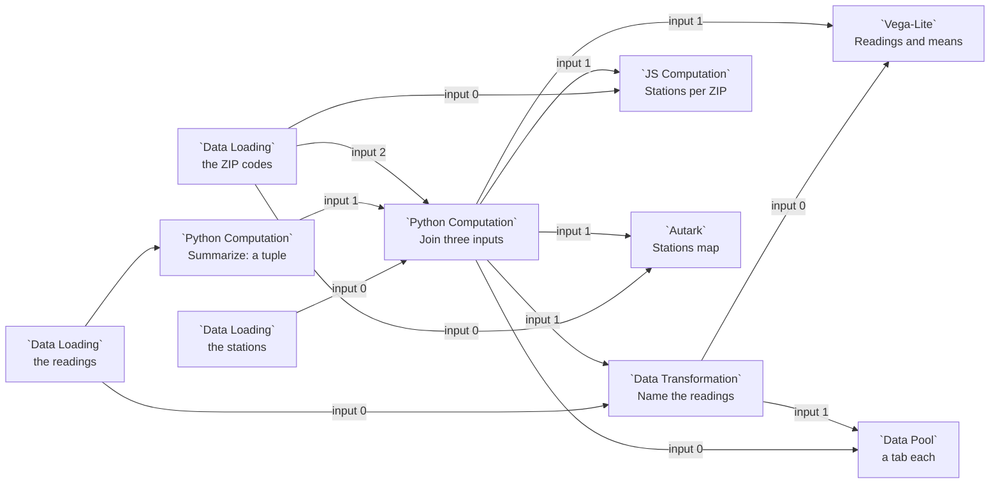

# Example: Several inputs

One node fed by several others, in each kind of node that takes several inputs:
Python Computation, Data Transformation, JS Computation, Vega-Lite, Autark and
Data Pool. One of the inputs carries a tuple. The data are the air quality
readings and stations of [example 20](20-storage-folder-of-csv-files.md), and the
ZIP codes of Chicago's Loop.

## How several inputs reach a node

Each edge into a node takes the next input circle, numbered from 0, top to
bottom: `in`, `in_1`, `in_2`. The node runs once every wired circle holds a
value. Each input has a chip, `[!! input 1 !!]`, that writes how that kind of
node reads it:

| Node | One input | Several inputs |
|---|---|---|
| Python, Data Transformation, JavaScript | `arg` is the input | `arg` is a list, one item per circle; `[!! input k !!]` runs as `arg[k]` |
| Vega-Lite | the dataset `input_0` | the datasets `input_0`, `input_1`, ... |
| Autark | the table `input_0` | the tables `input_0`, `input_1`, ... |
| Data Pool | one tab | a tab per input |

A tuple a Python node returns leaves by its one output circle and arrives on one
input:

- With one input, `arg` is the tuple, so `arg[0]` is its first item.
- With several, `arg[k]` is input k, so `arg[1][0]` is the first item of the
  tuple on input 1.
- On a Vega-Lite or Autark node whose only input is a tuple, each item is a
  dataset or table of its own, `input_0`, `input_1`, ..., as in
  [example 17](17-autark-geodataframe-maps.md). A Vega-Lite node refuses a tuple
  next to other inputs, so this example takes the tuple apart in Python first.

So `arg[0]` means the tuple's first item on a node with one input, and input 0
on a node with several. Code written for one input, such as `arg.crs`, stops
working when a second edge is connected, because `arg` becomes a list. Chips
follow the node: connecting a second edge turns `[!! input 0 !!]` from `arg`
into `arg[0]`.

## Pipeline overview



## Load the data

The readings, as in example 20:

```python
import pandas as pd
import geopandas as gpd

dataset_path = curio_data_path("data.curio.storage-air-quality")
try:
    df = gpd.read_parquet(dataset_path)
except Exception:
    df = pd.read_parquet(dataset_path)

return df
```

The stations, as points:

```python
import geopandas as gpd

df = curio_load_data("data.curio.storage-stations")

# A point at each station, in longitude and latitude.
return gpd.GeoDataFrame(df, geometry=gpd.points_from_xy(df["lon"], df["lat"]), crs=4326)
```

The ZIP codes of the Loop and around it:

```python
gdf = curio_load_data("data.utk.chicago-boundary")

# The Loop and the ZIP codes around it.
downtown = ["60601", "60602", "60603", "60604", "60605",
            "60606", "60607", "60611", "60654", "60661"]
return gdf[gdf["zip"].isin(downtown)][["zip", "geometry"]]
```

## One input, a tuple out

**Summarize** has one input, so `arg` is the readings table itself. It returns
two tables as a tuple:

```python
# One input, so arg is that input itself: the readings table.
readings = arg

# Two tables from one input, returned together as a tuple: each sensor's mean
# PM2.5 and its highest reading. The tuple leaves by the one output circle.
means = readings.groupby("sensor", as_index=False)["pm25"].mean().rename(columns={"pm25": "pm25_mean"})
peaks = readings.groupby("sensor", as_index=False)["pm25"].max().rename(columns={"pm25": "pm25_peak"})
return means, peaks
```

## Three inputs in Python

**Join three inputs** takes the stations on input 0, Summarize's tuple on
input 1 and the ZIP codes on input 2. `arg` is a list of three, and the tuple is
one item of it:

```python
import geopandas as gpd

# Three inputs, so arg is a list of three, in circle order, and each chip
# below runs as one item of it.
stations = [!! input 0 !!]      # runs as arg[0]: the stations
means, peaks = [!! input 1 !!]  # runs as arg[1]: Summarize's tuple, unpacked
zips = [!! input 2 !!]          # runs as arg[2]: the ZIP code polygons

# arg[1][0] would be the means alone: input 1, then item 0 of its tuple.
stations = stations.merge(means, on="sensor").merge(peaks, on="sensor")
return gpd.sjoin(stations, zips, predicate="within").drop(columns="index_right")
```

Each station comes out with its mean, its peak and its ZIP code: Clark and
Madison in 60603 (mean 8.0), State and Lake in 60601 (10.0), and Michigan and
Adams in 60604 (12.0).

## Two inputs in Data Transformation

```python
readings, stations = [!! input 0 !!], [!! input 1 !!]

# Each reading, with the name of the station that took it.
return readings.merge(stations[["sensor", "name"]], on="sensor")
```

## Two inputs in JavaScript

In a JS Computation node `arg` is the same list. A GeoDataFrame arrives as a
GeoJSON FeatureCollection, and a DataFrame as a list of rows. The node returns
one row per ZIP code, with the number of stations in it and their mean:

```js
// Two inputs, so arg is a list of two. A GeoDataFrame reaches JavaScript as
// a GeoJSON FeatureCollection (and a DataFrame as a list of rows).
const zips = [!! input 0 !!];
const stations = [!! input 1 !!];

// How many stations stand in each ZIP code, and their mean PM2.5.
return zips.features.map((zip) => {
  const inside = stations.features.filter((station) => station.properties.zip === zip.properties.zip);
  const total = inside.reduce((sum, station) => sum + station.properties.pm25_mean, 0);
  return {
    zip: zip.properties.zip,
    stations: inside.length,
    pm25_mean: inside.length > 0 ? Math.round((total / inside.length) * 100) / 100 : null,
  };
});
```

## Two inputs in Vega-Lite

The chart draws `input_0`, the named readings, unless a view names another
input. Its second layer names `input_1`, the joined stations, with the input's
chip, and a column chip, `[!! input 1.pm25_mean !!]`, names a column of it. A
chip inside a quoted string runs as the plain name, which keeps the spec JSON:

```json
{
  "$schema": "https://vega.github.io/schema/vega-lite/v6.json",
  "description": "PM2.5 at each station over time, and a dashed rule at its mean.",
  "layer": [
    {
      "mark": {"type": "line", "point": true},
      "encoding": {
        "x": {"field": "timestamp", "type": "temporal", "title": "Time", "scale": {"type": "utc"}},
        "y": {"field": "pm25", "type": "quantitative", "title": "PM2.5"},
        "color": {"field": "name", "type": "nominal", "title": "Station"}
      }
    },
    {
      "data": {"name": "[!! input 1 !!]"},
      "mark": {"type": "rule", "strokeDash": [4, 4]},
      "encoding": {
        "y": {"field": "[!! input 1.pm25_mean !!]", "type": "quantitative"},
        "color": {"field": "name", "type": "nominal"}
      }
    }
  ]
}
```

The chips run as `"input_1"` and `"pm25_mean"`.

## Two inputs in Autark

Each input is a table, `input_0` the ZIP codes and `input_1` the stations,
coloured by their mean:

```json
{
  "map": {
    "layerRefs": [
      {"dataRef": "[!! input 0 !!]"},
      {
        "dataRef": "[!! input 1 !!]",
        "getFnv": "pm25_mean",
        "getFnvType": "quantitative",
        "colorMapInterpolator": "interpolateReds",
        "isPick": true
      }
    ]
  }
}
```

## Two inputs in a Data Pool

The pool shows each input as a tab: the joined stations on input 0, the named
readings on input 1.
