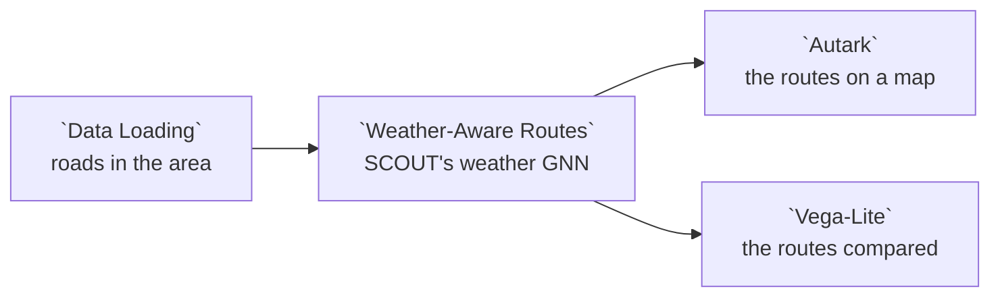

# Example: SCOUT weather-aware routing

SCOUT's routing use case asks which way to cross a city when the weather
changes along the trip. This example takes downtown Chicago's roads and a
WRF-Chem weather run of 6 July 2025, and runs the **Weather-Aware Routes** node
of the `scout.weather-routing@1` package, SCOUT's routing ported to Curio. A
graph neural network from the Model Catalog estimates the weather at every
road node; each street is weighed by the rain and wind the trip will meet when
it gets there; and the node gives the fastest route and the weather-aware one.
A map draws them, and a chart compares them as SCOUT's comparison nodes do.

## Pipeline overview



## Data

Two datasets, cut out of SCOUT's own data by
[`scripts/build_example_weather_routing.py`](../../scripts/build_example_weather_routing.py):

| Dataset | What it holds |
|---|---|
| **Chicago Roads** (`data.osm.chicago-roads`) | SCOUT's OpenStreetMap road graph of Chicago, cut to downtown, from the West Loop to the lake and from the river to the Near South Side: 45,900 directed edges, each with the nodes it joins (`u`, `v`, `key`), its `length` in metres, `speed_kph` and `travel_time` in seconds. © OpenStreetMap contributors, ODbL. |
| **Chicago Weather, 6 July 2025** (`data.scout.chicago-weather-2025-07-06`) | SCOUT's WRF-Chem run, five files side by side as SCOUT names them: `RAIN.nc`, `T2.nc` (temperature at 2 m), `WSPD10.nc` and `WDIR10.nc` (wind speed and direction at 10 m) and `RH2.nc` (relative humidity at 2 m), 49 quarter-hour steps from 00:00 to 12:00 on a 1 km grid of 20 by 20 cells. The date is SCOUT's: its routing counts time from `2025-07-06T00:00:00`, and the files' `START_DATE` is 6 July 2025. |

The weather is read one file at a time, by name:

```python
roads = curio_load_data("data.osm.chicago-roads")
rain = curio_load_data("data.scout.chicago-weather-2025-07-06", part="RAIN.nc")  # an xarray Dataset
```

The roads keep the order SCOUT's graph lists its edges in, so the node's graph
walks them as SCOUT's does. The package's libraries (`networkx`, `scipy`,
`onnxruntime`, `xarray`, `netCDF4`) are installed with it, and Curio installs
the package when it starts with `--with-examples`, because this dataflow
declares it. The GNN, `model.scout.weather-gnn`, ships with Curio in the
[Model Catalog](../MODEL-CATALOG.md). The license of SCOUT's weather run and
trained weights is still to be confirmed.

## Load the roads of the area

```python
# Chicago's road network as SCOUT routes on it (downtown), with SCOUT's
# graph keys; the routing node reads SCOUT's weather run itself.
roads = curio_load_data("data.osm.chicago-roads")

# The area to route in, as SCOUT's data layer sets its roi: the roads that
# reach into the box, in degrees of longitude and latitude. The Widgets tab
# sets the box; its defaults are SCOUT's use case.
west, south, east, north = [!! west !!], [!! south !!], [!! east !!], [!! north !!]
if not (west < east and south < north):
    raise ValueError("The bounding box needs west less than east and south less than north.")
area = roads.cx[west:east, south:north]
if area.empty:
    raise ValueError("No road reaches into the bounding box; widen it in the Widgets tab.")
return area
```

| Widget | Default | What it sets |
|---|---|---|
| West | `-87.662`° | The box's western longitude |
| South | `41.859`° | The box's southern latitude |
| East | `-87.613`° | The box's eastern longitude |
| North | `41.898`° | The box's northern latitude |

The defaults are the `roi` of SCOUT's "Fetch network data" layer. As in SCOUT,
the routing graph is the network's nodes inside these roads' bounds and the
edges between them.

## Plan the routes

Weather-Aware Routes is a package node: its code reads the road network and
the five weather files from the dataset, names the GNN, and calls the routing
module the package ships beside it. Its **Widgets** tab holds SCOUT's
settings, with SCOUT's defaults:

| Widget | Default | What it sets |
|---|---|---|
| Origin | 41.896438, -87.659758 (1256 West Chicago Avenue) | Where the trip starts; it snaps to the nearest road node |
| Destination | 41.861649, -87.614034 (1410 South Special Olympics Drive) | Where it ends |
| Start time | `2025-07-06T00:00:00` | When it leaves |
| Mode | `Default weights` | `Default weights`, `Custom weights` or `Single-factor weights` |
| K | 1 | Routes per condition, in `Custom weights` |
| Weather conditions | rain, wind | The conditions weighed and reported |
| Rain, Heat, Wind, Humidity weight | 0.85834, 0.0285, 0.01657, 0.09648 | Each condition's weight |
| Route width on the map | 40 m | How wide the map draws each route |

What the node does, as SCOUT's `calculate_weather_route` does:

1. The fastest route gives the trip's length, and the streets are cut into
   quarter-hour zones from the origin.
2. Each zone's weather cells take the weather at the time the trip reaches
   the zone.
3. The GNN estimates rain, temperature, humidity, wind speed and direction at
   every road node from its nearest cell and its neighbours'.
4. Each street is weighed by those estimates and its travel time, and the
   routes are the lightest.

In `Default weights` mode the node gives two routes: `fastest-route` and
`weighted-route`, the lightest by the total weight. `Single-factor weights`
gives a route for each condition chosen, such as `rain-aware-route`, and the
fastest; `Custom weights` the K lightest routes for each.

The node returns four values: the routes, their endpoints, each route as a
band as wide as **Route width on the map** sets, and the routes' measures,
one row per route and measure.

## Draw them

The Autark map draws the routes, one colour per route from a categorical
scheme, so its legend names `fastest-route` and `weighted-route`, and a circle
at the origin and the destination. The streets and the rest of the city come
from the map's basemap toggle.

Autark draws a line layer at a fixed width, about 17 m, which a document
cannot change, so the map draws the node's third value: each route as a band
40 m wide (the **Route width on the map** widget), on the ground. The
endpoints, the second value, are points, which Autark draws as circles.

```json
{
  "map": {
    "layerRefs": [
      {"dataRef": "input_2", "getFnv": "route", "getFnvType": "categorical",
       "colorMapInterpolator": "schemeTableau10", "legendTitle": "Route"},
      {"dataRef": "input_1", "getFnv": "kind", "getFnvType": "categorical",
       "colorMapInterpolator": "schemeSet1", "legendTitle": "Endpoint"}
    ]
  }
}
```

## Compare them

The Vega-Lite chart reads the fourth value, `input_3`, and draws one panel per
measure, each with its own scale: travel time, distance, and the exposure to
rain and to wind.

```json
{
  "data": {"name": "input_3"},
  "facet": {"column": {"field": "metric", "type": "nominal", "title": null}},
  "spec": {
    "mark": "bar",
    "encoding": {
      "x": {"field": "route", "type": "nominal", "title": null},
      "y": {"field": "value", "type": "quantitative", "title": null},
      "color": {"field": "route", "type": "nominal", "legend": null}
    }
  },
  "resolve": {"scale": {"y": "independent"}}
}
```

With the defaults, the weighted route takes 10.7 minutes instead of 10.3, and
its rain exposure is 2,452 instead of 2,858, SCOUT's own numbers.

## SCOUT parity

[`test_scout_weather_routing.py`](../../utk_curio/backend/tests/test_packages/test_scout_weather_routing.py)
runs the node on this dataset and compares it with what SCOUT's own code wrote
for this use case, both with its defaults and in `Single-factor weights` mode
(rain 0.6, wind 0.3, leaving at 06:00): every route goes through the same road
nodes, and its distance, duration and exposures agree within a ten-thousandth.

## Try

- Change **Mode** to `Single-factor weights` to see a rain-aware and a
  wind-aware route beside the fastest.
- Move **Start time** to the afternoon: the zones take later weather, and the
  routes can change.
- Add **heat** or **humidity** to **Weather conditions**; the chart adds their
  exposure.
