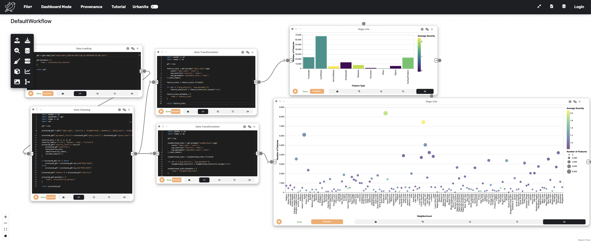
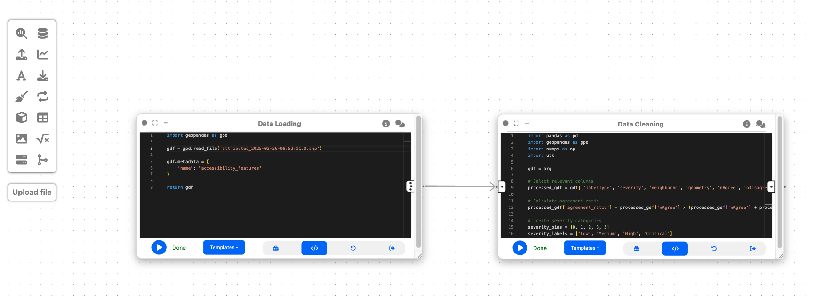
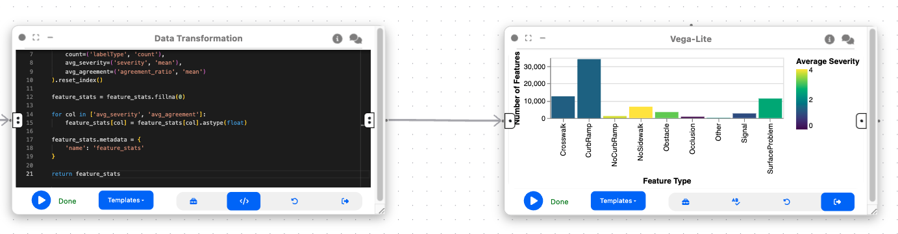
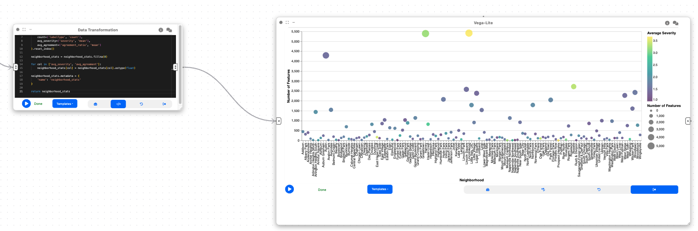

# Example: Visual Analytics of Sidewalk Accessibility Data

Author: [makaveli2P](https://github.com/makaveli2P)

In this example, we will explore how Curio can be used to analyze and visualize sidewalk accessibility data from Project Sidewalk. This pipeline enables urban planners and accessibility advocates to identify accessibility issues, prioritize areas for improvement, and make data-driven decisions. Here is the overview of the entire dataflow pipeline:



Before you begin, please familiarize yourself with Curio's main concepts and functionalities by reading our [usage guide](https://github.com/urban-toolkit/curio/blob/main/docs/USAGE.md).

The data for this tutorial can be found [here](https://sidewalk-chicago.cs.washington.edu/api). Download the Shapefile of the Access Attributes with labels. 

For completeness, we also include the template code in each dataflow step.


## Step 1: Load sidewalk accessibility data

The icons on the left-hand side can be used to instantiate different nodes. Let's start by creating a "Data Loading" node to import the shapefile data containing accessibility features:

```python
import geopandas as gpd

gdf = gpd.read_file('attributes_2025-02-26-08/52/11.0../data/.shp')

gdf.metadata = {
    'name': 'accessibility_features'
}

return gdf
```



This node loads geospatial data containing information about different types of sidewalk accessibility features, such as curb ramps, missing curb ramps, obstacles, and surface problems. The data includes attributes like feature type, severity, neighborhood, and geometry.

## Step 2: Data cleaning and processing

Now, let's create a "Data Cleaning" node and connect it to the output of Step 1. This node will prepare our data for visualization by:
1. Selecting relevant columns
2. Calculating agreement metrics
3. Categorizing severity levels
4. Adding necessary information for UTK visualization

```python
import pandas as pd
import geopandas as gpd
import numpy as np
import utk

gdf = arg

processed_gdf = gdf[['labelType', 'severity', 'neighborhd', 'geometry', 'nAgree', 'nDisagree']]

processed_gdf['agreement_ratio'] = processed_gdf['nAgree'] / (processed_gdf['nAgree'] + processed_gdf['nDisagree'])

severity_bins = [0, 1, 2, 3, 5]
severity_labels = ['Low', 'Medium', 'High', 'Critical']
processed_gdf['severity_level'] = pd.cut(
    processed_gdf['severity'],
    bins=severity_bins,
    labels=severity_labels,
    include_lowest=True
)

if processed_gdf.crs is None:
    processed_gdf = processed_gdf.set_crs("EPSG:4326")
else:
    processed_gdf = processed_gdf.to_crs("EPSG:4326")

processed_gdf['thematic'] = processed_gdf['severity']

processed_gdf.metadata = {
    'name': 'accessibility_analysis'
}

return processed_gdf
```

This cleaning step is essential because:
- It extracts only the relevant attributes for our analysis
- The agreement ratio helps us understand the consensus about each feature
- Severity categories make it easier to visualize different levels of accessibility issues
- The correct coordinate reference system ensures proper geospatial visualization
- The thematic value enables color coding in UTK visualizations

## Step 3: Feature type analysis

To understand the distribution of accessibility issues by type, we'll create an "Data Transformation" node connected to the output of Step 2:

```python
import pandas as pd
import numpy as np

gdf = arg

feature_stats = gdf.groupby('labelType').agg(
    count=('labelType', 'count'),
    avg_severity=('severity', 'mean'),
    avg_agreement=('agreement_ratio', 'mean')
).reset_index()

feature_stats = feature_stats.fillna(0)

for col in ['avg_severity', 'avg_agreement']:
    feature_stats[col] = feature_stats[col].astype(float)

feature_stats.metadata = {
    'name': 'feature_stats'
}

return feature_stats
```

This analysis aggregates the data by feature type to help us:
- Identify which types of accessibility issues are most common
- Compare the average severity across different feature types
- Understand the level of agreement about different features

## Step 4: Neighborhood analysis

To compare accessibility issues across different neighborhoods, we'll create another "Data Transformation" node connected to the output of Step 2:

```python
import pandas as pd
import numpy as np

gdf = arg

neighborhood_stats = gdf.groupby('neighborhd').agg(
    count=('labelType', 'count'),
    avg_severity=('severity', 'mean'),
    avg_agreement=('agreement_ratio', 'mean')
).reset_index()

neighborhood_stats = neighborhood_stats.fillna(0)

for col in ['avg_severity', 'avg_agreement']:
    neighborhood_stats[col] = neighborhood_stats[col].astype(float)

neighborhood_stats.metadata = {
    'name': 'neighborhood_stats'
}

return neighborhood_stats
```

This analysis is crucial because it helps urban planners:
- Identify neighborhoods with the highest concentration of accessibility issues
- Compare the severity of issues across different areas
- Prioritize neighborhoods for accessibility improvements


## Step 5: Feature type distribution visualization

To complement the spatial visualization, let's create a "2D Plot (Vega Lite)" node connected to the output of Step 3 (feature_stats):

```json
{
  "$schema": "https://vega.github.io/schema/vega-lite/v5.json",
  "data": {"name": "feature_stats"},
  "mark": "bar",
  "encoding": {
    "x": {
      "field": "labelType",
      "type": "nominal",
      "title": "Feature Type"
    },
    "y": {
      "field": "count",
      "type": "quantitative",
      "title": "Number of Features"
    },
    "color": {
      "field": "avg_severity",
      "type": "quantitative",
      "title": "Average Severity",
      "scale": {
        "scheme": "viridis"
      }
    },
    "tooltip": [
      {"field": "labelType", "type": "nominal", "title": "Feature Type"},
      {"field": "count", "type": "quantitative", "title": "Count"},
      {"field": "avg_severity", "type": "quantitative", "title": "Avg Severity", "format": ".2f"},
      {"field": "avg_agreement", "type": "quantitative", "title": "Avg Agreement", "format": ".2f"}
    ]
  }
}
```




This bar chart visualization provides a clear view of:
- The distribution of different types of accessibility issues
- A comparison of their frequencies
- The average severity of each type (through color coding)
- Additional metrics through tooltips for interactive exploration

## Step 6: Neighborhood comparison visualization

Let's create another "2D Plot (Vega Lite)" node connected to the output of Step 4 (neighborhood_stats):

```json
{
  "$schema": "https://vega.github.io/schema/vega-lite/v5.json",
  "data": {"name": "neighborhood_stats"},
  "mark": "circle",
  "encoding": {
    "x": {
      "field": "neighborhd",
      "type": "nominal",
      "title": "Neighborhood"
    },
    "y": {
      "field": "count",
      "type": "quantitative",
      "title": "Number of Features"
    },
    "size": {
      "field": "count",
      "type": "quantitative",
      "title": "Number of Features",
      "scale": {
        "range": [50, 500]
      }
    },
    "color": {
      "field": "avg_severity",
      "type": "quantitative",
      "title": "Average Severity",
      "scale": {
        "scheme": "viridis"
      }
    },
    "tooltip": [
      {"field": "neighborhd", "type": "nominal", "title": "Neighborhood"},
      {"field": "count", "type": "quantitative", "title": "Count"},
      {"field": "avg_severity", "type": "quantitative", "title": "Avg Severity", "format": ".2f"},
      {"field": "avg_agreement", "type": "quantitative", "title": "Avg Agreement", "format": ".2f"}
    ]
  }
}
```


This bubble chart visualization is valuable because it:
- Shows the distribution of issues across neighborhoods
- Uses size to indicate the number of issues (larger bubbles = more issues)
- Uses color to represent severity (darker colors = higher severity)
- Enables comparison of neighborhoods for prioritization


## Final result

This workflow creates a visual analytics system for sidewalk accessibility data. By combining spatial visualization with statistical analysis, urban planners and accessibility advocates can:

1. Identify patterns in accessibility issues across the city
2. Compare the distribution and severity of different types of issues
3. Prioritize neighborhoods for accessibility improvements
4. Make data-driven decisions for urban planning

The interactive nature of the visualizations allows for exploration and discovery, giving insights into urban accessibility challenges. This can ultimately help make cities more accessible for everyone, particularly people with mobility impairments. 
