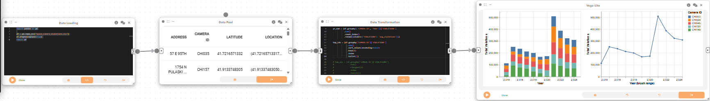
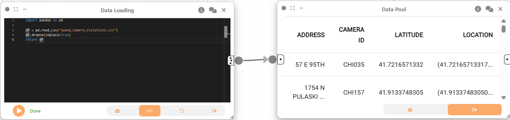
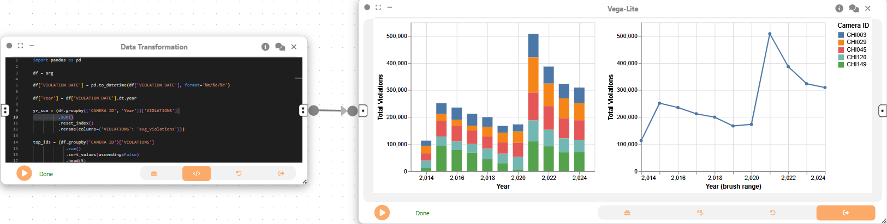
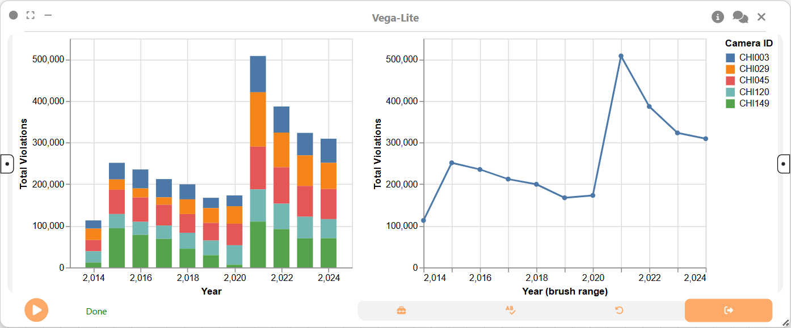

# Example: Visual analytics of speed camera violations

Author: Ameer Mustafa, Filip Petrev, Sania Sohail, Aakash Kolli

In this example, we will explore how Curio can facilitate the temporal analysis of urban mobility data by processing and aggregating tabular records to analyze and visualize trends in speed camera violations across Chicago.

Here is the overview of the entire dataflow pipeline:



Before you begin, please familiarize yourself with Curio’s main concepts and functionalities by reading our [usage guide](https://github.com/urban-toolkit/curio/blob/main/docs/USAGE.md).

The data for this tutorial can be found [here](../data/Speed_Camera_Violations.zip).

For completeness, we also include the template code in each dataflow step.

## Step 1: Load speed camera violatiions data

We begin creating a Data Loading node to load the speed camera violations dataset into Curio.

```python
import pandas as pd

df = pd.read_csv("Speed_Camera_Violations../data/../data/.csv")
df.dropna(inplace=True)
return df
```



## Step 2: Data Pool

Next, we create a Data Pool node, which passes the cleaned DataFrame to downstream nodes for further transformation and visualization.

## Step 3: Data Transformation – Top 5 Cameras by Violations per Year

Now, we will create a Data transformation node connected to the output of Step 2:

```python
import pandas as pd

df = arg

df['VIOLATION DATE'] = pd.to_datetime(df['VIOLATION DATE'], format='%m/%d/%Y')

df['Year'] = df['VIOLATION DATE'].dt.year

yr_sum = (df.groupby(['CAMERA ID', 'Year'])['VIOLATIONS']
          .sum()
          .reset_index()
          .rename(columns={'VIOLATIONS': 'avg_violations'}))

top_ids = (df.groupby('CAMERA ID')['VIOLATIONS']
             .sum()
             .sort_values(ascending=False)
             .head(5)
             .index
             .tolist())

yr_sum = yr_sum[yr_sum['CAMERA ID'].isin(top_ids)]

camera_pos = (df.groupby('CAMERA ID')[['LATITUDE', 'LONGITUDE']]
                .mean()
                .reset_index())

yr_sum = yr_sum.merge(camera_pos, on='CAMERA ID')

return yr_sum
```



This analysis aggregates the violations by camera and year, identifying the top 5 cameras with the highest total violations.

## Step 4: Linked View Visualization – Interactive Exploration

We then create a linked view visualization using the 2D Plot (Vega-Lite) node. This visualization includes both a stacked bar chart and a line chart to explore total violations over time.

```json
{
  "$schema": "https://vega.github.io/schema/vega-lite/v5.json",
  "data": { "name": "table" },
  "config": { "bar": { "continuousBandSize": 18 } },
  "hconcat": [
    {
      "width": 320,
      "height": 260,
      "selection": { "yrBrush": { "type": "interval", "encodings": ["x"] } },
      "mark": { "type": "bar" },
      "encoding": {
        "x": { "field": "Year", "type": "quantitative", "title": "Year" },
        "y": {
          "aggregate": "sum",
          "field": "avg_violations",
          "type": "quantitative",
          "title": "Total Violations"
        },
        "color": {
          "field": "CAMERA ID",
          "type": "nominal",
          "legend": { "title": "Camera ID" }
        }
      }
    },
    {
      "width": 320,
      "height": 260,
      "transform": [
        { "filter": { "selection": "yrBrush" } },
        {
          "aggregate": [
            { "op": "sum", "field": "avg_violations", "as": "total" }
          ],
          "groupby": ["Year"]
        },
        { "sort": { "field": "Year" } }
      ],
      "mark": { "type": "line", "point": true },
      "encoding": {
        "x": {
          "field": "Year",
          "type": "quantitative",
          "title": "Year (brush range)"
        },
        "y": {
          "field": "total",
          "type": "quantitative",
          "title": "Total Violations"
        }
      }
    }
  ]
}
```



## Final result

This example demonstrates how Curio can be used for a detailed temporal analysis of urban safety data. By transforming and aggregating violation records, we can generate interactive visualizations like stacked bar charts and linked views to effectively identify and compare trends over time. This workflow allows for a deeper understanding of violation patterns and the performance of specific camera locations.
