# Example: Urban traffic violation analysis

Authors: Niketan Doddamani, Purvi Vadher, Sanjay Kalaivanan, Aakash Kolli

In this example, we will explore how Curio can be used to construct a comprehensive dataflow for analyzing and visualizing urban red-light traffic violations. This example demonstrates how to load, process, and visualize urban traffic data, enabling insights into violation patterns, enforcement effectiveness, and spatial trends.

Here is the overview of the entire dataflow pipeline:

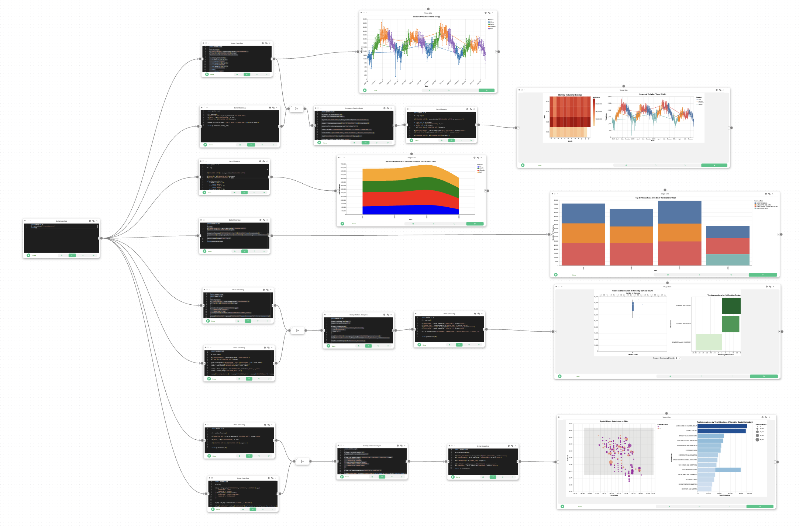


Before you begin, please familiarize yourself with Curio’s main concepts and functionalities by reading our [usage guide](https://github.com/urban-toolkit/curio/blob/main/docs/USAGE.md).

The data for this tutorial can be found [here](../data/red-light-violation.zip).

For completeness, we also include the template code in each dataflow step.

## Step 1: Load the red-light violation data

We begin by loading the red-light violation data into Curio using a Data Loading node. This step reads the CSV file and prepares it for further processing.

```python
import pandas as pd

df = pd.read_csv("Filtered_Data../data/../data/.csv")
return df
```

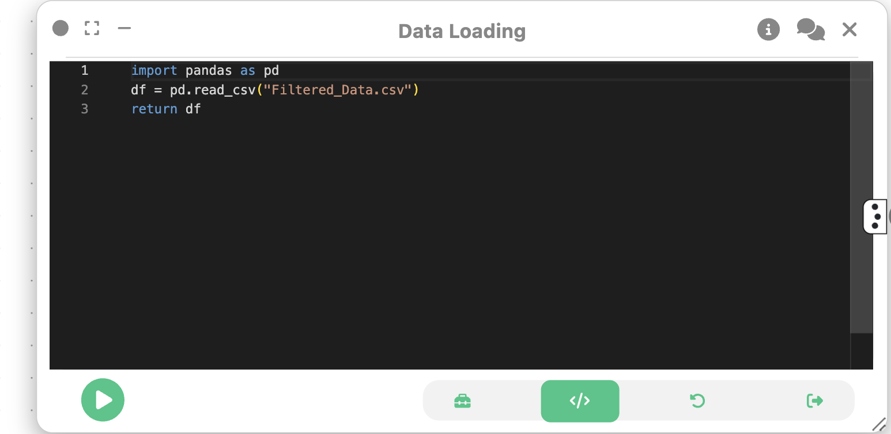

## Step 2: Dataflow to Observe Seasonal Violation Trends

We will create a basic dataflow that consists of the Data Loading node, a Data Cleaning node, and a 2D Plot (Vega-Lite) node. This will allow us to observe seasonal trends in red-light violations over time.

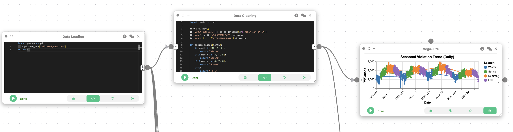

We create a Data Cleaning node and connect it to the Data Loading node. This node will be used to extract relevant temporal features from the data and prepare it for trend analysis. This involves parsing dates, extracting months and years, and assigning seasons.

```python
import pandas as pd

df = arg.copy()
df['VIOLATION DATE'] = pd.to_datetime(df['VIOLATION DATE'])
df['Year'] = df['VIOLATION DATE'].dt.year
df['Month'] = df['VIOLATION DATE'].dt.month

def assign_season(month):
    if month in [12, 1, 2]:
        return "Winter"
    elif month in [3, 4, 5]:
        return "Spring"
    elif month in [6, 7, 8]:
        return "Summer"
    else:
        return "Fall"

df['Season'] = df['Month'].apply(assign_season)

df_trend = df.groupby(['VIOLATION DATE', 'Year', 'Season'])['VIOLATIONS'].sum().reset_index()
df_trend['VIOLATION DATE'] = df_trend['VIOLATION DATE'].astype(str)

return pd.DataFrame(df_trend)
```

Now, to visualize the seasonal trends in red-light violations, we then create a 2D Plot (Vega-Lite) node that shows the number of violations over time, categorized by season.

```json
{
  "$schema": "https://vega.github.io/schema/vega-lite/v5.json",
  "width": 750,
  "height": 400,
  "title": "Seasonal Violation Trend (Daily)",
  "mark": {
    "type": "line",
    "point": true
  },
  "encoding": {
    "x": {
      "field": "VIOLATION DATE",
      "type": "temporal",
      "title": "Date",
      "axis": {
        "format": "%Y %b",
        "labelAngle": -45
      }
    },
    "y": {
      "field": "VIOLATIONS",
      "type": "quantitative",
      "title": "Violations"
    },
    "color": {
      "field": "Season",
      "type": "nominal",
      "title": "Season",
      "scale": {
        "domain": ["Winter", "Spring", "Summer", "Fall"],
        "range": ["#1f77b4", "#2ca02c", "#ff7f0e", "#9467bd"]
      }
    },
    "tooltip": [
      { "field": "VIOLATION DATE", "type": "temporal", "title": "Date" },
      { "field": "Season", "type": "nominal" },
      { "field": "VIOLATIONS", "type": "quantitative" }
    ]
  }
}
```


## Step 3: Dataflow to Observe Monthly and Seasonal Violation Trends

  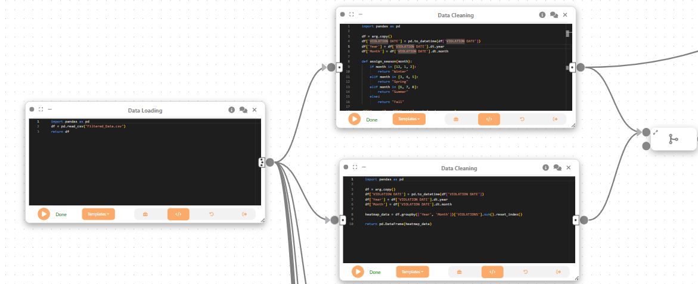
<figure>
  <figcaption>The top node is the Data Loading node from Step 1. The bottom node is the Data Cleaning node created in this step.</figcaption>
</figure>

Next, we create a new Data Cleaning node (bottom node in the above image) to prepare the data for a heatmap visualization. This node will aggregate violations by month and year, allowing us to analyze monthly trends.

Then, we create a Merge Flow to combine both Data Cleaning nodes, allowing us to analyze both daily violation trends and monthly totals.

```python
import pandas as pd

df = arg.copy()
df['VIOLATION DATE'] = pd.to_datetime(df['VIOLATION DATE'])
df['Year'] = df['VIOLATION DATE'].dt.year
df['Month'] = df['VIOLATION DATE'].dt.month

heatmap_data = df.groupby(['Year', 'Month'])['VIOLATIONS'].sum().reset_index()

return pd.DataFrame(heatmap_data)
```


Then, we create a Computational Analysis node that merges the daily violation data with the monthly heatmap data.

```python
import pandas as pd

df_trend = pd.DataFrame(arg[0])
heatmap_data = pd.DataFrame(arg[1])

df_trend['VIOLATION DATE'] = pd.to_datetime(df_trend['VIOLATION DATE'])

summary = heatmap_data.groupby('Year')['VIOLATIONS'].sum().reset_index()

merged = df_trend.merge(summary, on='Year', how='left')

final = merged[['VIOLATION DATE', 'VIOLATIONS_x', 'Season', 'VIOLATIONS_y']]

final.columns = ['VIOLATION DATE', 'Daily Violations', 'Season', 'Yearly Total']

final['VIOLATION DATE'] = final['VIOLATION DATE'].astype(str)

array_data = final.to_dict(orient='records')

shape = [final.shape[0], final.shape[1]]

return pd.DataFrame(array_data)
```

We then create a Data Cleaning node to ensure the data is in the correct format for visualization. This includes converting date fields to strings and ensuring numeric fields are properly formatted.

```python
import pandas as pd

df = arg.copy()

df['VIOLATION DATE'] = pd.to_datetime(df['VIOLATION DATE'], errors='coerce')

if 'Year' not in df.columns:
    df['Year'] = df['VIOLATION DATE'].dt.year
if 'Month' not in df.columns:
    df['Month'] = df['VIOLATION DATE'].dt.month

df['Daily Violations'] = pd.to_numeric(df['Daily Violations'], errors='coerce')
df['Yearly Total'] = pd.to_numeric(df['Yearly Total'], errors='coerce')

df['VIOLATION DATE'] = df['VIOLATION DATE'].astype(str)

return pd.DataFrame(df)
```

Lastly, we create a 2D Plot (Vega-Lite) node to visualize both monthly and seasonal trends in red-light violations. This visualization will include a heatmap for monthly violations and a line chart for daily violations, allowing users to explore trends interactively.

```json
{
  "$schema": "https://vega.github.io/schema/vega-lite/v5.json",
  "hconcat": [
    {
      "width": 300,
      "height": 300,
      "title": "Monthly Violations Heatmap",
      "params": [
        {
          "name": "yearFilter",
          "select": {
            "type": "point",
            "fields": ["Year"],
            "on": "click"
          }
        }
      ],
      "mark": "rect",
      "encoding": {
        "x": {
          "field": "Month",
          "type": "ordinal",
          "title": "Month"
        },
        "y": {
          "field": "Year",
          "type": "ordinal",
          "title": "Year"
        },
        "color": {
          "aggregate": "sum",
          "field": "Yearly Total",
          "type": "quantitative",
          "scale": {
            "scheme": "orangered"
          },
          "title": "Violations"
        },
        "tooltip": [
          { "field": "Year", "type": "ordinal" },
          { "field": "Month", "type": "ordinal" },
          {
            "aggregate": "sum",
            "field": "Yearly Total",
            "type": "quantitative",
            "title": "Total Violations"
          }
        ]
      }
    },
    {
      "width": 600,
      "height": 300,
      "title": "Seasonal Violation Trend (Daily)",
      "transform": [
        {
          "filter": "yearFilter.Year == null || datum.Year == yearFilter.Year"
        }
      ],
      "mark": "line",
      "encoding": {
        "x": {
          "field": "VIOLATION DATE",
          "type": "temporal",
          "title": "Date"
        },
        "y": {
          "field": "Daily Violations",
          "type": "quantitative",
          "title": "Violations"
        },
        "color": {
          "field": "Season",
          "type": "nominal"
        },
        "tooltip": [
          { "field": "VIOLATION DATE", "type": "temporal" },
          { "field": "Daily Violations", "type": "quantitative" },
          { "field": "Season", "type": "nominal" }
        ]
      }
    }
  ]
}
```

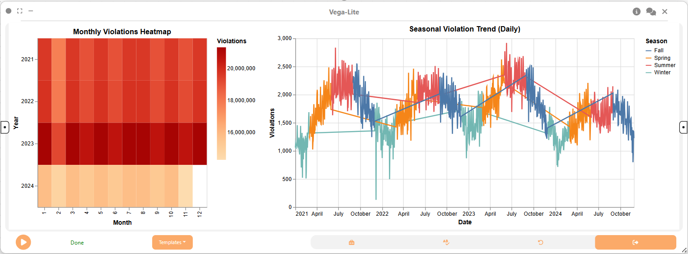

## Step 4: Dataflow to Create Stacked Area Chart

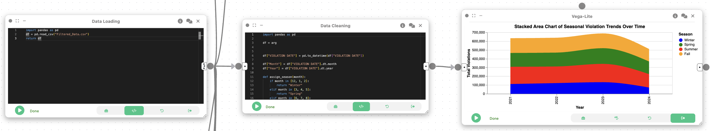

First, we create a Data Cleaning node to prepare the data for seasonal analysis. This node will extract the month and year from the violation date, assign seasons, and aggregate violations by year and season.

```python
import pandas as pd

df = arg

df["VIOLATION DATE"] = pd.to_datetime(df["VIOLATION DATE"])

df["Month"] = df["VIOLATION DATE"].dt.month
df["Year"] = df["VIOLATION DATE"].dt.year

def assign_season(month):
    if month in [12, 1, 2]:
        return "Winter"
    elif month in [3, 4, 5]:
        return "Spring"
    elif month in [6, 7, 8]:
        return "Summer"
    else:
        return "Fall"

df["Season"] = df["Month"].apply(assign_season)

df_seasonal = df.groupby(["Year", "Season"])["VIOLATIONS"].sum().reset_index()

return pd.DataFrame(df_seasonal)
```

Then, we use a Vega-Lite node to create a stacked area chart to visualize how red-light violations change over time across different seasons.

```json
{
  "$schema": "https://vega.github.io/schema/vega-lite/v5.json",
  "title": "Seasonal Red-Light Violations Over Time",
  "mark": "area",
  "encoding": {
    "x": {
      "field": "Year",
      "type": "ordinal",
      "title": "Year"
    },
    "y": {
      "field": "VIOLATIONS",
      "type": "quantitative",
      "title": "Total Violations"
    },
    "color": {
      "field": "Season",
      "type": "nominal",
      "title": "Season"
    },
    "tooltip": [
      { "field": "Year", "type": "ordinal" },
      { "field": "Season", "type": "nominal" },
      { "field": "VIOLATIONS", "type": "quantitative" }
    ]
  },
  "width": 600,
  "height": 400
}
```


## Step 5: Data Flow to Visualize Top Intersections by Violations

First, we create a Data Cleaning node to prepare the data for visualizing the top intersections with the most violations. This involves aggregating violations by intersection and year, and ranking them to identify the top 3 intersections for each year.

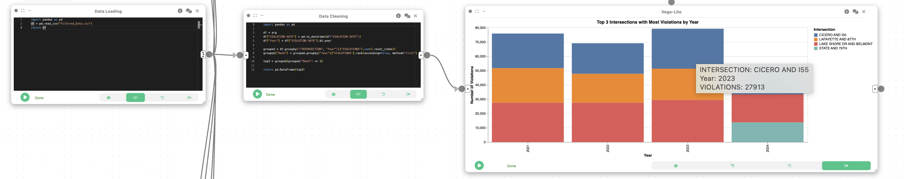

```python
import pandas as pd

df = arg
df["VIOLATION DATE"] = pd.to_datetime(df["VIOLATION DATE"])
df["Year"] = df["VIOLATION DATE"].dt.year

grouped = df.groupby(["INTERSECTION", "Year"])["VIOLATIONS"].sum().reset_index()
grouped["Rank"] = grouped.groupby("Year")["VIOLATIONS"].rank(ascending=False, method="first")

top3 = grouped[grouped["Rank"] <= 3]

return pd.DataFrame(top3)
```

We then make a 2D Plot (Vega-Lite) node to visualize the top intersections using a stacked bar chart.

```json
{
  "$schema": "https://vega.github.io/schema/vega-lite/v5.json",
  "title": "Top 3 Intersections with Most Violations by Year",
  "mark": "bar",
  "encoding": {
    "x": {
      "field": "Year",
      "type": "ordinal",
      "title": "Year"
    },
    "y": {
      "field": "VIOLATIONS",
      "type": "quantitative",
      "title": "Violations"
    },
    "color": {
      "field": "INTERSECTION",
      "type": "nominal",
      "title": "Intersection"
    },
    "tooltip": [
      { "field": "INTERSECTION", "type": "nominal" },
      { "field": "VIOLATIONS", "type": "quantitative" }
    ]
  },
  "width": 600,
  "height": 400
}
```
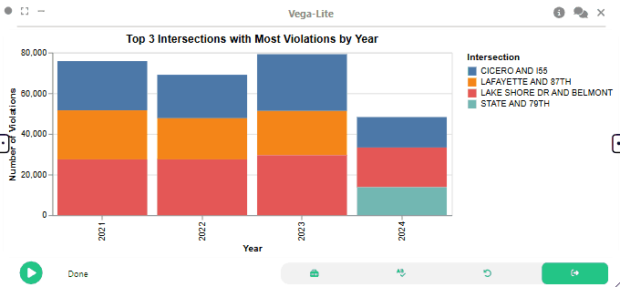
## Step 6: Dataflow to Visualize Camera Count vs. Violation Distribution

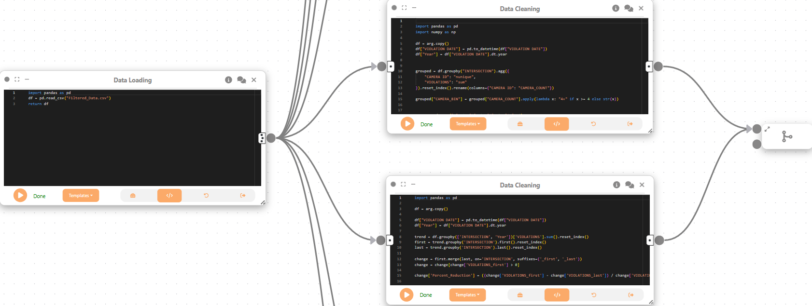

First, we create two Data Cleaning nodes to prepare the data for further analysis. The first node aggregates camera counts and violations by intersection, while the second node calculates the percentage reduction in violations over time.

We then create a Merge Flow to combine the results from both Data Cleaning nodes, allowing us to analyze camera deployment and compliance trends.

### First Data Cleaning Node

```python

import pandas as pd
import numpy as np

df = arg.copy()
df["VIOLATION DATE"] = pd.to_datetime(df["VIOLATION DATE"])
df["Year"] = df["VIOLATION DATE"].dt.year


grouped = df.groupby("INTERSECTION").agg({
    "CAMERA ID": "nunique",
    "VIOLATIONS": "sum"
}).reset_index().rename(columns={"CAMERA ID": "CAMERA_COUNT"})

grouped["CAMERA_BIN"] = grouped["CAMERA_COUNT"].apply(lambda x: "4+" if x >= 4 else str(x))


camera_order = {"1": 1, "2": 2, "3": 3, "4+": 4}
grouped["x_base"] = grouped["CAMERA_BIN"].map(camera_order)
np.random.seed(42)
grouped["jittered_x"] = grouped["x_base"] + np.random.uniform(-0.2, 0.2, size=len(grouped))


return pd.DataFrame(grouped)
```

### Second Data Cleaning Node

```python
import pandas as pd

df = arg.copy()

df["VIOLATION DATE"] = pd.to_datetime(df["VIOLATION DATE"])
df["Year"] = df["VIOLATION DATE"].dt.year

trend = df.groupby(['INTERSECTION', 'Year'])['VIOLATIONS'].sum().reset_index()
first = trend.groupby('INTERSECTION').first().reset_index()
last = trend.groupby('INTERSECTION').last().reset_index()

change = first.merge(last, on='INTERSECTION', suffixes=('_first', '_last'))
change = change[change['VIOLATIONS_first'] > 0]

change['Percent_Reduction'] = ((change['VIOLATIONS_first'] - change['VIOLATIONS_last']) / change['VIOLATIONS_first']) * 100


return pd.DataFrame(change)
```

We then create a Merge Flow to combine the results from both Data Cleaning nodes, allowing us to analyze camera deployment and compliance trends.


Now, we create a Computational Analysis node to merge the results from the two Data Cleaning nodes. This node will combine the aggregated camera counts and violations with the percentage reduction in violations, preparing the data for visualization.

```python
import pandas as pd

grouped = pd.DataFrame(arg[0])
change = pd.DataFrame(arg[1])

merged = grouped.merge(
    change[['INTERSECTION', 'Percent_Reduction']],
    on='INTERSECTION',
    how='left'
)

merged['VIOLATIONS'] = pd.to_numeric(merged['VIOLATIONS'], errors='coerce')
merged['Percent_Reduction'] = pd.to_numeric(merged['Percent_Reduction'], errors='coerce')

merged = merged.dropna(subset=['Percent_Reduction'])

array_data = merged.to_dict(orient='records')

shape = [merged.shape[0], merged.shape[1]]

return pd.DataFrame(array_data)
```

Next, we create a Data Cleaning node to ensure the data is in the correct format for visualization. This includes converting numeric fields to appropriate types and dropping any rows with missing values.

```python
import pandas as pd

df = arg.copy()

df['VIOLATIONS'] = pd.to_numeric(df['VIOLATIONS'], errors='coerce')
df['CAMERA_COUNT'] = pd.to_numeric(df['CAMERA_COUNT'], errors='coerce')
df['Percent_Reduction'] = pd.to_numeric(df['Percent_Reduction'], errors='coerce')
df['jittered_x'] = pd.to_numeric(df['jittered_x'], errors='coerce')

df = df.dropna(subset=['VIOLATIONS', 'CAMERA_COUNT', 'Percent_Reduction', 'jittered_x'])


return pd.DataFrame(df)
```

Lastly, we use a linked visualization to show violation distribution and compliance by camera count.

```json
{
  "$schema": "https://vega.github.io/schema/vega-lite/v5.json",
  "params": [
    {
      "name": "cameraFilter",
      "bind": {
        "input": "select",
        "options": ["1", "2", "3", "4+"],
        "labels": ["1 Camera", "2 Cameras", "3 Cameras", "4+ Cameras"]
      }
    }
  ],
  "hconcat": [
    {
      "width": 500,
      "mark": "boxplot",
      "encoding": {
        "x": {
          "field": "CAMERA_BIN",
          "type": "nominal",
          "title": "Camera Count"
        },
        "y": {
          "field": "VIOLATIONS",
          "type": "quantitative",
          "title": "Violations"
        },
        "color": {
          "field": "CAMERA_BIN",
          "type": "nominal"
        }
      }
    },
    {
      "width": 500,
      "mark": {
        "type": "bar",
        "cursor": "pointer"
      },
      "transform": [
        { "filter": "cameraFilter == null || datum.CAMERA_BIN == cameraFilter" }
      ],
      "encoding": {
        "x": {
          "field": "Percent_Reduction",
          "type": "quantitative",
          "title": "Percent Reduction"
        },
        "y": {
          "field": "INTERSECTION",
          "type": "nominal",
          "sort": "-x",
          "title": "Intersection"
        },
        "color": {
          "field": "Percent_Reduction",
          "type": "quantitative",
          "scale": { "scheme": "blues" }
        }
      }
    }
  ]
}
```

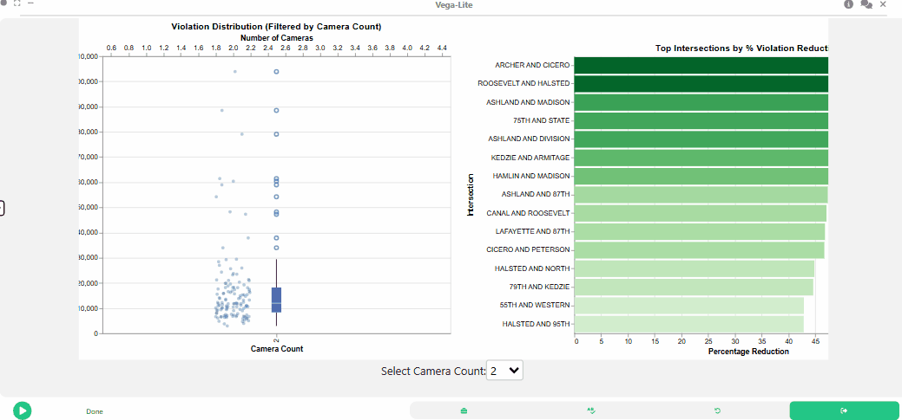

## Step 7: Dataflow to Visualize Spatial Distribution of Red-Light Violations

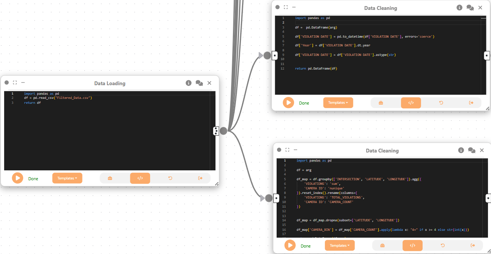

We create two Data Cleaning nodes to prepare the data for spatial visualization. The first node extracts the year from the violation date and formats it, while the second node aggregates violations by intersection, latitude, and longitude, preparing it for mapping.

We then create a Merge Flow to combine the results from both Data Cleaning nodes.

### First Data Cleaning Node

```python
import pandas as pd

df =  pd.DataFrame(arg)

df['VIOLATION DATE'] = pd.to_datetime(df['VIOLATION DATE'], errors='coerce')

df['Year'] = df['VIOLATION DATE'].dt.year

df['VIOLATION DATE'] = df['VIOLATION DATE'].astype(str)


return pd.DataFrame(df)
```

### Second Data Cleaning Node

```python
import pandas as pd

df = arg

df_map = df.groupby(['INTERSECTION', 'LATITUDE', 'LONGITUDE']).agg({
    'VIOLATIONS': 'sum',
    'CAMERA ID': 'nunique'
}).reset_index().rename(columns={
    'VIOLATIONS': 'TOTAL_VIOLATIONS',
    'CAMERA ID': 'CAMERA_COUNT'
})


df_map = df_map.dropna(subset=['LATITUDE', 'LONGITUDE'])

df_map['CAMERA_BIN'] = df_map['CAMERA_COUNT'].apply(lambda x: "4+" if x >= 4 else str(int(x)))

return pd.DataFrame(df_map)
```

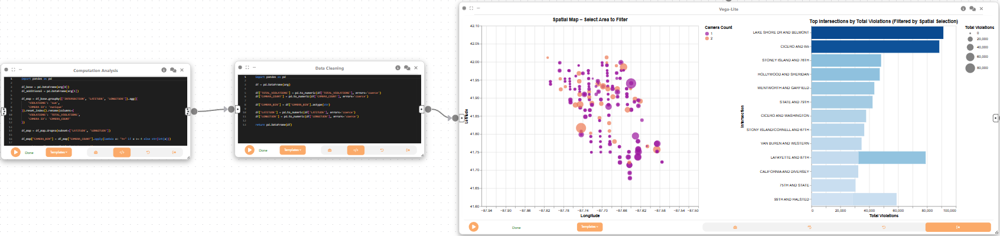

Next, we create a Computational Analysis node to prepare the data for spatial visualization. This node aggregates violations by intersection, latitude, and longitude, and calculates the total number of violations and unique camera counts.

```python
import pandas as pd

df_base = pd.DataFrame(arg[0])
df_additional = pd.DataFrame(arg[1])

df_map = df_base.groupby(['INTERSECTION', 'LATITUDE', 'LONGITUDE']).agg({
    'VIOLATIONS': 'sum',
    'CAMERA ID': 'nunique'
}).reset_index().rename(columns={
    'VIOLATIONS': 'TOTAL_VIOLATIONS',
    'CAMERA ID': 'CAMERA_COUNT'
})

df_map = df_map.dropna(subset=['LATITUDE', 'LONGITUDE'])

df_map["CAMERA_BIN"] = df_map["CAMERA_COUNT"].apply(lambda x: "4+" if x >= 4 else str(int(x)))

array_data = df_map.to_dict(orient='records')

return pd.DataFrame(array_data)
```

We then create a Data Cleaning node to ensure the data is in the correct format for spatial visualization. This includes converting numeric fields to appropriate types and ensuring latitude and longitude are numeric.

```python
import pandas as pd

df = pd.DataFrame(arg)

df['TOTAL_VIOLATIONS'] = pd.to_numeric(df['TOTAL_VIOLATIONS'], errors='coerce')
df['CAMERA_COUNT'] = pd.to_numeric(df['CAMERA_COUNT'], errors='coerce')

df['CAMERA_BIN'] = df['CAMERA_BIN'].astype(str)

df['LATITUDE'] = pd.to_numeric(df['LATITUDE'], errors='coerce')
df['LONGITUDE'] = pd.to_numeric(df['LONGITUDE'], errors='coerce')

return pd.DataFrame(df)
```

Lastly, we create a 2D Plot (Vega-Lite) node to visualize the spatial distribution of red-light violations across intersections in Chicago. This visualization will allow users to explore the geographic patterns of violations and camera deployment.


```json
{
  "$schema": "https://vega.github.io/schema/vega-lite/v5.json",
  "hconcat": [
    {
      "width": 600,
      "height": 500,
      "title": "Spatial Map – Select Area to Filter",
      "params": [
        {
          "name": "spatialBrush",
          "select": {
            "type": "interval",
            "encodings": ["x", "y"]
          }
        }
      ],
      "mark": "circle",
      "encoding": {
        "x": {
          "field": "LONGITUDE",
          "type": "quantitative",
          "scale": { "domain": [-87.95, -87.5] },
          "title": "Longitude"
        },
        "y": {
          "field": "LATITUDE",
          "type": "quantitative",
          "scale": { "domain": [41.6, 42.1] },
          "title": "Latitude"
        },
        "size": {
          "field": "TOTAL_VIOLATIONS",
          "type": "quantitative",
          "scale": { "range": [20, 800] },
          "title": "Total Violations"
        },
        "color": {
          "field": "CAMERA_BIN",
          "type": "nominal",
          "title": "Camera Count",
          "scale": { "scheme": "plasma" }
        },
        "tooltip": [
          { "field": "INTERSECTION", "type": "nominal" },
          { "field": "TOTAL_VIOLATIONS", "type": "quantitative" },
          { "field": "CAMERA_COUNT", "type": "quantitative" }
        ]
      }
    },
    {
      "width": 400,
      "height": 500,
      "title": "Top Intersections by Total Violations (Filtered by Spatial Selection)",
      "mark": "bar",
      "transform": [
        {
          "filter": { "param": "spatialBrush" }
        },
        {
          "window": [{ "op": "rank", "as": "rank" }],
          "sort": [{ "field": "TOTAL_VIOLATIONS", "order": "descending" }]
        },
        {
          "filter": "datum.rank <= 15"
        }
      ],
      "encoding": {
        "x": {
          "field": "TOTAL_VIOLATIONS",
          "type": "quantitative",
          "title": "Total Violations"
        },
        "y": {
          "field": "INTERSECTION",
          "type": "nominal",
          "sort": "-x",
          "title": "Intersection"
        },
        "color": {
          "field": "TOTAL_VIOLATIONS",
          "type": "quantitative",
          "scale": { "scheme": "blues" },
          "legend": null
        },
        "tooltip": [
          { "field": "INTERSECTION", "type": "nominal" },
          { "field": "TOTAL_VIOLATIONS", "type": "quantitative" }
        ]
      }
    }
  ]
}
```

## Final result

This tutorial demonstrated how Curio can be used to build a complete urban data analysis workflow, from data loading and cleaning to advanced interactive and spatial visualizations. By leveraging Curio’s modular dataflow and visualization capabilities, we can uncover temporal, spatial, and compliance patterns in urban traffic violation data, supporting informed policy and enforcement decisions.
