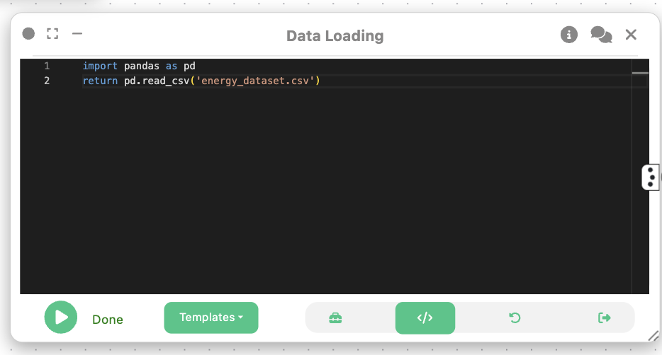
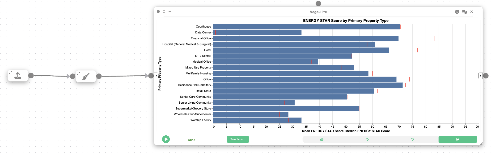

# Example: Visual analytics of building energy efficiency

Authors: Himanshu Dongre, Aakash Kolli

In this example, we will learn how Curio can be used to perform a comparative analysis of building energy performance. The process involves loading and cleaning a dataset of Chicago buildings, then making a visualization to benchmark the energy efficiency across different property types.

Here is the overview of the entire dataflow pipeline:


Before you begin, please familiarize yourself with Curio’s main concepts and functionalities by reading our [usage guide](https://github.com/urban-toolkit/curio/blob/main/docs/USAGE.md).

The data for this tutorial can be found [here](../data/energy_dataset.csv).

For completeness, we also include the template code in each dataflow step.

## Step 1: Load energy efficieency data

We begin by loading the energy efficiency dataset into Curio using a Data Loading node.

```python
import pandas as pd

df = pd.read_csv("energy_dataset../data/../data/.csv")
return df
```



## Step 2: Data cleaning and processing

Next, we create a Data Cleaning node to preprocess the data to retain only the key attributes and remove incomplete rows. We also convert the ZIP code to an integer for consistency.

```python
iedf  = arg[['Data Year', 'ID', 'Property Name', 'Address', 'ZIP Code', 'Chicago Energy Rating', 'Community Area', 'Primary Property Type', 'Gross Floor Area - Buildings (sq ft)', 'Year Built', '# of Buildings', 'ENERGY STAR Score', 'Site EUI (kBtu/sq ft)', 'Source EUI (kBtu/sq ft)', 'Weather Normalized Site EUI (kBtu/sq ft)', 'Weather Normalized Source EUI (kBtu/sq ft)', 'Total GHG Emissions (Metric Tons CO2e)', 'GHG Intensity (kg CO2e/sq ft)', 'Latitude', 'Longitude', 'Location']]

# Rename the data columns for consistency and easy use
edf.columns = ['Year', 'ID', 'Property Name', 'Address', 'ZIP Code', 'Chicago Energy Rating', 'Community Area', 'Primary Property Type', 'Gross Floor Area', 'Year Built', '# of Buildings', 'ENERGY STAR Score', 'Site EUI', 'Source EUI', 'Weather Normalized Site EUI', 'Weather Normalized Source EUI', 'Total GHG Emissions', 'GHG Intensity', 'Latitude', 'Longitude', 'Location']

# Filter out rows with missing data
edf = edf.dropna()
edf['ZIP Code'] = edf['ZIP Code'].astype(int)

return edf
```


## Step 3: Visualization – Mean and Median Chart

Then, we create a 2D Plot (Vega-Lite) node to create a bar and tick chart, which compares energy efficiency metrics across property types. This chart displays the mean and median of a selected metric (e.g., weather normalized site EUI) for each property type.

```json
{
  "$schema": "https://vega.github.io/schema/vega-lite/v5.json",
  "data": { "name": "table" },
  "title": "Mean and Median Weather Normalized Site EUI by Property Type",
  "width": 700,
  "height": 400,
  "layer": [
    {
      "mark": "bar",
      "encoding": {
        "x": {
          "field": "PRIMARY PROPERTY TYPE",
          "type": "nominal",
          "sort": "-y",
          "title": "Property Type"
        },
        "y": {
          "aggregate": "mean",
          "field": "WEATHER NORMALIZED SITE EUI (KBTU/SQ FT)",
          "type": "quantitative",
          "title": "Mean Weather Normalized Site EUI"
        },
        "color": {
          "field": "PRIMARY PROPERTY TYPE",
          "type": "nominal",
          "legend": null
        }
      }
    },
    {
      "mark": { "type": "tick", "color": "black", "size": 40 },
      "encoding": {
        "x": {
          "field": "PRIMARY PROPERTY TYPE",
          "type": "nominal"
        },
        "y": {
          "aggregate": "median",
          "field": "WEATHER NORMALIZED SITE EUI (KBTU/SQ FT)",
          "type": "quantitative"
        }
      }
    }
  ]
}
```



## Final result

The final result of this workflow is a layered chart that presents both the mean and median energy use intensity for various building types. Displaying both metrics reveals important details about the data's distribution as a large gap between the mean and median values for a category shows that a few highly inefficient buildings are skewing the average. Recognizing this distinction helps in developing more effective energy efficiency policies and programs.
