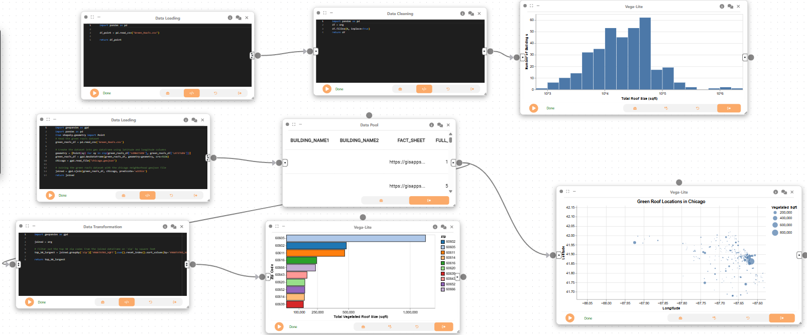
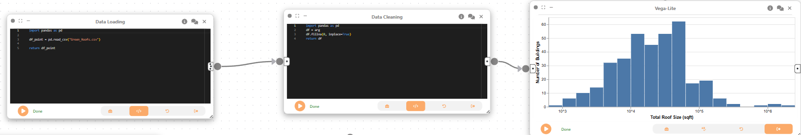
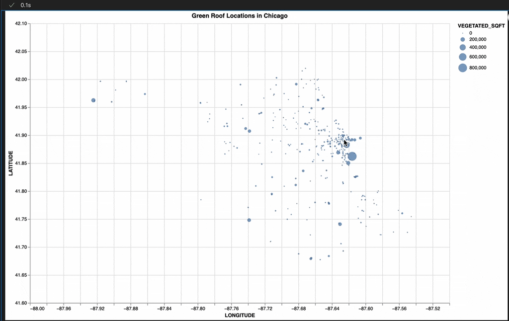
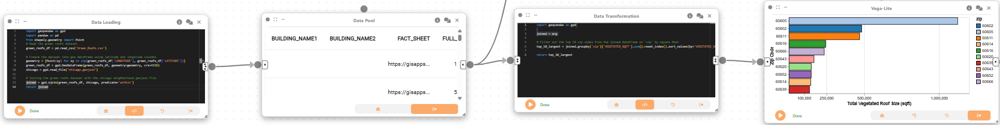

# Example: Visual analytics of green roofs

Authors: Samuel Haddad, Lorena Castillejo, Aakash Kolli

In this example, we will explore how Curio can facilitate the spatial analysis of urban green infrastructure by integrating tabular and geospatial data to analyze and visualize the distribution and density of green roofs in Chicago.


Here is the overview of the entire dataflow pipeline:



Before you begin, please familiarize yourself with Curio’s main concepts and functionalities by reading our [usage guide](https://github.com/urban-toolkit/curio/blob/main/docs/USAGE.md).

The data for this tutorial can be found [here](../data/Green_Roofs.zip).

For completeness, we also include the template code in each dataflow step.

## Step 1: Load the green roofs data

We begin the first dataflow by loading the green roofs dataset into Curio using a Data Loading node. This step reads the CSV file and prepares it for further processing. If code in a data loadning node has a runtime error, try changing the text inside the file to the full file path. Example: instead of pd.read_csv('Green_Roofs.csv'), try pd.read_csv(r'C:\Users\Username\Rest of Filepath\Green_Roofs\Green_Roofs.csv')

```python
import pandas as pd

df = pd.read_csv("Green_Roofs../data/../data/.csv")
return df
```



## Step 2: Data cleaning and processing

Next, we clean the dataset by creating a Data Cleaning node and connecting it to the previous node.

```python
import pandas as pd

df = arg
df.fillna(0, inplace=True)

return df
```

## Step 3: Histogram – Distribution of Green Roof Sizes

Now, we use a 2D Plot (Vega-Lite) node to create a histogram visualization to understand the overall distribution of green roof sizes.

```json
{
  "$schema": "https://vega.github.io/schema/vega-lite/v5.json",
  "description": "Histogram of Total Roof Size of Buildings in Chicago (log-scaled)",
  "data": {
    "name": "data"
  },
  "transform": [
    { "filter": "datum.TOTAL_ROOF_SQFT > 0" },
    {
      "calculate": "log(datum.TOTAL_ROOF_SQFT) / log(10)",
      "as": "log_roof_size"
    }
  ],
  "mark": "bar",
  "encoding": {
    "x": {
      "field": "log_roof_size",
      "bin": { "maxbins": 30 },
      "axis": {
        "title": "Total Roof Size (sqft)",
        "values": [3, 4, 5, 6],
        "labelExpr": "'10^' + datum.value"
      }
    },
    "y": {
      "aggregate": "count",
      "type": "quantitative",
      "axis": {
        "title": "Number of Buildings"
      }
    }
  }
}
```


## Step 4: Data Loading

For the next dataflow, we start with creating a Data Loading node to load in both datasets and join them.

```python
import geopandas as gpd
import pandas as pd
from shapely.geometry import Point
# Read the green roofs dataset
green_roofs_df = pd.read_csv('Green_Roofs../data/.csv')

# Create the dataset into geo dataframe using latitude and longitude columns
geometry = [Point(xy) for xy in zip(green_roofs_df['LONGITUDE'], green_roofs_df['LATITUDE'])]
green_roofs_df = gpd.GeoDataFrame(green_roofs_df, geometry=geometry, crs=4326)
chicago = gpd.read_file("chicago.geojson")

# Joining the green roofs dataset with the chicago neighborhood geojson file
joined = gpd.sjoin(green_roofs_df, chicago, predicate='within')
return joined
```


## Step 5: Data Pool

Next, we create a Data Pool node, which passes the joined dataset to downstream nodes for further transformation and visualization.

## Step 6: Spatial Distribution of Green Roofs

Then, we use the 2D Plot (Vega-Lite) node to create a dot density map to explore the spatial distribution of green roofs. Each dot represents a green roof, with its position determined by latitude and longitude, and its size encoding the green roof area.

```json
{
  "$schema": "https://vega.github.io/schema/vega-lite/v5.json",
  "description": "Dot Density Map of Green Roof Locations in Chicago with Zoom & Pan",
  "width": 500,
  "height": 600,
  "title": "Green Roof Locations in Chicago",
  "mark": "circle",
  "selection": {
    "grid": {
      "type": "interval",
      "bind": "scales"
    }
  },
  "encoding": {
    "x": {
      "field": "LONGITUDE",
      "type": "quantitative",
      "scale": { "domain": [-88.0, -87.5] },
      "axis": { "title": "Longitude" }
    },
    "y": {
      "field": "LATITUDE",
      "type": "quantitative",
      "scale": { "domain": [41.6, 42.1] },
      "axis": { "title": "Latitude" }
    },
    "size": {
      "field": "VEGETATED_SQFT",
      "type": "quantitative",
      "legend": { "title": "Vegetated Sqft" }
    },
    "tooltip": [
      { "field": "VEGETATED_SQFT", "type": "quantitative" },
      { "field": "TOTAL_ROOF_SQFT", "type": "quantitative" },
      { "field": "zip", "type": "nominal" }
    ]
  },
  "config": {
    "view": { "stroke": "transparent" }
  }
}
```



## Step 7: Data Transformation

Then, we create a Data Transformation node and connect it to the same Data Pool node as before. This node will be used to calculate the top 10 zip codes with the largest green roofs.

```python
import geopandas as gpd

joined = arg

# filter out the top 10 zip codes from the joined dataframe on 'zip' by square feet
top_10_largest = joined.groupby('zip')['VEGETATED_SQFT'].sum().reset_index().sort_values(by='VEGETATED_SQFT', ascending=False).head(10)

return top_10_largest
```



## Step 8: Visualizing Zip Codes with Largest Green Roofs

Now, we create a 2D Plot (Vega-Lite) node to create a bar chart that visualizes the top 10 zip codes with the largest green roof areas.

```json
{
  "$schema": "https://vega.github.io/schema/vega-lite/v5.json",
  "description": "Top 10 largest zip codes by green roof area",
  "width": 400,
  "height": 200,
  "selection": {
    "zip_select": {
      "type": "multi",
      "fields": ["zip"],
      "toggle": "event.shiftKey"
    }
  },
  "mark": { "type": "bar", "stroke": "black", "color": "green" },
  "encoding": {
    "x": {
      "field": "VEGETATED_SQFT",
      "type": "quantitative",
      "axis": {
        "title": "Total Vegetated Roof Size (sqft)",
        "values": [100000, 250000, 500000, 1000000],
        "format": ",d"
      }
    },
    "y": {
      "field": "zip",
      "type": "nominal",
      "sort": "-x",
      "axis": { "title": "Zip Code" }
    },
    "color": {
      "field": "zip",
      "type": "nominal",
      "scale": { "scheme": "category20" }
    },
    "opacity": {
      "condition": { "selection": "zip_select", "value": 1 },
      "value": 0.3
    },
    "tooltip": [
      { "field": "zip", "type": "nominal" },
      { "field": "VEGETATED_SQFT", "type": "quantitative" }
    ]
  }
}
```


## Final result

This example demonstrates how Curio can be used for spatial analysis of urban sustainability initiatives. By integrating tabular green roof data with geospatial boundaries, this workflow generates interactive visualizations like dot density maps and bar charts. These tools enable a deeper understanding of spatial patterns, size distributions, and key neighborhoods with high concentrations of green infrastructure.
