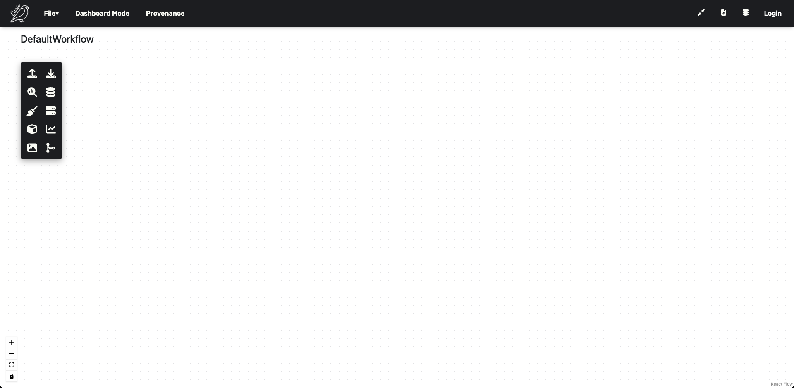
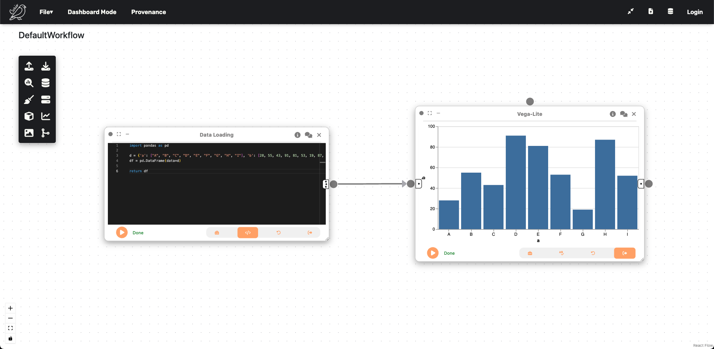

# 👟 Quick Start Tutorial

This tutorial will guide you through creating a Vega-Lite barchart visualization using the dataflow interface. We'll connect nodes to visualize a simple dataset, demonstrating Curio's core functionality.


!!! info "Before You Begin"
    Make sure you have Curio installed and running. If you haven't installed Curio yet, check out our [Installation Guide](installation.md).

---

## 🌱 Getting Started

### Step 1: Launch Curio

After installation, start Curio and open your browser to access the interface. You'll see a blank canvas ready for building your first dataflow.

### Step 2: Understanding the Blank Canvas

When you first open Curio, you'll see a blank canvas like this:



The icons on the left-hand side can be used to instantiate different nodes, including visualization ones.

---

## 📊 Creating a Barchart

In this tutorial, we are going to learn how Curio can easily help with visualizing a simple dataset using a Vega-Lite barchart.

### Step 3: Add Data Loading Node

Let's start by instantiating a **Data Loading** node:

1. **Drag** the Data Loading icon from the left sidebar.
2. **Change** the view to `Code`.
3. **Enter** the following synthetic dataset:


```python
import pandas as pd

d = {'a': ["A", "B", "C", "D", "E", "F", "G", "H", "I"], 
     'b': [28, 55, 43, 91, 81, 53, 19, 87, 52]}
df = pd.DataFrame(data=d)

return df
```
4. **Hit run** - The Python `return` will output `df` for the next node.


!!! tip "External Files"
    External files can be referenced through regular Python file handling functions, given that the file was uploaded to the server. For simplicity, we're using synthetic data here.


### Step 4: Add Vega-Lite Visualization Node

Now we'll create the visualization:

1. **Drag** a `Vega-Lite` node.
2. **Connect** it to the Data Loading node.
3. **Switch** to the `Grammar` view and enter the Vega-Lite specification.

```json
{
  "$schema": "https://vega.github.io/schema/vega-lite/v5.json",
  "description": "A simple bar chart with embedded data.",
  "mark": "bar",
  "encoding": {
    "x": {"field": "a", "type": "nominal", "axis": {"labelAngle": 0}},
    "y": {"field": "b", "type": "quantitative"}
  }
}
```
4. **Hit run**


!!! info "Data Flow Magic"
    Curio handles the data-flow automatically - Vega-Lite has access to the DataFrame outputted by the previous node.

### Step 5: See Your Results

After hitting run, you can see that a barchart was created:



!!! success "Congratulations!"
    You created your first data-flow using Curio! 🎉

---

## 🔍 What You've Learned

In this tutorial, you've learned:

- **Node Creation** - How to instantiate different types of nodes.
- **Code vs Grammar Views** - Different ways to configure nodes.
- **Data Flow** - How data passes between connected nodes.
- **Vega-Lite Integration** - Creating visualizations with grammar of graphics.

---

## 🎉 Next Steps

Congratulations! You've created your first Curio workflow. Here's what to explore next:

!!! tip "Continue Learning"
    - **Explore [Examples](../examples/examples.md)**: Check out pre-built workflows in the examples gallery.
    - **Try Advanced Features**: Experiment with UTK integration and interactive dashboards.
    - **Build Complex Workflows**: Connect multiple nodes for urban analysis pipelines.

### Common Use Cases

Curio excels at:

- **Visual Analytics** - Integrating heterogeneous urban datasets with interactive visualizations.
- **Scenario Planning** - What-if analysis and real-time urban development simulations.
- **Machine Learning Workflows** - Human-in-the-loop model training and evaluation.
- **Energy & Environment** - Building efficiency analysis and green infrastructure mapping.
- **Interactive Dashboards** - Multi-view coordinated exploration with UTK and Vega-Lite.

---

## 🆘 Need Help?

If you encounter any issues:

1. **Check Node Outputs** - Look for error messages in node execution results.
2. **Validate Connections** - Ensure data types match between connected nodes.
3. **Community Support** - Ask questions on [Discord](https://discord.gg/vjpSMSJR8r)
4. **Report Issues** - Open an issue on [GitHub](https://github.com/urban-toolkit/curio/issues)

**Ready to dive deeper?** Explore our curated [Examples](../examples/examples.md) for advanced capabilities of Curio! 🚀
