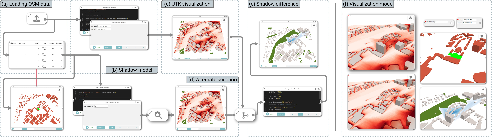

# Curio: Collaborative Urban Insight Observatory

[](https://discord.gg/vjpSMSJR8r) [](https://github.com/urban-toolkit/curio/actions/workflows/docker-compose.yml) [](https://pypi.org/project/utk-curio/) [](https://github.com/urban-toolkit/curio/graphs/contributors)

Welcome to **Curio** - a framework for collaborative urban visual analytics that uses a dataflow model with multiple abstraction levels (code, grammar, GUI elements) to facilitate collaboration across the design and implementation of visual analytics components. The framework allows experts to intertwine preprocessing, managing, and visualization stages while tracking provenance of code and visualizations.

<div align="center">
  
</div>


## Key Features

- 🔄 **Provenance-aware dataflow**: Complete tracking and visualization of analysis history.
- 👥 **Modularized and collaborative visual analytics**: Work together across different stages.
- 🗺️ **Support for 2D and 3D maps**: Comprehensive geospatial visualization capabilities.
- 🔗 **Linked data-driven interactions**: Interactive and connected visual components.
- 🧩 **Integration with UTK and Vega-Lite**: Seamless integration with visualization frameworks.

## What's New in v0.5

Curio v0.5 introduces a number of improvements and fixes:

- 📦 **Pip Installation Support:** Curio can now be installed via `pip install utk-curio`
- 🚀 **Performance Improvements:** Enhanced computation execution speed in the backend
- 🧪 **Initial End-to-End Testing:** Integrated test for backend/sandbox testing
- 🧭 **New Examples Added:** Included new dataflows like "Complaints by Zip Code" and "Accessibility Analysis"
- 🐳 **Docker Enhancements:** Fixed Docker build issues and dependency installation errors
- 🧹 **General Bug Fixes:** Resolved issues with icons, route definitions, and upload status tracking


## Overview

This project is part of the [Urban Toolkit ecosystem](https://urbantk.org), which includes [Curio](https://github.com/urban-toolkit/curio/) and [UTK](https://github.com/urban-toolkit/utk). Curio is a framework for collaborative urban visual analytics that uses a dataflow model with multiple abstraction levels to facilitate collaboration across the design and implementation of visual analytics components. UTK is a flexible and extensible visualization framework that enables the easy authoring of web-based visualizations through a new high-level grammar specifically built with common urban use cases in mind.

**Links:** [Paper](https://arxiv.org/abs/2408.06139) | [Website](https://urbantk.org/curio) | [Discord](https://discord.gg/vjpSMSJR8r)

<div align="center">
  <video controls poster="public/resources/curio_video_gif.gif" style="width: 100%; height: auto; margin: 2rem 0; object-fit: cover;">
    <source src="public/resources/curio_video.mp4" type="video/mp4">
    Your browser does not support the video tag.
  </video>
</div>

## Citation

**Curio: A Dataflow-Based Framework for Collaborative Urban Visual Analytics**  
*Gustavo Moreira, Maryam Hosseini, Carolina Veiga, Lucas Alexandre, Nico Colaninno, Daniel de Oliveira, Nivan Ferreira, Marcos Lage, Fabio Miranda*  
IEEE Transactions on Visualization and Computer Graphics (Volume: 31, Issue: 1, January 2025)  
**Paper:** [[DOI](https://doi.org/10.1109/TVCG.2024.3456353)] | [[ArXiv](https://arxiv.org/abs/2408.06139)]

```bibtex
@ARTICLE{moreira2025curio,
  author={Moreira, Gustavo and Hosseini, Maryam and Veiga, Carolina and Alexandre, Lucas and Colaninno, Nicola and de Oliveira, Daniel and Ferreira, Nivan and Lage, Marcos and Miranda, Fabio},
  journal={IEEE Transactions on Visualization and Computer Graphics}, 
  title={Curio: A Dataflow-Based Framework for Collaborative Urban Visual Analytics}, 
  year={2025},
  volume={31},
  number={1},
  pages={1224-1234},
  doi={10.1109/TVCG.2024.3456353}
}
```

## License

This project is licensed under the MIT License - see the [LICENSE](https://github.com/urban-toolkit/curio?tab=MIT-1-ov-file) file for details.


## Acknowledgements

Curio and the Urban Toolkit have been supported by the National Science Foundation (NSF) (Awards [#2320261](https://www.nsf.gov/awardsearch/showAward?AWD_ID=2320261), [#2330565](https://www.nsf.gov/awardsearch/showAward?AWD_ID=2330565), and [#2411223](https://www.nsf.gov/awardsearch/showAward?AWD_ID=2411223)), Discovery Partners Institute (DPI), and IDOT.


---

**Ready to get started?** Head over to the [Installation Guide](getting-started/installation.md) to begin!
