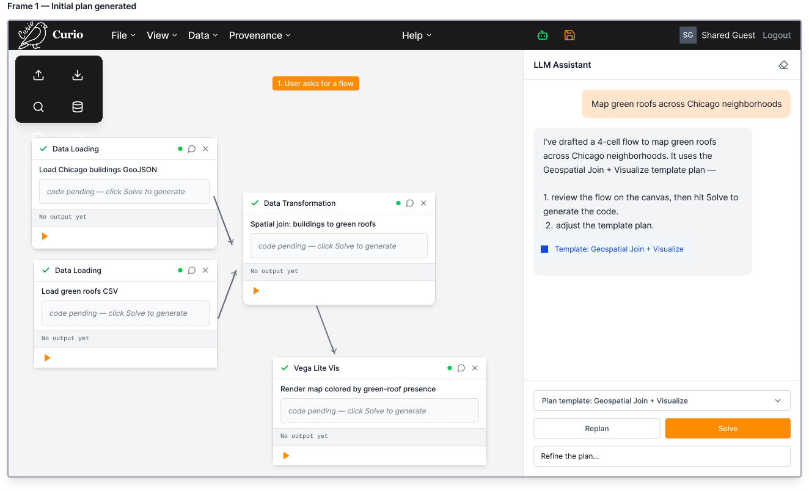
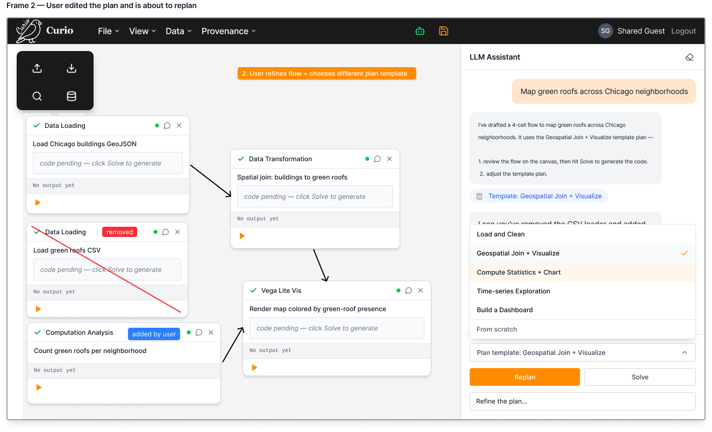
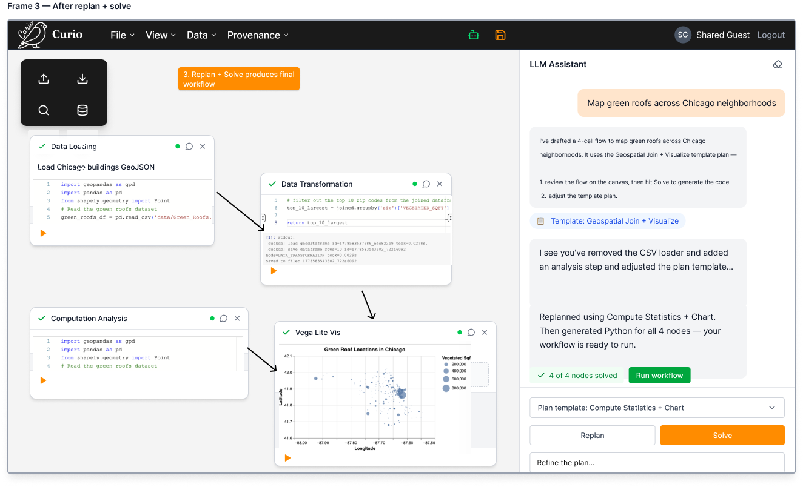

AGENT - Dataflow creation

The LLM alignment will have three phases: plan, revise, solve.

Plan = agent proposes a node graph, 
Revise = user fixes and replans the graph,
Solve = agent fills in the contents of the nodes.

A set of planning templates for the typical Curio use cases can be browsed by the user so that the agent approaches the problem solving from the angle of the selected plan (e.g., load and clean data, geospatial simulation, what‑if analysis, etc.):

**Planning phase (the agent proposes a node graph):**

**Revise phase (user fixes and replans the graph):**

**Solve (the agent fills in the contents of the nodes):**

