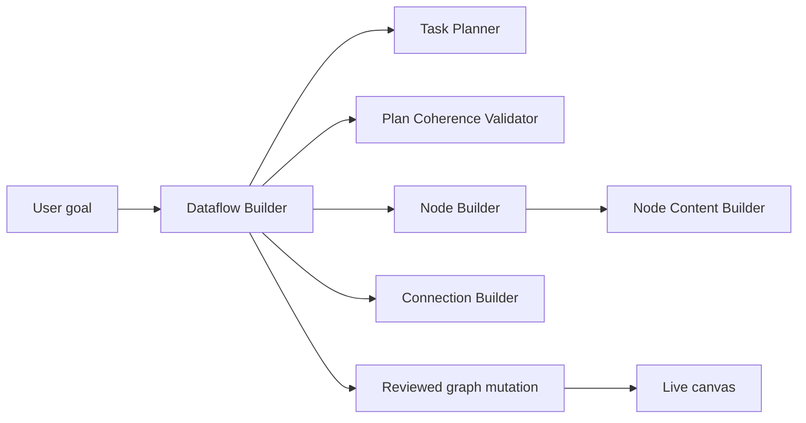

> **Status: brainstorm material — consolidated, not a plan of record.**
> This session was reviewed against the plan of record on 2026-08-04; see
> `dev/49-dataflow-researcher-consolidation-memo.md` for what matched existing documentation, what
> conflicted (two boundary slips, resolved), and the surviving new requirements (DR-1…DR-6, owned
> by the future Dataflow Builder memo and a future research-node memo). Do not implement from
> this file directly.

**Question:**

How can the node builder work to have a similar result as in the video 'plans/urbanagentic/dataflow-builder/Screen Recording 20260629 at 31522 PM 1.mp4’?

**Answer:**

The video’s result should be implemented as a guided **Plan → Revise → Solve → Run** workflow. Architecturally, this is larger than the current “Node Builder”: the **Dataflow Builder** should orchestrate the workflow, while Node Builder remains the specialist that creates or fills individual nodes.

## 1. Problem Statement

The current AI flow is fragmented:

- [LLMChat.tsx](/Users/karla/coding/curio-feat/utk_curio/frontend/urban-workflows/src/components/LLMChat.tsx) is essentially a generic chat panel.
- Applying an AI task can clear the entire canvas.
- Existing planning, suggestion, connection, and node-content capabilities operate independently.
- There is no durable workflow state representing “planning,” “user revision,” or “solving.”
- The proposed Node Builder memo creates one reviewed node at a time; it does not orchestrate a complete graph.

The recording instead demonstrates:

1. The user states a goal.
2. The agent proposes a connected graph containing lightweight placeholder nodes.
3. The user edits that graph directly and may select another planning template.
4. Replan reconciles the edited graph with the goal.
5. Solve generates content for all unresolved nodes.
6. The user runs the resulting workflow.

This matters because the canvas becomes the shared plan—not merely the output of a chat response—and the user retains control before expensive or destructive generation occurs.

## 2. Scope

Included:

- A canvas-attached `agent.dataflow-builder`.
- Explicit `plan`, `revise`, `solve`, and `ready` states.
- Browsable planning templates such as:

  - Load and Clean
  - Geospatial Join and Visualize
  - Compute Statistics and Chart
  - Time-Series Exploration
  - Build a Dashboard
  - From Scratch

- Reviewable whole-graph proposals.
- Placeholder nodes with intent, expected inputs/outputs, and “code pending” state.
- Detection of user additions, removals, rewiring, renaming, and node-intent changes.
- Delegation to Node Builder, Connection Builder, validators, and related specialists.
- Progressive solve status and a final Run Workflow action.
- Persistence, recovery, cancellation, and tests.

Affected areas include `MainCanvas`, `FlowProvider`, workflow operations, the attached-agent chat/dock, agent manifests, proposal services, delegation, execution records, and dataflow serialization.

Out of scope:

- Unreviewed canvas replacement.
- Arbitrary node types outside installed project packages.
- Automatic package installation.
- Automatic use of credentials without explicit authorization.
- Replacing React Flow or the existing package/node registry.
- Treating Node Builder itself as the owner of multi-node orchestration.

## 3. Recommended Implementation Approach

### Product responsibility

Use this composition:



`agent.dataflow-builder` should own:

- Phase transitions.
- Planning-template selection.
- The proposed graph.
- Revision reconciliation.
- Delegation scheduling.
- Aggregate progress.
- Final readiness.

`agent.node-builder` should own:

- Selecting an existing compatible template.
- Creating a node proposal where necessary.
- Delegating content generation.
- Returning a typed node result.

### State machine

Use an explicit persisted state machine:

```text
idle
  → planning
  → plan_review
  → revising
  → plan_review
  → solving
  → ready
  → running
  → completed | failed
```

Do not infer the phase from button labels, chat text, or whether nodes happen to contain code.

### Typed plan representation

The model should return a structured plan rather than raw React Flow nodes:

```ts
interface DataflowPlan {
  planId: string;
  revision: number;
  goal: string;
  templateId: string | null;
  nodes: PlannedNode[];
  edges: PlannedEdge[];
  assumptions: string[];
  warnings: string[];
}

interface PlannedNode {
  planNodeId: string;
  nodeType: string;
  title: string;
  intent: string;
  status: "planned" | "user-added" | "removed" | "solving" | "solved" | "failed";
  inputContract: PortContract[];
  outputContract: PortContract[];
  content?: string;
}
```

A mapper should be solely responsible for translating between this domain plan and React Flow’s node/edge representation.

### Review boundary

Plan and Replan should produce a graph-level proposal. Applying that proposal should update both:

- The saved project specification.
- The live canvas.

The update must be atomic from the user’s perspective. This extends the canvas-mutation bridge already recommended in [48-node-builder-composite-memo.md](/Users/karla/coding/curio-feat/plans/urbanagentic/hookable-agents/dev/48-node-builder-composite-memo.md).

### Preserve user edits

Replan must not regenerate the canvas from scratch. It should calculate a semantic diff:

- Preserve unchanged nodes and their IDs.
- Preserve user-authored content by default.
- Record explicitly removed nodes as removal constraints.
- Identify user-added nodes as required plan elements.
- Reuse manually adjusted positions.
- Propose connection changes separately.
- Explain conflicts before applying them.

This is essential to reproduce the behavior shown in the recording.

### Solve orchestration

Solve should:

1. Freeze a revision snapshot.
2. Topologically order unresolved nodes.
3. Solve independent nodes concurrently with a bounded limit.
4. Delegate each node to Node Builder or Node Content Builder.
5. Validate the result.
6. Write successful content into the corresponding node.
7. Mark downstream nodes stale if an upstream contract changes.
8. Continue unaffected branches when one node fails.
9. Finish with a readiness summary.

The UI can therefore report “3 of 4 nodes solved” and offer retry for only the failed node.

## 4. Data and State Handling

The persisted project specification should be the durable source of truth. React Flow remains the immediate interaction surface, but mutations must synchronize through one graph-change service.

Store orchestration state separately from ordinary node data:

```ts
interface DataflowBuilderSession {
  phase: BuilderPhase;
  activePlanId: string;
  appliedRevision: number;
  baseGraphDigest: string;
  templateId: string | null;
  nodeRuns: Record<string, NodeSolveState>;
  lastError?: BuilderError;
}
```

Key behavior:

- Planning must not clear the existing canvas.
- Existing work should default to “extend,” with “replace” requiring explicit confirmation.
- Replan should use the latest live graph snapshot and revision number.
- A stale response must not overwrite edits made while the agent was working.
- Solve results should be applied per node only if that node’s intent/content digest still matches.
- Successful node results should remain visible if another node fails.
- Reloading the project should restore the active phase and progress.
- Cancel should stop pending work without discarding completed node results.

## 5. UI and UX Requirements

Replace the generic LLM panel for this workflow with a phase-aware Dataflow Builder panel.

The panel should contain:

- Goal and conversation history.
- Current plan-template selector.
- Phase indicator: Plan, Revise, Solve, Ready.
- A concise change summary after planning or replanning.
- Primary actions appropriate to the phase.
- Per-node solve progress.
- Retry and cancellation controls.
- Final Run Workflow action.

During plan review, node cards should show:

- Node category and title.
- Plain-language intent.
- Input/output expectations.
- `Code pending — choose Solve to generate`.
- Clear indicators for user-added, agent-proposed, changed, or removed nodes.

Recommended button behavior:

- `Plan`: create the first reviewable graph proposal.
- `Replan`: reconcile the current canvas and selected template.
- `Solve`: fill unresolved nodes without replacing approved work.
- `Run workflow`: execute only when required nodes are valid.
- `Refine the plan…`: send revision instructions without losing canvas edits.

Accessibility requirements include labeled controls, keyboard-operable template selection, announced phase/progress changes, focus returning to the relevant action after completion, and non-color-only node status indicators.

## 6. Edge Cases

The implementation must handle:

- Empty goals or an empty canvas.
- Planning into an existing workflow.
- A user deleting or editing a node while planning is in progress.
- Duplicate or unsupported node types.
- Missing project packages.
- Invalid or cyclic connections.
- User-added nodes without enough intent to solve.
- Nodes that require unavailable datasets or credentials.
- Partial solve failures.
- A stale replan or solve response.
- Repeated Plan, Replan, or Solve clicks.
- Cancelled or timed-out model calls.
- Reloading during a solve.
- A removed node referenced by another proposed edge.
- Reopening the panel after completing or abandoning a session.
- Node output contracts changing after downstream content was generated.
- Templates that cannot represent the requested computation.

Unsupported requirements should produce a visible reviewed recommendation, not an invented node type or silent package installation.

## 7. Testing Strategy

Required unit tests:

- Plan-schema parsing and validation.
- Domain-plan-to-canvas mapping.
- Semantic graph diffing.
- Preservation of node IDs, positions, and user content.
- Topological solve scheduling.
- Revision and digest conflict detection.
- Phase-transition guards.

Required component tests:

- Correct controls for each phase.
- Template selection and Replan.
- Node status rendering.
- Partial failure and retry.
- Cancellation.
- Accessible labels and keyboard behavior.

Required integration tests:

- Goal → Plan → Apply → canvas graph.
- User edits → Replan → preserved edits.
- Solve → progressive node updates.
- Saved graph and live canvas remaining consistent.
- Reloading during an active or partially completed session.
- Concurrent user edits preventing stale agent writes.

Required end-to-end regression coverage:

- Reproduce the recording’s green-roof workflow.
- Remove one planned loader.
- Add an analysis node.
- Select another planning template.
- Replan.
- Solve all nodes.
- Run the finished workflow without clearing or rebuilding the canvas unexpectedly.

## 8. Acceptance Criteria

- Entering a goal produces a reviewable connected graph with unresolved placeholder nodes.
- The canvas is not cleared merely because the user starts or changes an AI task.
- Users can add, remove, move, rename, and reconnect nodes before solving.
- Replan incorporates those edits and clearly identifies proposed changes.
- Unchanged nodes retain IDs, positions, and user-authored content.
- Changing the planning template influences the revised plan without blindly replacing the graph.
- Solve displays per-node progress and fills nodes incrementally.
- Independent nodes may solve concurrently within configured limits.
- One failed node does not erase successful results.
- Stale results cannot overwrite newer user edits.
- Graph mutations require review and update the persisted graph and live canvas consistently.
- Run Workflow becomes available only when required nodes and connections pass validation.
- Refreshing the page restores the approved graph and builder state.
- All graph, orchestration, and mutation contracts are typed and tested.

## 9. Recommended Commit Breakdown

1. Add typed Dataflow Builder plan, revision, phase, and proposal contracts with tests.
2. Add semantic graph diffing and atomic saved-spec/live-canvas mutation support.
3. Add the Dataflow Builder manifest, orchestration service, and bounded delegation.
4. Add the phase-aware builder panel and planning-template selector.
5. Add progressive node solving, validation, retry, cancellation, and recovery.
6. Add the full Plan → Revise → Solve → Run regression suite.

## 10. Engineering Quality Checklist

Before completion, verify:

- Dataflow Builder and Node Builder responsibilities remain separate.
- No business logic is embedded in chat rendering.
- Plan-to-canvas conversion is centralized.
- User edits are preserved through stable IDs and semantic diffs.
- Stale agent responses cannot overwrite current state.
- Every mutation passes through review and the shared graph mutation path.
- Node generation is bounded, cancellable, retryable, and observable.
- Partial progress survives failures and reloads.
- Installed package and node-template constraints are respected.
- Accessibility and keyboard operation are covered.
- The canvas does not flicker, clear, or unexpectedly re-layout.

The key design decision is: **build the video experience as Dataflow Builder orchestration over Node Builder—not as additional behavior inside Node Builder itself.** The existing project already has many of the required specialists; the main missing layer is the persisted phase state, graph-level proposals, semantic replanning, and coordinated solving.


---------------------------
**Question:**

I just want to brainstorm ideas, because I was thinking that the each line with the execution flow from the llm can be contained in a single custom node that has a web search agent and the node will have the question and answer in this custom node display area

**Answer:**

Yes—that’s a compelling direction. Instead of having the LLM immediately translate every workflow step into code, each step becomes an **agentic research node** that owns a question, performs web search, and displays its answer directly on the canvas.

Conceptually:

```text
User goal
   ↓
LLM decomposes goal into questions
   ↓
[Research Node 1] → [Research Node 2] → [Synthesis Node]
 question             follow-up question       final result
 sources              sources                  combined answer
 answer               answer
```

For example, “Evaluate suitable Chicago neighborhoods for green-roof investment” could produce:

- “What Chicago building datasets are available?”
- “Which neighborhoods have the most suitable roof area?”
- “What incentives or regulations affect green-roof development?”
- “Synthesize the evidence into recommendations.”

Each line of the LLM plan becomes one custom node.

### What the custom node could display

A compact node could show:

- A short title.
- The research question.
- Current status: Draft, Searching, Answered, Needs review, or Failed.
- A concise answer preview.
- Source count and citation links.
- Search/research agent badge.
- Run, refresh, inspect, and approve actions.

Expanded, it could expose tabs:

- **Answer** — formatted response.
- **Sources** — URLs, titles, dates, and excerpts.
- **Question** — editable question and instructions.
- **Process** — searches performed and reasoning summary.
- **Output** — structured result passed downstream.

The canvas node should show a concise result, while detailed evidence can open in a drawer. Otherwise, research-heavy nodes may become extremely tall.

### How execution could work

Each node receives three kinds of context:

1. Its own question.
2. Approved outputs from upstream nodes.
3. Workflow-level context such as the overall goal, location, date range, and constraints.

Its output could be more structured than plain text:

```ts
interface ResearchNodeOutput {
  answer: string;
  findings: Finding[];
  sources: SourceCitation[];
  confidence: "low" | "medium" | "high";
  unresolvedQuestions: string[];
  retrievedAt: string;
}
```

That would allow downstream nodes to consume actual findings and citations instead of scraping text from the visible answer.

### A useful distinction between node types

I would consider three related agentic nodes rather than making every node identical:

- **Research node** — searches external sources and answers a question.
- **Analysis node** — compares, calculates, filters, or evaluates upstream findings.
- **Synthesis node** — combines several branches into a report, recommendation, dataset, or visualization specification.

They can share the same visual shell and agent-runtime contract. The distinction mainly controls permissions, expected inputs, and output shape.

### Where Node Builder fits

The Node Builder would not perform every search itself. It would:

- Interpret one line of the proposed plan.
- Select the existing Research Node template.
- Configure its question, output contract, and agent settings.
- Place it on the canvas.
- Connect it to relevant upstream nodes.

The Dataflow Builder would still decide how many research steps are needed and how they connect. Node Builder turns each approved step into a configured custom node.

This preserves a useful division:

```text
Dataflow Builder: “What steps form the investigation?”
Node Builder:     “What kind of node should execute this step?”
Research Agent:   “Find and answer this specific question.”
```

### User editing could be especially natural

Before running, the user could:

- Rewrite a node’s question.
- Add or remove research nodes.
- Reconnect dependencies.
- Restrict allowed sources or domains.
- Choose search depth.
- Require recent or primary sources.
- Mark a node as human-provided rather than agent-generated.

After editing, “Replan” could inspect the canvas and suggest missing questions without replacing user-created nodes.

### Important product choices

A few decisions would shape the experience:

- **Does each node have its own agent attachment?**  
  This is flexible and fits the existing hookable-agent model.

- **Or is Research Node a custom executable node with a built-in agent?**  
  This is simpler for users: dropping the node automatically supplies the research capability.

- **Does downstream execution wait for approval?**  
  For research workflows, an “approve before downstream use” option would prevent weak findings from propagating.

- **Can a node refresh its answer?**  
  Because web results change, outputs should include retrieval dates. Refreshing should mark dependent nodes stale.

- **What counts as a valid result?**  
  A node might require two independent sources, at least one primary source, or a minimum confidence level before reporting success.

### My preferred version

I’d make **Research Task** a reusable custom node with a built-in web-search agent. The LLM creates a graph of these nodes in the planning phase, but searches do not run yet. Users can inspect and edit every question. When they choose Solve, the nodes run in dependency order, display answers and citations in place, and pass structured evidence downstream.

That would preserve the appealing interaction from the video while making the canvas itself a transparent, editable research process—not merely a visual representation of hidden LLM work.