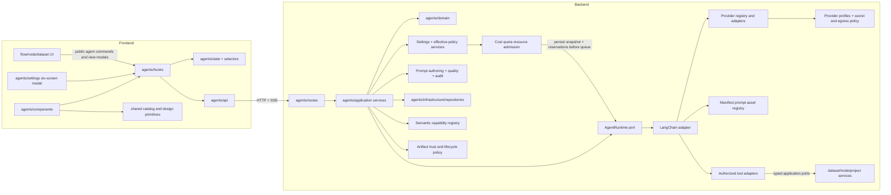
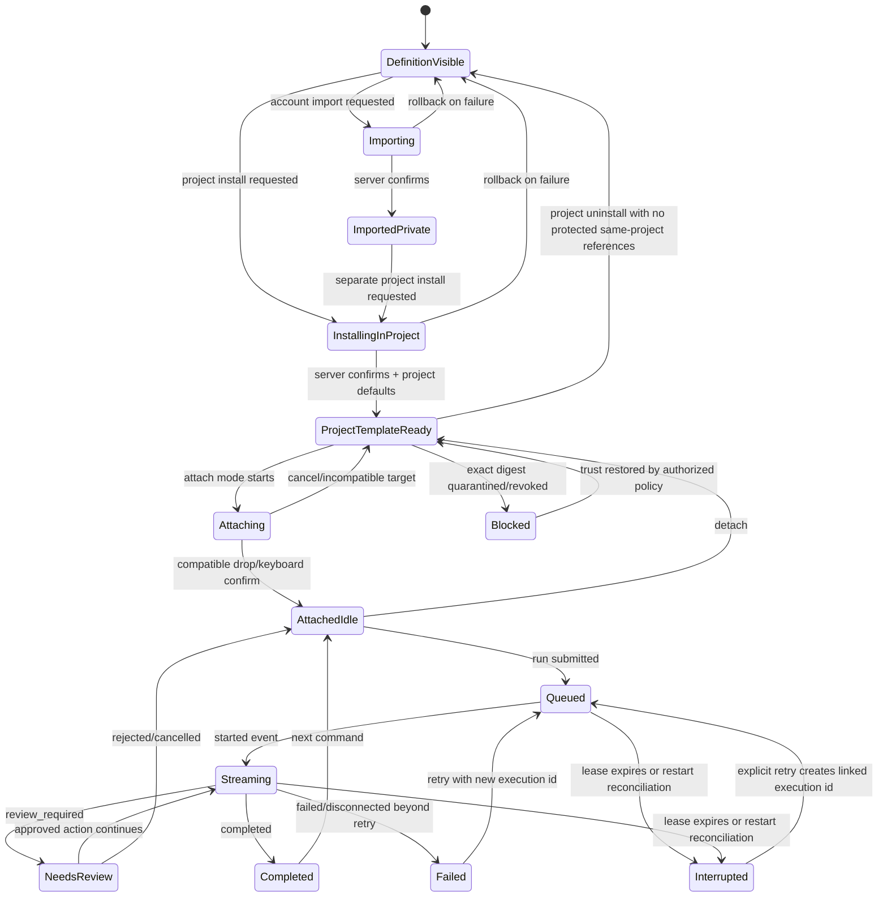
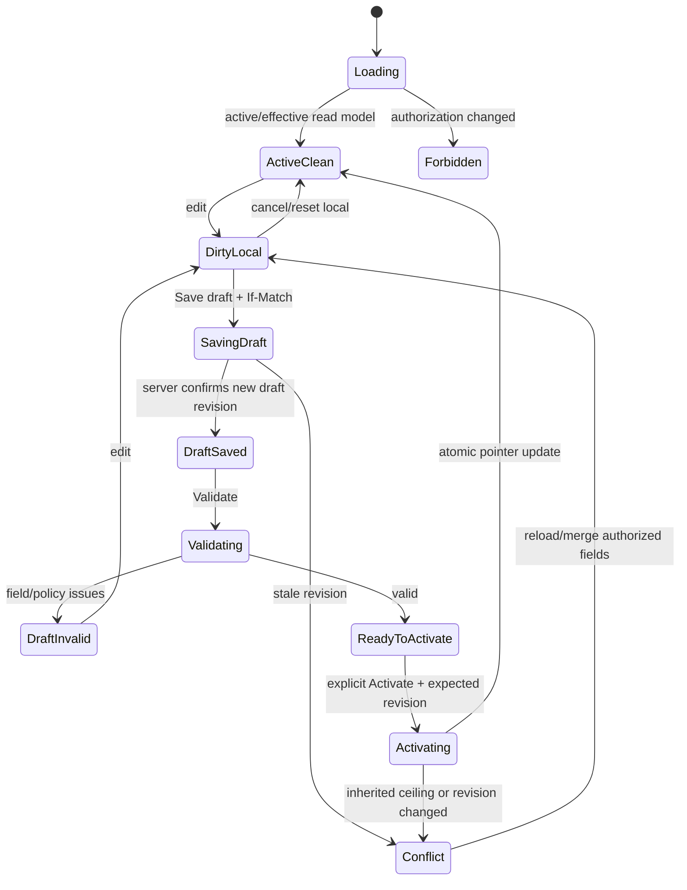
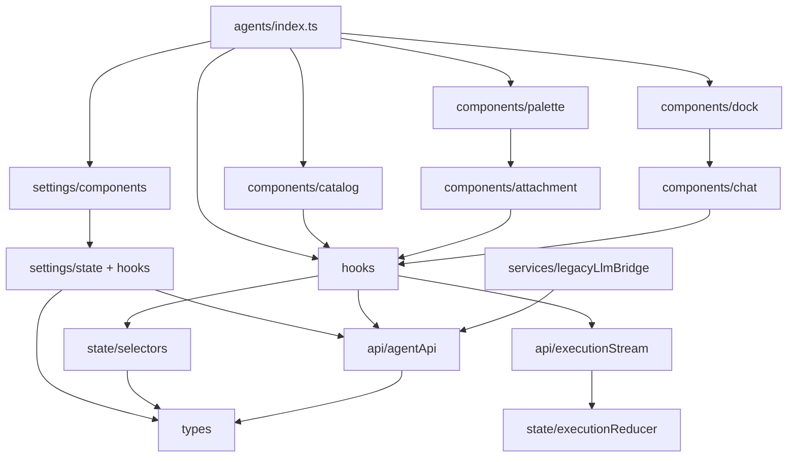
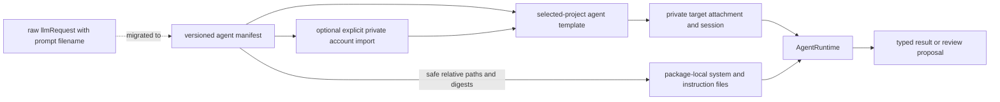

# Agents Catalog Cursor-Style Implementation Blueprint

Status: detailed pre-implementation plan  
Depends on: `03-agents-catalog-development-plan.md`  
Architecture amendment: `04-agents-module-encapsulation-memo.md`  
Settings and prompt-governance amendment: `11-agent-configuration-modals-and-prompt-governance-memo.md`  
Plan hardening and open decisions: `14-plan-hardening-and-open-decisions-memo.md`  
Composite-agent specifications: `15-composite-agent-specifications-memo.md`  
Node-package capabilities: `16-agent-node-package-capabilities-memo.md`  
Traceability: `kggraph/Stage-2-Design-Phase/2.1-Agents-Catalog-Design-Traceability.md`

This blueprint translates the approved product and architecture plan into concrete modules, contracts, flows, files, tests, and incremental implementation steps. It contains illustrative pseudocode only; names should be confirmed against repository conventions during implementation.

## 1. Problem Statement

Curio currently has direct LLM request behavior in general frontend components/providers and broad backend API routes, but it does not have a cohesive Agents Catalog domain. Its plan also mentions chat-based configuration and runtime limits without defining governed settings screens, per-agent defaults, atomic admission, private prompt authoring, reproducible quality evidence, or prompt audit history. Implementing catalog, installation, attachment, chat sessions, settings, prompt governance, orchestration, tools, providers, and LangChain directly in existing locations would create tight coupling, duplicated state, overspend races, and mutable or leaked prompt provenance.

The implementation must introduce an explicit `agents/` feature boundary on the frontend and backend. Other domains provide typed context or operations to agents, but they must not own agent lifecycle, policy admission, prompt authoring/evaluation/audit, or provider/LangChain infrastructure. Chat remains conversational refinement/run/review/history; it may open a governed settings screen but cannot activate policy, edit immutable prompt bytes, release, or publish.

## 2. Goals and Non-Goals

### Goals

- One discoverable frontend feature module for all agent UI, state, hooks, API access, mapping, compatibility, and execution streaming.
- One backend bounded context for manifests, catalog/install/attachment/session/execution domain logic, orchestration, LangChain, prompts, tools, and LLM providers.
- Exact immutable artifact coordinates and clear separation between account imports, global publications, project templates, private attachments, sessions, and executions.
- Ordered, resumable execution events and explicit review-before-apply mutations.
- Incremental migration of existing LLM callers without duplicate provider logic.
- Enforceable dependency boundaries and module-specific tests.
- Private-by-default provider profiles, least-privilege context/tool authorization, and fail-closed data-egress policy.
- Restart-safe execution interruption and explicit linked retry without automatic provider or tool replay.
- One accessible settings shell with six dedicated Cost, Quotas, Resource policies, Prompt quality, Prompt editor, and Prompt audit screens (per `DEC-038`, Cost/Quotas/Resource ship in v1; the three prompt-governance screens are v2 — the six-screen shell is the v2 end-state).
- Reviewed per-agent default profiles, independent typed revision streams, strict layered policy resolution, and immutable effective-policy snapshots with atomic admission reservations.
- Private prompt drafts owned by explicit account imports, reproducible exact-digest evaluations, new immutable releases, and append-only integrity-linked prompt governance history.

### Non-goals

- Rewriting generic catalog layout, authentication, React Flow, dataset/node domain services, or shared HTTP primitives.
- Letting manifests contain arbitrary executable tool code.
- Exposing LangChain objects, provider SDK objects, or credentials to the frontend.
- Migrating unrelated AI/ML inference features that are not part of the agent/LLM runtime.
- Marketplace billing/payment collection, client-controlled safety ceilings, or provider-credential editing inside agent settings.
- In-place prompt mutation, account-wide installed palettes, automatic lifecycle chaining or policy activation/publication, publishable project/attachment state, or silent use of the unresolved OQ-007 generated-content evaluator.

## 3. Architecture Decisions and Tradeoffs

### ADR-AG-001 — Feature-owned `agents/` modules

Decision: all primarily agent/LLM responsibilities live under frontend and backend `agents/` roots. Each root exposes a narrow public API.

Rationale: ownership is visible from the path, tests can enforce imports, and future agent work does not accumulate in flow/node/dataset components.

Tradeoff: moving legacy LLM code creates temporary compatibility work. Accept this cost and remove adapters after migration.

### ADR-AG-002 — Backend-controlled execution

Decision: the frontend submits commands and consumes normalized events; the backend creates LangChain agents and invokes providers/tools.

Rationale: credentials, tool authorization, retries, audit, and cancellation require a trusted boundary.

Tradeoff: streaming requires a persistent event transport and reconnect logic. Use SSE first because execution is primarily server-to-client; retain transport-neutral client interfaces.

### ADR-AG-003 — Separate lifecycle aggregates

Decision: model immutable `AgentDefinitionArtifact`, private `AccountImportedAgent`, `GlobalAgentPublication`, `ProjectAgentTemplate`, private `AttachedAgentInstance`, `AgentSession`, and `AgentExecution` separately.

Rationale: importing is not installing, installing is not attaching, detaching is not project uninstalling, and a session is not an active runtime process.

Tradeoff: more records and joins. Application read models/selectors hide that complexity from UI components.

### ADR-AG-004 — Immutable manifests plus mutable projections

Decision: versioned manifests contain definition metadata only. Account import, global publication, project installation/defaults, attachment, and execution state live in separate records.

Rationale: immutable version definitions are reproducible and cacheable; live state cannot accidentally mutate a catalog artifact.

Tradeoff: catalog cards require a server/client mapper joining several sources.

### ADR-AG-005 — Runtime and provider ports

Decision: `AgentRuntime` and `LLMProviderAdapter` are application ports. LangChain and provider SDKs are infrastructure adapters.

Rationale: domain/application tests run without LangChain; provider compatibility is centralized; future frameworks do not change UI/domain contracts.

Tradeoff: adapters translate messages, tools, streaming chunks, and errors. Shared normalized types keep that translation explicit.

### ADR-AG-006 — Typed event log as execution truth

Decision: persist ordered execution events and derive current execution status from the latest valid event.

Rationale: the same log supports streaming, reconnect, transcript/audit, parent-child orchestration, and failure diagnosis.

Tradeoff: event sequencing and compaction need care. Persist monotonic sequence numbers and allow session summaries without deleting audit events prematurely.

### ADR-AG-007 — Domain tools remain domain-owned

Decision: dataset/node/flow operations remain in their existing domains. Agent infrastructure wraps them as authorized typed tools.

Rationale: adding an agent caller does not make a dataset install or graph mutation agent-owned.

Tradeoff: adapter modules are required, but they prevent domain duplication and circular imports.

### ADR-AG-008 — Server query state plus local interaction state

Decision: global catalog and private import resources use account-keyed queries; project templates/defaults and their palette use project-keyed queries; attachment/session/execution resources use project-and-target-keyed queries. Ephemeral drag, hover, composer draft, and selected attachment state remain local/provider state.

Rationale: avoids copying server entities into a global client store and reduces stale-state races.

Tradeoff: selectors combine multiple queries. Centralize query keys and read-model selectors in `agents/state`.

### ADR-AG-009 — Semantic capabilities are separate from prompt assets

Decision: manifests declare stable semantic capabilities such as `node.explain` and `code.syntax.analyze`. Prompt paths identify package-local implementation assets and cannot serve as capability IDs.

Rationale: orchestration and discovery need behavior contracts that survive prompt rewrites, alternate implementations, framework changes, and localization. Multiple agents may implement the same capability.

Tradeoff: the system needs a capability taxonomy, contract-version compatibility, and deterministic implementation resolution. This added structure prevents orchestration from coupling to filenames or a single package.

### ADR-AG-010 — Explicit account Import and selected-project Install

Decision: bounded manifest Import creates a private `AccountImportedAgent` and immutable artifact in the authenticated account library without changing any project. A separate selected-project Install creates a `ProjectAgentTemplate` and independent default profile from an authorized visible exact definition. Only that project's AGENTS palette changes.

Rationale: reusable imports need an account-private library, while operational defaults and palette membership must remain isolated per project. Separate commands prevent accidental installation or publication during import.

Tradeoff: installing the same definition in multiple projects creates small independent template/default records. This is intentional because one project's settings, update timing, and uninstall must not affect another project.

Security invariant: repository and service methods derive account and project authorization from the actor and route context. Client payloads never select another account store, and no Import, Install, Attach, or Publish command invokes another lifecycle transition.

### ADR-AG-011 — Exact artifact coordinates and project-template source pins

Decision: identify every immutable package with `AgentArtifactCoordinate {publisherNamespace, agentId, exactVersion, artifactDigest}`. `AccountImportedAgent` records ownership of an explicit import. `ProjectAgentTemplate {projectAgentTemplateId, projectId, sourceArtifactCoordinate}` records one project's installed source and defaults. Attachments persist the same-project template ID and execution snapshots persist every resolved exact coordinate and settings revision.

Rationale: exact coordinates prevent source or digest substitution and let versions coexist; project source updates can be explicit without silently changing existing attachments or execution history.

Tradeoff: the store must retain and reference-count old immutable artifacts. The same publisher/agent/version arriving with a different digest fails closed as a coordinate collision; garbage collection occurs only after import, publication, template, attachment, active-work, retained-history, retention, and backup references permit it.

### ADR-AG-012 — Account provider profiles, opaque secrets, and fail-closed egress

Decision: provider/model selection uses account-level `ProviderProfile` records. Credentials live only in an encrypted secret store behind opaque references; manifests and attachment configuration declare credential requirements but never contain secret values. Installation grants no data, tool, provider, or egress permission. Execution independently authorizes the artifact, dataflow target, declared context reads, provider destination, and typed tool grants.

Migration and default source (see `17-hardening-resolutions-memo.md` §3.3): a one-time migration moves the legacy plaintext `user.llm_api_type`/`llm_api_key` (`app/api/routes.py:74-91`) into a per-account default `ProviderProfile` + encrypted secret store, with a time-bounded `/llm/chat`/`/llm/check` compatibility bridge removed at cutover; this lands before any provider-profile-referencing Resource-policy screen. The **default** `ProviderProfile` and the `LangChainModelBridge` derive provider/model/API/runtime defaults from the existing `dev/aiconn/` configuration (`DEC-039`) — OpenAI-compatible sage200 endpoint `https://sage200.evl.uic.edu/v1`, models `llama4-nim` (default) + `gemma4`, `AICONN_API_KEY`, chat-completions runtime — not separate LangChain-specific defaults. LangChain has no independent default provider/model/endpoint; per-agent `providerRequirements`/`runtime` and per-scope Resource policy are explicit overrides of that seed.

Rationale: visible definitions and project templates must not inherit credentials or data access. Central provider profiles support rotation and revocation while keeping secrets out of the browser, dataflow spec, transcript, logs, and published package.

Tradeoff: profile validation and execution require an additional policy join. Remote execution is visibly identified and never used as an implicit fallback. Custom endpoints are revalidated against scheme, redirect, DNS, private/link-local/metadata-network, TLS, timeout, and response-size policy; separately authorized local profiles are the only exception for approved local endpoints.

### ADR-AG-013 — Leased execution, interruption, and explicit retry

Decision: nonterminal executions persist a lease owner, expiry/heartbeat, and monotonic fencing token. Startup reconciliation marks expired work `interrupted`; it never replays a provider request, tool call, or mutation automatically. Retry creates a new execution with `retryOfExecutionId` and a new idempotency scope while preserving the committed transcript/event history of the interrupted run.

Rationale: the server cannot prove whether an external provider or tool completed after a crash. Marking uncertainty explicitly avoids duplicate cost and side effects.

Tradeoff: workers must heartbeat and all event/tool/mutation writes reject stale fencing tokens. The UI gains an interrupted state and an explicit retry path rather than pretending a disconnected execution is still running.

### ADR-AG-014 — Sharing out of scope (reuse existing flow-sharing)

Sharing is out of scope (D-0 = B); agents reuse Curio's existing flow-sharing and add no new sharing mechanic. The only invariant is that the feature introduces no agent-private data as a new shared surface.

### ADR-AG-015 — Distinct lifecycle and trust operations

Decision: private-import deletion, selected-project uninstall, attachment detach, imported-definition publication/unpublish, security quarantine/revocation, and artifact garbage collection are separate authorized operations and projections. User Publish accepts only an owned validated `AccountImportedAgent`. Ordinary unpublish stops discovery but preserves retained template/source references; quarantine/revocation addresses a specific digest and blocks install, attach, and run.

Rationale: user intent, ownership, public visibility, security response, and physical storage cleanup have different safety rules and cannot share one delete flag.

Tradeoff: catalog and palette read models join more lifecycle state. Project uninstall serializes with same-project attachment creation and checks protected same-project references; retained imports, publications, histories, and backups independently fence destructive deletion or garbage collection according to policy.

### ADR-AG-016 — Shared settings shell with six governed screens

Decision: authorized Account policy, Imported definition, Project agent default, and Attached instance entry points open one `AgentSettingsModal` dialog shell with six directly addressable screens: Cost, Quotas, Resource policies, Prompt quality, Prompt editor, and Prompt audit. Screens are not nested dialogs. Release cut (`DEC-038`): Cost/Quotas/Resource policies ship in v1; Prompt quality/editor/audit are v2 (demand-gated), rendered in v1 as an explicit "available in a later release" disabled state. Governed changes use explicit draft/validate/activate or draft/evaluate/release workflows, never chat-only mutation.

Rationale: a consistent scope-aware surface makes inherited/effective values, permissions, conflicts, and immutable release boundaries visible while keeping conversational refinement separate from governance.

Tradeoff: not every screen applies at every scope. Server-provided authorization/applicability flags drive omission or read-only reasons, and draggable palette rows remain action-free; settings launch from account policy, imported-definition detail, project-template detail, and attachment chat header.

### ADR-AG-017 — Layered typed policies, per-agent defaults, and atomic admission

Decision: cost, quota, and resource settings have independent typed draft/active revision streams. Each project Install materializes a reviewed per-agent default profile from immutable manifest seed suggestions. Effective runtime policy is the strictest deployment ∩ account ∩ project-template ∩ attachment intersection; lower scopes only tighten. Admission persists the effective snapshot and atomically reserves budget, quota, and resource capacity before queue/provider/tool work. The evaluation sub-budget is account-scope only (`DEC-037`); project-template/attachment Cost policies omit it. Prompt authoring/quality/audit records remain owned by the imported definition and are read-only provenance at template/attachment scope — and, when the source import is unpublished, visible only to its owner (`DEC-036`); publishing to the Global Catalog widens prompt visibility to installers of the published artifact.

Rationale: independent revisions prevent one modal from overwriting another, strict intersection prevents privilege expansion, and reservations prevent concurrent runs from overspending or oversubscribing capacity.

Tradeoff: reads need provenance joins and admission needs transactional counters/ledgers. Central services expose a normalized read model, reconcile ambiguous reservations, and fail closed when a hard-cost price or capacity fact is unknown.

### ADR-AG-018 — Private prompt authoring and new immutable release

Decision: prompt editing creates an authorized account-private `PromptAuthoringWorkspace` only for an owned `AccountImportedAgent` created by explicit Import. Built-in/global definitions, project templates, and attachments are read-only. Save creates draft revisions only. Release verifies the current contained prompt digest, validation, exact quality evidence, and review, then creates a new immutable private imported artifact; project-template update and imported-only catalog publication remain separate operations. A future fork/export must be packaged and explicitly re-imported and is out of scope.

Rationale: published/installed bytes and existing attachment pins remain reproducible while authors can safely iterate without leaking or activating incomplete content.

Tradeoff: the application stores protected draft content separately and must handle optimistic edit conflicts. Prompt bodies remain memory-only in the browser and absent from generic query caches, local storage, URLs, telemetry, transcripts, and public/shared DTOs.

### ADR-AG-019 — Reproducible prompt quality and integrity-linked audit

Decision: static and approved model-based evaluations persist exact draft, suite, fixture, evaluator, provider-profile, policy, usage, and cost pins. Any input change makes evidence stale. Prompt audit is mandatory, append-only, integrity-linked, separately authorized from transcripts, and redacted by default; reveal/export is itself audited. Platform prompt-quality infrastructure is independent of the unavailable `agent.generated-content-evaluator` governed by OQ-007 and never substitutes it silently.

Rationale: exact evidence can gate Release without self-certification, and protected audit metadata proves governance events without copying rendered prompts/context into broad logs.

Tradeoff: evaluator/profile availability, fixture egress, cost/quota, and audit retention add policy joins. Model judgment remains visibly advisory unless an approved gate requires it, and audit content retention stays bounded by OQ-008.

## 4. System Architecture



Dependency rule: arrows may point inward through public interfaces. `FlowUI` cannot import `agents/api` internals; `DomainServices` cannot import LangChain or agent runtime code.

## 5. End-to-End Data Flow

Example: import a reusable definition, install it in one selected project, attach, run, review, and apply the mutation-proposal `Node Content Builder` agent.

```mermaid
sequenceDiagram
    actor User
    participant Catalog as Agents Catalog UI
    participant Hooks as Agent hooks/API
    participant App as Backend agent services
    participant Repo as Agent repositories
    participant Runtime as LangChain runtime
    participant Provider as LLM provider
    participant Flow as Node/flow domain service

    User->>Catalog: Import manifest package
    Catalog->>Hooks: importAgent(package)
    Hooks->>App: POST account import + idempotency key
    App->>Repo: bounded validation; atomically create artifact + AccountImportedAgent
    Repo-->>Hooks: AccountImportedAgentDTO + exact coordinate
    Note over Catalog,Repo: Import changes no project and never publishes

    User->>Catalog: Install Node Content Builder in selected project
    Catalog->>Hooks: installInProject(projectId, exactArtifactCoordinate)
    Hooks->>App: POST selected-project template install + idempotency key
    App->>Repo: authorize project; create ProjectAgentTemplate + independent defaults
    Repo-->>Hooks: ProjectAgentTemplateDTO + revision
    Hooks-->>Catalog: reconcile only the selected project's palette

    User->>Catalog: Attach to node
    Hooks->>App: POST attachment(projectAgentTemplateId, target, config)
    App->>Repo: lock same-project template; verify source + target compatibility
    App->>Repo: create private unversioned attachment and session; release lock
    Repo-->>Hooks: AttachmentReadModel

    User->>Catalog: Request proposed node content
    Hooks->>App: POST execution(command, revision)
    App->>Repo: resolve strict policy; atomically reserve cost/quota/resource
    App->>Repo: persist queued execution + effective snapshot + reservation IDs
    App->>Runtime: authorize profile/egress/tools; acquire lease; instantiate and run(context snapshot)
    Runtime->>Provider: stream normalized request
    Provider-->>Runtime: chunks/tool intents
    Runtime-->>Hooks: ordered SSE events
    Runtime->>App: review-required proposal
    App-->>Hooks: review_required event + effect preview
    User->>Hooks: Apply proposal
    Hooks->>App: POST review decision + expected target revision
    App->>Flow: authorized mutation
    Flow-->>App: updated target revision
    App-->>Hooks: mutation_applied and completed events
```

Prompt settings and immutable release flow:

```mermaid
sequenceDiagram
    actor Author
    participant Modal as AgentSettingsModal
    participant API as Settings/authoring API
    participant Policy as Settings + governance services
    participant Store as Draft/evaluation/audit repositories
    participant Artifacts as Immutable artifact repository

    Author->>Modal: Open owned imported definition / Prompt editor
    Modal->>API: GET authorized scope + current draft/active/effective metadata
    Author->>Modal: Edit prompt and Save draft
    Modal->>API: PATCH workspace prompt with If-Match
    API->>Policy: validate explicit-import ownership, contained asset, schema
    Policy->>Store: append draft revision + governance event
    Store-->>Modal: new revision/digest; earlier audit/evaluation evidence is stale
    Author->>Modal: Run Prompt audit
    Modal->>API: POST audit(exact draft digest, ruleset/policy revisions)
    API->>Policy: run static security/compliance/provenance checks
    Policy->>Store: persist typed findings/remediation gate + governance event
    Author->>Modal: Resolve/review required findings
    Author->>Modal: Run Prompt quality
    Modal->>API: POST evaluation(exact draft digest, suite revision)
    API->>Policy: authorize evaluator/profile/egress; reserve evaluation cost/quota
    Policy->>Store: persist pinned evaluation run/result + audit event
    Author->>Modal: Release version
    Modal->>API: POST release(expected workspace revision, SemVer)
    API->>Policy: verify exact validation/audit/evaluation/review evidence
    Policy->>Artifacts: atomically commit new exact coordinate
    Policy->>Store: append integrity-linked release audit event
    Artifacts-->>Modal: new immutable AgentArtifactCoordinate
    Note over Modal,Artifacts: Project-template update and imported-only publication remain separate explicit actions
```

## 6. Frontend State Flow



Important: this diagram is a derived UI view. The manifest does not store these states. Artifact trust, account import, project template, global publication, attachment, and execution records remain independent server resources. Import, Install, Attach, and Publish never invoke one another. `Interrupted` never resumes side effects in place; retry creates a new linked execution.

Governed settings use an independent state flow per setting kind so saving Quotas cannot overwrite Cost or Resource policy:



Prompt Editor replaces `Activate` with exact-digest Evaluate/Review/Release. Save never changes an active artifact; any edit transitions evaluation evidence to `stale`.

## 7. Component and Module Relationships



Only `agents/index.ts` is a supported cross-feature import. Internal components may import within `agents/`; shared components must not import back into `agents/`.

## 8. Proposed Folder and File Structure

### Frontend

```text
src/agents/
  index.ts
  types/
    manifest.ts
    catalog.ts
    attachment.ts
    session.ts
    execution.ts
    provider.ts
    settings.ts
    costPolicy.ts
    quotaPolicy.ts
    resourcePolicy.ts
    promptQuality.ts
    promptAuthoring.ts
    promptAudit.ts
  api/
    agentApi.ts
    agentQueryKeys.ts
    executionStream.ts
    agentApiErrors.ts
  hooks/
    useAgentCatalog.ts
    useAccountImportedAgents.ts
    useProjectAgentTemplates.ts
    useAgentMutations.ts
    useAttachmentMode.ts
    useAgentAttachments.ts
    useAgentSession.ts
    useAgentExecution.ts
    useAgentNavigation.ts
  state/
    agentSelectors.ts
    executionReducer.ts
    AgentInteractionProvider.tsx
  services/
    agentReadModelMapper.ts
    targetDescriptorAdapter.ts
    attachmentCompatibility.ts
    legacyLlmBridge.ts
  utilities/
    agentReference.ts
    executionStatus.ts
    eventDeduplication.ts
    sanitizeAgentContent.ts
  providers/
    AgentExecutionProvider.tsx
  components/
    catalog/AgentCatalogDrawer.tsx
    catalog/AgentCatalogCard.tsx
    palette/AgentsPaletteDropdown.tsx
    palette/ProjectAgentTemplateRow.tsx
    attachment/CompatibleTargetOverlay.tsx
    dock/AttachedAgentDock.tsx
    dock/AttachedAgentTile.tsx
    chat/AgentChatDrawer.tsx
    chat/AgentTranscript.tsx
    chat/SafeAgentContent.tsx
    chat/AgentReviewCard.tsx
    chat/AgentComposer.tsx
    settings/AgentSettingsButton.tsx
    settings/AgentSettingsModal.tsx
    settings/AgentSettingsNavigation.tsx
    settings/InheritedPolicySummary.tsx
    settings/PolicyConflictBanner.tsx
    settings/UnsavedChangesGuard.tsx
    settings/CostPolicyScreen.tsx
    settings/QuotaPolicyScreen.tsx
    settings/ResourcePolicyScreen.tsx
    settings/PromptQualityScreen.tsx
    settings/PromptEditorScreen.tsx
    settings/PromptAuditScreen.tsx
  settings/
    api/agentSettingsApi.ts
    api/agentSettingsQueryKeys.ts
    hooks/useAgentSettingsSummary.ts
    hooks/useSettingsDraft.ts
    hooks/useEffectiveAgentPolicy.ts
    hooks/usePromptWorkspace.ts
    hooks/usePromptEvaluationRuns.ts
    hooks/usePromptAuditRuns.ts
    hooks/usePromptAuditEvents.ts
    state/settingsModalReducer.ts
    state/settingsSelectors.ts
    services/policyFormMapper.ts
    services/promptDiffMapper.ts
  tests/
    api/
    hooks/
    state/
    services/
    components/
    integration/
    accessibility/
```

### Backend

```text
utk_curio/backend/app/agents/
  __init__.py
  routes.py
  domain/
    manifest.py
    entities.py
    value_objects.py
    events.py
    policies.py
    errors.py
    settings/
      scope.py
      revision.py
      defaults.py
      cost.py
      quota.py
      resource.py
      prompt_quality.py
      prompt_audit.py
      effective_policy.py
      reservations.py
    authoring/
      workspace.py
      prompt_revision.py
      evaluation.py
  application/
    ports.py
    dto.py
    account_import_service.py
    catalog_service.py
    project_template_service.py
    lifecycle_service.py
    publication_service.py
    attachment_service.py
    session_service.py
    execution_service.py
    review_service.py
    orchestration_service.py
    provider_service.py
    settings_query_service.py
    settings_draft_service.py
    settings_activation_service.py
    effective_policy_service.py
    execution_admission_service.py
    cost_policy_service.py
    quota_policy_service.py
    resource_policy_service.py
    prompt_authoring_service.py
    prompt_evaluation_service.py
    prompt_release_service.py
    prompt_audit_service.py
    prompt_governance_event_service.py
  infrastructure/
    repositories/
      catalog_repository.py
      artifact_repository.py
      account_import_repository.py
      project_template_repository.py
      publication_repository.py
      trust_repository.py
      provider_profile_repository.py
      attachment_repository.py
      session_repository.py
      execution_repository.py
      settings_repository.py
      reservation_repository.py
      usage_ledger_repository.py
      authoring_repository.py
      evaluation_repository.py
      prompt_audit_repository.py
      prompt_audit_event_repository.py
    runtime/
      langchain_runtime.py
      langchain_model_bridge.py
      checkpoint_store.py
      event_publisher.py
      execution_leases.py
    providers/
      registry.py
      base.py
      secret_store.py
      egress_policy.py
      pricing_registry.py
      openai_provider.py
      openai_compatible_provider.py
      ollama_profile.py          # local defaults/health over the OpenAI-compatible adapter
      huggingface_hosted_provider.py
      huggingface_local_provider.py
    prompts/
      registry.py
      loader.py
      asset_resolver.py
      definitions/
    tools/
      registry.py
      dataset_tools.py
      node_tools.py
      flow_tools.py
  schemas/
    manifest-v1.json
    api.py
    events.py
    settings.py
    prompt_authoring.py
    prompt_evaluation.py
    prompt_audit.py
```

### Versioned agent artifacts

```text
agents/
  agent.chat-agent@1.0.0/
    manifest.json
    prompts/default_preamble.txt
    prompts/chat_prompt.txt
    schemas/input.schema.json
    schemas/output.schema.json
  agent.debug-agent@1.0.0/
    manifest.json
    prompts/default_preamble.txt
    prompts/debug_prompt.txt
    schemas/input.schema.json
    schemas/output.schema.json
  ...one self-contained directory per prompt-backed agent
```

## 9. Frontend Contracts and Responsibilities

### Core types

```ts
type AgentId = string;
type AgentVersion = string;
type ArtifactDigest = `sha256:${string}`;
type ArtifactId = string;
type AccountImportedAgentId = string;
type ProjectAgentTemplateId = string;
type PublicationId = string;
type AttachmentId = string;
type ExecutionId = string;

interface AgentArtifactCoordinate {
  publisherNamespace: string;
  agentId: AgentId;
  exactVersion: AgentVersion;
  artifactDigest: ArtifactDigest;
}

interface AccountImportedAgent {
  accountImportedAgentId: AccountImportedAgentId;
  artifactCoordinate: AgentArtifactCoordinate;
  validationStatus: "valid" | "invalid" | "quarantined";
  importedAt: string;
  revision: number;
}

interface ProjectAgentTemplate {
  projectAgentTemplateId: ProjectAgentTemplateId;
  dataflowId: string;
  sourceArtifactCoordinate: AgentArtifactCoordinate;
  settingsProfileId: string;
  defaultProfileVersion: string;
  sourceKind: "global" | "builtIn" | "accountImport";
  installedAt: string;
  revision: number;
}

interface AgentPublication {
  publicationId: PublicationId;
  accountImportedAgentId: AccountImportedAgentId;
  artifactCoordinate: AgentArtifactCoordinate;
  status: "validating" | "published" | "unpublished";
  revision: number;
}

interface AgentArtifactTrust {
  artifactId: ArtifactId;
  artifactCoordinate: AgentArtifactCoordinate;
  status: "trusted" | "quarantined" | "revoked";
  revision: number;
}

interface ProviderProfileSummary {
  providerProfileId: string;
  providerType: string;
  model: string;
  locality: "local" | "remote";
  hasCredential: boolean;
  revision: number;
}

interface AgentAttachment {
  id: AttachmentId;
  dataflowId: string;
  projectAgentTemplateId: ProjectAgentTemplateId;
  target: AgentTargetDescriptor;
  sessionId: string;
  providerProfileId: string;
  enabled: boolean;
  configuration: JsonObject;
  revision: number;
}

type SettingKind = "cost" | "quota" | "resource" | "promptQuality" | "promptAudit";
type SettingsScope =
  | { type: "account" }
  | { type: "importedDefinition"; accountImportedAgentId: AccountImportedAgentId }
  | { type: "projectTemplate"; dataflowId: string; projectAgentTemplateId: ProjectAgentTemplateId }
  | { type: "attachment"; dataflowId: string; attachmentId: AttachmentId }
  | { type: "authoringWorkspace"; workspaceId: string };

interface AgentSettingsBinding {
  bindingId: string;
  scope: SettingsScope;
  settingKind: SettingKind;
  activeRevisionId: string;
  draftRevisionId?: string;
  revision: number;
}

interface AgentSettingsRevision<TPolicy> {
  revisionId: string;
  bindingId: string;
  ordinal: number;
  state: "draft" | "active" | "superseded";
  schemaVersion: string;
  baseActiveRevisionId?: string;
  bodyHash: ArtifactDigest;
  policy: TPolicy;
  createdBy: string;
  createdAt: string;
  activatedAt?: string;
}

interface CostPolicy {
  currency: string;
  period: "daily" | "monthly" | "rolling";
  warningMinorUnits?: number;
  hardLimitMinorUnits?: number;
  perExecutionMinorUnits?: number;
  evaluationBudgetMinorUnits?: number; // account scope only (DEC-037); omitted on project-template/attachment CostPolicy
  enforcement: "warn" | "block";
}

interface QuotaPolicy {
  maxExecutions?: number;
  maxInputTokens?: number;
  maxOutputTokens?: number;
  maxToolCalls?: number;
  maxConcurrentExecutions: number;
  maxQueuedExecutions?: number;
  window: QuotaWindow;
}

interface ResourcePolicy {
  allowedProviderProfileIds: readonly string[];
  allowedModels: readonly string[];
  allowedLocalities: readonly ("local" | "remote")[];
  maxContextTokens?: number;
  maxOutputTokens?: number;
  maxDurationMs?: number;
  maxToolCalls?: number;
  localCompute?: { cpuCores?: number; ramMiB?: number; gpuMiB?: number };
  egressClassifications: readonly string[];
}

interface EffectiveAgentPolicySnapshot {
  policySnapshotId: string;
  sourceRevisionIds: readonly string[];
  cost: CostPolicy;
  quota: QuotaPolicy;
  resource: ResourcePolicy;
  resolvedAt: string;
  digest: ArtifactDigest;
}

interface PromptAuthoringWorkspace {
  workspaceId: string;
  basedOnArtifactCoordinate: AgentArtifactCoordinate;
  state: "draft" | "released" | "restricted";
  headRevision: number;
  headDigest: ArtifactDigest;
  releasedArtifactCoordinate?: AgentArtifactCoordinate;
}

interface PromptEvaluationRun {
  evaluationRunId: string;
  workspaceId: string;
  promptDraftDigest: ArtifactDigest;
  suiteRevisionId: string;
  evaluatorArtifactCoordinate?: AgentArtifactCoordinate;
  providerProfileRevisionId?: string;
  policySnapshotId: string;
  status: "queued" | "running" | "completed" | "failed" | "cancelled" | "stale";
}

interface PromptAuditPolicy {
  rulesetRevisionId: string;
  requiredSeveritiesForRelease: readonly ("critical" | "high" | "medium" | "low")[];
  requireAuditAfterEdit: true;
  enabledRuleIds: readonly string[];
}

interface PromptAuditRun {
  auditRunId: string;
  workspaceId: string;
  promptDraftDigest: ArtifactDigest;
  rulesetRevisionId: string;
  policyRevisionId: string;
  status: "queued" | "running" | "completed" | "failed" | "cancelled" | "stale";
  releaseGate: "pending" | "passed" | "blocked";
}

interface PromptAuditFinding {
  findingId: string;
  auditRunId: string;
  ruleId: string;
  category: "security" | "compliance" | "provenance";
  severity: "critical" | "high" | "medium" | "low";
  locations: readonly PromptLocation[];
  remediationState: "open" | "accepted" | "resolved" | "false_positive";
}

interface PromptAuditEvent {
  auditEventId: string;
  action: string;
  actorId: string;
  beforeDigest?: ArtifactDigest;
  afterDigest?: ArtifactDigest;
  previousEventHash?: ArtifactDigest;
  eventHash: ArtifactDigest;
  occurredAt: string;
}

type AgentExecutionEvent =
  | { type: "queued"; sequence: number; executionId: ExecutionId }
  | { type: "message_delta"; sequence: number; text: string }
  | { type: "review_required"; sequence: number; proposal: ReviewProposal }
  | { type: "interrupted"; sequence: number; retryable: true }
  | { type: "completed"; sequence: number; result: AgentResult }
  | { type: "failed"; sequence: number; error: AgentError };
```

Types are illustrative. Production definitions must align exactly with backend schemas and include all normalized events.

`AgentAttachment.configuration` contains only non-secret schema-defined agent inputs/preferences. Governed cost/quota/resource policy is referenced through settings bindings and an execution snapshot, never duplicated into that generic object.

Cost, Quota, and Resource policy bindings support Account policy, Project agent default, and downward-only Attached instance scopes. Prompt Quality, Prompt Editor, and Prompt Audit authoring support only an owned imported definition/private authoring workspace; project-template and attachment scopes may show authorized read-only provenance/evidence but never an override that weakens release/audit requirements. Prompt Editor is workspace state rather than an `AgentSettingsRevision` body.

### API client

`agentApi.ts` owns HTTP commands and DTO decoding. It must not own React state.

```ts
interface AgentApi {
  listCatalog(query: AgentCatalogQuery, signal?: AbortSignal): Promise<AgentCatalogPage>;
  listImports(signal?: AbortSignal): Promise<AccountImportedAgent[]>;
  importPackage(input: ImportAgentPackageCommand): Promise<AccountImportedAgent>;
  deleteImport(accountImportedAgentId: AccountImportedAgentId, input: RevisionedCommand): Promise<void>;
  listProjectTemplates(dataflowId: string, signal?: AbortSignal): Promise<ProjectAgentTemplate[]>;
  installInProject(dataflowId: string, input: InstallProjectAgentCommand): Promise<ProjectAgentTemplate>;
  updateProjectTemplate(dataflowId: string, projectAgentTemplateId: ProjectAgentTemplateId, input: UpdateProjectAgentTemplateCommand): Promise<ProjectAgentTemplate>;
  uninstallFromProject(dataflowId: string, projectAgentTemplateId: ProjectAgentTemplateId, input: RevisionedCommand): Promise<void>;
  publish(accountImportedAgentId: AccountImportedAgentId, input: PublishAgentCommand): Promise<AgentPublication>;
  unpublish(publicationId: PublicationId, input: RevisionedCommand): Promise<void>;
  attach(input: AttachAgentCommand): Promise<AgentAttachmentReadModel>;
  startExecution(input: StartExecutionCommand): Promise<ExecutionReceipt>;
  retryExecution(input: RetryExecutionCommand): Promise<ExecutionReceipt>;
  decideReview(input: ReviewDecisionCommand): Promise<void>;
  cancelExecution(executionId: ExecutionId): Promise<void>;
}
```

`agentSettingsApi.ts` owns the narrower private settings and authoring contracts:

```ts
interface AgentSettingsApi {
  getSetting(scope: SettingsScope, kind: SettingKind, signal?: AbortSignal): Promise<AgentSettingReadModel>;
  saveDraft(scope: SettingsScope, kind: SettingKind, command: SaveSettingDraftCommand): Promise<AgentSettingReadModel>;
  validateDraft(scope: SettingsScope, kind: SettingKind, command: RevisionedCommand): Promise<ValidationResult>;
  activateDraft(scope: SettingsScope, kind: SettingKind, command: RevisionedCommand): Promise<AgentSettingReadModel>;
  resetToAgentDefault(scope: SettingsScope, kind: SettingKind, command: RevisionedCommand): Promise<AgentSettingReadModel>;
  createPromptWorkspace(accountImportedAgentId: AccountImportedAgentId, command: CreateWorkspaceCommand): Promise<PromptAuthoringWorkspace>;
  savePromptDraft(workspaceId: string, promptAssetId: string, command: SavePromptDraftCommand): Promise<PromptDraftReadModel>;
  startPromptEvaluation(workspaceId: string, command: StartPromptEvaluationCommand): Promise<PromptEvaluationRun>;
  startPromptAudit(workspaceId: string, command: StartPromptAuditCommand): Promise<PromptAuditRun>;
  cancelPromptAudit(workspaceId: string, auditRunId: string): Promise<void>;
  updatePromptAuditFinding(workspaceId: string, findingId: string, command: FindingRemediationCommand): Promise<PromptAuditFinding>;
  releasePromptVersion(workspaceId: string, command: ReleasePromptVersionCommand): Promise<AgentArtifactCoordinate>;
  listPromptAuditEvents(resource: PromptAuditResource, query: AuditQuery): Promise<PromptAuditPage>;
}
```

Every write command carries an idempotency key; revision-sensitive commands carry `expectedRevision`.

### Hooks

- `useAgentCatalog`: paged server query; preserves prior page during filters/revalidation.
- `useAccountImportedAgents`: authenticated-account-keyed private import list plus ownership, validation, publication eligibility, and pending mutation state; it is never a project palette source.
- `useProjectAgentTemplates`: selected-project-keyed template/default list and trust state; this is the only AGENTS palette source and is cleared on project switch.
- `useAgentMutations`: independent import/delete-import, project-install/uninstall/update-source, imported-only publish/unpublish, and attach/detach mutation orchestration with targeted cache reconciliation.
- `useAttachmentMode`: local pointer/keyboard attachment mode and compatible target descriptors.
- `useAgentExecution`: starts/cancels/retries, owns stream subscription lifecycle, dispatches normalized events.
- `useAgentSession`: paged transcript plus optimistic user messages reconciled by client message ID.
- `useAgentNavigation`: stable previous/next attachment order derived from canvas order and attachment ID.
- `useAgentSettingsSummary`: server-authorized screen applicability and Account policy/Imported definition/Project agent default/Attached instance scope summary.
- `useSettingsDraft`: one setting-kind active/draft/inherited/ceiling/effective read model, optimistic-concurrency save/validate/activate/reset commands, and exact-key reconciliation.
- `useEffectiveAgentPolicy`: read-only provenance/limit explanation; never authorizes execution.
- `usePromptWorkspace`: memory-only editor content, debounced/cancellable revision-checked save, dirty-close/account-switch cleanup, and exact digest state.
- `usePromptEvaluationRuns`, `usePromptAuditRuns`, and `usePromptAuditEvents`: private paged/streamed quality, static audit/findings/remediation, and append-only event read models with stale evidence and narrow reveal/export commands.

Hooks must return view-focused results such as `{data, status, error, retry, commands}` and hide transport/cache details from components.

### Selectors and reducer

```ts
function selectAgentCatalogCard(
  definition: CatalogAgent,
  importsById: ReadonlyMap<AccountImportedAgentId, AccountImportedAgent>,
  projectTemplatesById: ReadonlyMap<ProjectAgentTemplateId, ProjectAgentTemplate>,
  publications: ReadonlyMap<string, Publication>
): AgentCatalogCardViewModel;

function reduceExecutionEvent(
  state: ExecutionViewState,
  event: AgentExecutionEvent
): ExecutionViewState;
```

`reduceExecutionEvent` ignores duplicate or stale sequence numbers, preserves partial message content through reconnect/interruption, and accepts terminal events once. An explicit retry starts a new reducer identity linked to the interrupted execution. Selectors are pure and unit-tested.

### Components

- `AgentCatalogDrawer`: query controls and results; no direct fetch calls.
- `AgentCatalogCard`: declarative view model plus commands; shared pills/buttons reused.
- `AgentsPaletteDropdown`: active-project template-only list and browse action; switching projects replaces its query scope.
- `CompatibleTargetOverlay`: renders normalized compatibility output; no manifest parsing.
- `AttachedAgentDock`: stable tile layout, keyboard roving focus, reduced motion.
- `AgentChatDrawer`: session navigation, transcript, reviews, quick replies, composer.
- `SafeAgentContent`: the only renderer for model/tool Markdown or rich content; applies an allowlist sanitizer, safe-link policy, and typed content-part handling before DOM rendering.
- `AgentReviewCard`: exact effect preview and revision-aware approve/reject controls.
- `AgentSettingsButton`: labeled/tooltip cog with a server-authorized launch scope; never placed inside a draggable palette row.
- `AgentSettingsModal`: one focus-trapped responsive dialog shell and icon/text navigation for the six screens; owns no policy rules.
- `CostPolicyScreen`, `QuotaPolicyScreen`, and `ResourcePolicyScreen`: show editable, inherited, immutable-ceiling, effective, reset provenance, validation, and admission summaries.
- `PromptEditorScreen`: private contained-asset editor/diff with Save draft and Compare; it cannot activate, publish, or write to generic caches/storage.
- `PromptQualityScreen`: static/model check separation, exact evaluator/profile/locality/cost disclosure, Run/Cancel, stale evidence, and evaluator-unavailable state.
- `PromptAuditScreen`: typed policy draft/validate/activate where applicable; Run/Cancel versioned static security/compliance/provenance audits; finding severity/location/remediation and Release gate; plus a separate append-only governance-event facet with authorized audited reveal/export. It never renders the execution transcript or activates/releases/publishes merely by running an audit.

## 10. Backend Contracts and Responsibilities

### Domain entities and values

Use dataclasses/Pydantic according to established backend conventions, while keeping persistence and framework concerns out of domain types.

```python
@dataclass(frozen=True)
class AgentArtifactCoordinate:
    publisher_namespace: str
    agent_id: str
    exact_version: SemVer
    artifact_digest: str

@dataclass(frozen=True)
class AgentDefinition:
    agent_id: str
    version: SemVer
    roles: tuple[str, ...]
    capabilities: tuple[CapabilityDeclaration, ...]
    delegates_to: tuple[AgentRef, ...]
    prompts: PromptAssetSet
    tools: tuple[ToolRequirement, ...]
    compatible_targets: tuple[TargetConstraint, ...]
    provider_requirements: ProviderRequirements
    runtime_policy: RuntimePolicy
    artifact_digest: str

@dataclass
class AgentExecution:
    execution_id: str
    attachment_id: str
    status: ExecutionStatus
    last_sequence: int
    parent_execution_id: str | None
    retry_of_execution_id: str | None
    lease_owner: str | None
    lease_expires_at: datetime | None
    fencing_token: int

    def apply(self, event: AgentEvent) -> None:
        """Validate transition/fence and advance sequence exactly once."""

@dataclass
class AgentSettingsBinding:
    binding_id: str
    account_id: str
    scope: SettingsScopeRef
    setting_kind: SettingKind
    active_revision_id: str
    draft_revision_id: str | None
    revision: int

@dataclass(frozen=True)
class AgentSettingsRevision(Generic[TPolicy]):
    revision_id: str
    binding_id: str
    ordinal: int
    state: SettingsRevisionState
    schema_version: str
    base_active_revision_id: str | None
    body_hash: str
    policy: TPolicy

@dataclass(frozen=True)
class EffectiveAgentPolicySnapshot:
    policy_snapshot_id: str
    source_revision_ids: tuple[str, ...]
    cost_policy: CostPolicy
    quota_policy: QuotaPolicy
    resource_policy: ResourcePolicy
    digest: str
    resolved_at: datetime

@dataclass
class PromptAuthoringWorkspace:
    workspace_id: str
    account_id: str
    based_on_coordinate: AgentArtifactCoordinate
    head_revision: int
    head_digest: str
    state: AuthoringWorkspaceState

@dataclass(frozen=True)
class PromptEvaluationRun:
    evaluation_run_id: str
    workspace_id: str
    prompt_draft_digest: str
    suite_revision_id: str
    evaluator_coordinate: AgentArtifactCoordinate | None
    provider_profile_revision_id: str | None
    policy_snapshot_id: str
    fixture_digests: tuple[str, ...]
    status: EvaluationStatus

@dataclass(frozen=True)
class PromptAuditRun:
    audit_run_id: str
    workspace_id: str
    prompt_draft_digest: str
    ruleset_revision_id: str
    policy_revision_id: str
    status: PromptAuditStatus
    release_gate: ReleaseGateStatus

@dataclass
class PromptAuditFinding:
    finding_id: str
    audit_run_id: str
    rule_id: str
    category: PromptAuditCategory
    severity: FindingSeverity
    locations: tuple[PromptLocation, ...]
    remediation_state: RemediationState

@dataclass(frozen=True)
class PromptAuditEvent:
    audit_event_id: str
    actor_id: str
    action: PromptAuditAction
    before_digest: str | None
    after_digest: str | None
    previous_event_hash: str | None
    event_hash: str
    occurred_at: datetime
```

`CostPolicy`, `QuotaPolicy`, `ResourcePolicy`, `PromptQualityPolicy`, and `PromptAuditPolicy` are separate typed bodies with versioned schemas and validators. Generic revision metadata may be shared; the domain must not deserialize policy business rules into an unchecked dictionary. `PromptDraftFile` stores a server-contained asset ID/path, role, protected content reference/digest, variable contract, output-schema reference, and revision—not arbitrary client filesystem paths.

Domain policies:

- `ManifestCompatibilityPolicy.validate(definition, installed_runtime)`
- `AttachmentPolicy.can_attach(definition, target)`
- `ArtifactCoordinatePolicy.validate_or_reject_collision(coordinate)`
- `ProjectUninstallPolicy.check_active_references(project_template, same_project_attachments, reviews, executions)`
- `ArtifactLifecyclePolicy.can_delete_or_collect(artifact, retained_references, backup_policy)`
- `ArtifactTrustPolicy.can_install_attach_or_run(coordinate, trust_projection)`
- `ReviewPolicy.requires_confirmation(tool_or_mutation)`
- `ProviderCompatibilityPolicy.match(requirements, capabilities)`
- `ProviderEgressPolicy.authorize(profile, context_classification, destination)`
- `CapabilityResolutionPolicy.resolve(requirement, candidates, context)`
- `EffectivePolicyResolver.resolve(deployment, account, project_template, attachment)` returns the strictest values and provenance and rejects a lower-scope relaxation.
- `SettingsActivationPolicy.validate(binding, draft, current_inherited_policy)` revalidates ceilings and optimistic revisions at activation time.
- `CostAdmissionPolicy.estimate_and_reserve(snapshot, price_snapshot, request)` and `QuotaAdmissionPolicy.reserve(snapshot, request)` are deterministic/idempotent domain decisions applied transactionally.
- `ResourceAdmissionPolicy.authorize(snapshot, provider, model, locality, runtime_request)` enforces provider/egress/tool/context and local compute bounds.
- `PromptReleasePolicy.authorize(workspace, validation, audit_evidence, evaluation_evidence, review)` requires an owned explicit import and exact-current audit findings/remediation plus quality evidence; it cannot publish or update a project template.
- `PromptEvaluationPolicy.authorize(candidate, evaluator, suite, provider, egress, budget)` rejects self-evaluation, stale inputs, unapproved tools/network, and unavailable evaluators.
- `PromptStaticAuditPolicy.authorize(candidate, ruleset, policy)` pins exact inputs, computes typed findings, and blocks Release for required unresolved severity/remediation states.
- `PromptAuditEventPolicy.require_event(operation)` makes governed baseline history non-disableable and keeps event evidence separate from transcripts and static audit runs.

Capability and tool declarations are untrusted requirements, not permission grants. Application policy intersects them with actor, dataflow, provider, and server-registry authorization on every execution.

### Application ports

```python
class AgentRuntime(Protocol):
    def instantiate(self, request: RuntimeInstantiation) -> RuntimeHandle: ...
    def run(self, handle: RuntimeHandle, command: AgentCommand) -> ExecutionReceipt: ...
    def stream(self, execution_id: str, after: int) -> AsyncIterator[AgentEvent]: ...
    def cancel(self, execution_id: str) -> None: ...

class LLMProviderAdapter(Protocol):
    provider_type: str
    def capabilities(self, profile: ProviderProfile) -> ProviderCapabilities: ...
    def validate(self, profile: ProviderProfile) -> ValidationResult: ...
    def health(self, profile: ProviderProfile) -> ProviderHealth: ...
    def invoke(self, request: ModelRequest, cancellation: CancellationToken) -> ModelResponse: ...
    def stream(self, request: ModelRequest, cancellation: CancellationToken) -> Iterator[ModelChunk]: ...

class ProviderPricingPort(Protocol):
    def snapshot(self, profile_revision_id: str, model: str) -> ProviderPriceSnapshot | None: ...

class ResourceSchedulerPort(Protocol):
    def reserve(self, request: ResourceReservationRequest) -> ResourceReservation: ...
    def release_or_reconcile(self, reservation_id: str, outcome: ReservationOutcome) -> None: ...
```

Repository ports expose aggregate-level operations, revisions, and transactions. Routes never call repositories or providers directly.

### Application services

- `AgentCatalogService`: search/version resolution and catalog read models.
- `AgentArtifactImportService`: bounded private staging, contained regular-file extraction, schema/digest/provenance validation, atomic artifact commit, and guaranteed failure cleanup.
- `AccountAgentImportService`: bounded package validation plus atomic immutable-artifact and private `AccountImportedAgent` creation/deletion; it never installs or publishes.
- `ProjectAgentTemplateService`: selected-project Install, explicit source update, independent default materialization, same-project usage checks, and project Uninstall serialized with attachment creation.
- `AgentPublicationService`: owner-only validated publish/unpublish by `accountImportedAgentId`/`publicationId`; it never mutates import or project-template state.
- `AgentLifecycleService`: private deletion, digest quarantine/revocation, retained-reference accounting, and policy-gated garbage collection as distinct operations.
- `AgentAttachmentService`: target compatibility, attachment/session creation, configuration revisions, enable/disable/detach.
- `AgentExecutionService`: authorization, context snapshot, lease/fencing, runtime invocation, event persistence, interruption reconciliation, cancel, and linked retry.
- `AgentReviewService`: proposal authorization, target revision check, domain mutation dispatch, audit result.
- `AgentOrchestrationService`: plan/delegate/link child executions/merge/evaluate without bypassing install or review services.
- `ProviderService`: account-profile validation, models/capabilities/health, encrypted-secret resolution, remote/local labeling, and fail-closed egress/SSRF enforcement.
- `AgentSettingsQueryService`: returns one setting-kind read model with server applicability/authorization, active/draft/inherited/ceiling/effective values, provenance, and revisions.
- `AgentSettingsDraftService`: creates/saves/discards independent typed drafts using optimistic concurrency; it cannot activate.
- `AgentSettingsActivationService`: revalidates inheritance and compare-and-swaps one active pointer while atomically appending its governance event.
- `EffectivePolicyService`: resolves deployment/account/project-template/attachment policy and persists a reproducible snapshot.
- `ExecutionAdmissionService`: in one transaction resolves policy, reserves budget/quota/resource, creates execution/evaluation with snapshot/reservation IDs, then queues; a client estimate is never authorization.
- `CostPolicyService`: provider price snapshots, advisory estimates, idempotent reservation, actual settlement, ambiguous-use reconciliation, and append-only usage ledger.
- `QuotaPolicyService` and `ResourcePolicyService`: atomic counters/windows/queue admission and provider/model/locality/context/tool/network/local-compute enforcement.
- `PromptAuthoringService`: explicit-import ownership authorization, contained prompt draft validation, optimistic revisions, and protected-content handling; every non-imported source is read-only.
- `PromptEvaluationService`: deterministic and approved isolated model evaluation with exact evidence pins, independent egress/budget, cancellation, and stale detection; it does not depend on the OQ-007 package.
- `PromptReleaseService`: exact-current validation/audit/evaluation/review gate and atomic new private imported-artifact commit; never updates a project template or publication.
- `PromptAuditService`: versioned ruleset/policy resolution, exact-digest static security/compliance/provenance runs, typed findings, authorized remediation transitions, cancellation/staleness, and Release-gate projection.
- `PromptGovernanceEventService`: append-only integrity chain, redacted event queries, and separately authorized/rate-limited reveal/diff/export that audits itself; never treats transcript messages as audit events.

### LangChain adapter

`LangChainAgentRuntime` is the only adapter allowed to import LangChain. It:

1. resolves the same-project template's exact manifest, prompt assets, delegated agents, and typed tools;
2. accepts only an application-authorized provider profile/context/tool grant, then asks `LangChainModelBridge` for a model backed by that provider adapter;
3. maps normalized session messages to LangChain messages;
4. installs callbacks that publish normalized events only while their execution fencing token is current;
5. pauses mutation tools at a review boundary;
6. maps LangChain/provider exceptions to `AgentError`;
7. persists checkpoint references, not framework objects, in domain records; checkpoints never authorize automatic side-effect replay after interruption.

## 11. Persistence Strategy

Prefer repository abstractions that follow the Data Catalog's shared-catalog plus per-user private-store convention. Logical records:

| Record | Required fields | Concurrency |
| --- | --- | --- |
| Agent artifact | artifact ID, publisher namespace, agent ID, exact SemVer, digest, manifest, provenance, content address | Opaque `artifactId` maps to one immutable exact coordinate; same publisher/ID/version with another digest is a conflict |
| Account imported agent | imported-agent ID, account key, exact coordinate, package provenance, validation state, importedAt, revision | Created only by explicit Import; unique account ownership; compare revision; no project side effect |
| Project agent template | template ID, project key, source exact coordinate, materialized default-profile bindings, installedAt, revision | Unique project/template identity; project-authorized compare revision; explicit source update only |
| Publication | publication ID, owner, account-imported-agent ID, exact coordinate, workflow state, deployment visibility, revision | Separate from import/templates; owned validated imports only; compare revision |
| Artifact trust projection | artifact ID, exact coordinate, trusted/quarantined/revoked state, reason, actor, revision | Security authority independent of publication; compare revision; never identify a mutable trust resource by a duplicated/naked digest field |
| Provider profile | profile ID, account, provider/model, local/remote, non-secret config, opaque secret reference, revision | Account-authorized; secrets encrypted and never returned |
| Attached agent instance | attachment ID, project/dataflow, project-template ID, target, non-secret downward-only overrides, provider-profile reference, session, enabled, revision | Same-project template required; revision is concurrency-only; no SemVer/release/publish state |
| Session | ID, attachment, initial intent, summary, created/updated | Append messages; compare metadata revision |
| Message | ID/client ID, session, role, content parts, sequence | Idempotent client message ID |
| Execution | ID, session/attachment, parent, retry-of, status, timestamps, usage, lease owner/expiry, fencing token | Status derived through fenced event application; expired nonterminal work becomes interrupted |
| Event | execution, sequence, type, payload, timestamp | Unique `(execution, sequence)` |
| Review proposal | ID, execution, effects, target revision, decision | Decide once with idempotency key |
| Settings binding | binding ID, account, scope type/ID, setting kind, active/draft revision IDs, revision | Unique scope + kind; compare binding revision; independent streams avoid cross-screen overwrites |
| Settings revision | revision ID, binding, ordinal, state, schema version, base active revision, typed body/hash, actor/timestamps | Immutable after creation; activation compare-and-swaps binding pointer |
| Agent default profile | profile ID/version, applicable exact artifact/profile family, typed seed revisions, provenance | Reviewed/versioned; each project Install materializes independent project-owned revisions; reset never bypasses current ceilings |
| Effective policy snapshot | snapshot ID/digest, source revision IDs, resolved cost/quota/resource values, timestamp | Immutable and referenced by execution/evaluation; recomputation cannot alter admitted work |
| Provider price snapshot | provider/profile/model price revision, currency, units, effective/source timestamps | Immutable per reservation/ledger attribution; stale/unknown policy is explicit |
| Budget/quota/resource reservation | reservation ID, account, execution/evaluation, policy snapshot, amount/counters/resources, status, expiry/lease, idempotency key | Atomic with execution/evaluation creation; settle/release/reconcile once |
| Usage ledger entry | entry ID, reservation/execution/evaluation, estimate/actual/reconciliation kind, units/cost, provider usage reference, timestamp | Append-only and idempotent; corrections append, never rewrite |
| Prompt authoring workspace | workspace ID, account-imported-agent ID, base exact coordinate, state, head revision/digest | Account-private explicit-import ownership; compare head revision; Release never mutates base artifact |
| Prompt draft revision/file | revision/file ID, workspace, contained asset ID/path, protected content reference/digest, variables/schema, actor/timestamp | Immutable revision; canonical contained paths; prompt body stored outside generic records |
| Evaluation suite/run | suite/revision/fixture digests; run exact draft/evaluator/profile/policy pins, status, usage/cost/results | Exact pins define freshness; idempotent start; changing any pin marks evidence stale for gates |
| Prompt audit policy/run/finding | policy/ruleset revision; run exact draft/ruleset/policy pins and status; finding rule/category/severity/locations/remediation | Exact pins define freshness; Run/Cancel is idempotent; required unresolved findings block Release; remediation compare-and-swaps finding revision and is audited |
| Prompt audit event | event ID, resource, actor/action/time, before/after digests, correlation/evidence refs, previous/event hashes | Append-only/integrity-linked; redacted metadata separate from optional encrypted snapshots/diffs |

Private project/dataflow serialization stores project-template and attachment references, setting-binding references, and non-secret schema-defined agent inputs only—not policy bodies, locks, reservations/ledgers, prompt drafts, evaluation fixtures/results, audit records, provider secrets, transcript bodies, or runtime framework objects. Public sharing never serializes this private aggregate. The selected project's template repository is the sole AGENTS palette source; immutable artifacts remain retained separately by exact coordinate.

Transactions:

- Account Import: stream to a private staging area; enforce media/archive, compressed/expanded bytes, file-count, expansion-ratio, canonical-path uniqueness, and regular-file-only limits; reject traversal, absolute paths, links, devices, FIFOs, and duplicate normalized names; validate schemas/digests/provenance; then atomically commit the artifact and `AccountImportedAgent` or remove staging completely. No project/publication record is written.
- Project Install: authorize the selected project and exact visible definition, then atomically create one `ProjectAgentTemplate` plus independent project-owned default bindings/revisions. Failure exposes neither template nor partial settings.
- Attach versus project Uninstall/source update: both acquire the same project-template lock (or serializable equivalent). Attach verifies trust/source and creates the private instance/session before releasing the lock. Uninstall performs its final same-project protected-reference check while holding that lock and never detaches silently.
- Project-template source update: atomically validate the new exact coordinate and advance only that project template; existing attachments remain unchanged until an explicit migration.
- Project Uninstall removes only the selected template after its same-project checks. Private-import deletion, imported-only unpublish, quarantine/revocation, and garbage collection use separate commands and authorization.
- Garbage collection: delete artifact bytes only after reference accounting, retention, and backup policy allow it; no request directly names a filesystem path.
- Review apply: lock/verify proposal + expected target revision + domain mutation + decision/event record are atomic where storage permits; otherwise use an explicit recoverable saga with idempotent steps.
- Execution lease: acquire/renew with a monotonically increasing fencing token; stale workers cannot append events or apply tools/mutations. Startup reconciliation marks expired nonterminal executions `interrupted`, and retry creates a new `executionId` linked by `retryOfExecutionId`.
- Project-template/default materialization: validate manifest `settingsDefaults` and the reviewed default-profile version, then atomically create independent project-owned setting bindings/revisions with the Install. A failure exposes neither template nor partial settings.
- Settings draft/activation: Save compare-and-swaps only one draft revision pointer. Activate re-reads inherited ceilings, validates the exact draft, compare-and-swaps the binding active pointer, supersedes the prior active revision, and appends an audit/outbox event atomically; stale state returns a conflict rather than last-write-wins.
- Execution/evaluation admission: within one serializable transaction resolve the strict policy and price snapshot, atomically acquire budget/quota/resource reservations, persist the immutable effective snapshot plus execution/evaluation/reservation IDs, then enqueue. If admission fails, no provider/tool work exists. Settlement appends actual usage; lease-expired/ambiguous reservations remain pending reconciliation rather than being discarded or replayed.
- Prompt Save: compare-and-swap workspace head, validate contained paths/variables/schema, store protected content and immutable draft metadata, update digest, mark prior audit/evaluation evidence stale, and append a governance event atomically.
- Prompt static audit: pin exact draft digest, ruleset, and audit-policy revision before running isolated deterministic checks; persist typed findings and gate state atomically. Authorized remediation transitions compare finding revisions and append governance events; they do not rewrite the original finding.
- Prompt Release: lock/CAS the owned import workspace head, verify validation, required audit findings/remediation, review, and evaluation evidence against the same exact inputs, allocate a non-colliding SemVer, commit a new private content-addressed imported artifact and release governance event atomically. Further edits create a new draft; project-template source update and imported-only publication are separate transactions.
- Prompt audit: governed mutations write an event in the same transaction or a transactional outbox whose failure prevents activation/release. Integrity corrections append remediation/tombstone events; retained history is never rewritten.

## 12. API and Service Interaction Patterns

### Resource conventions

- Routes validate transport schema and auth, then call one application service.
- Services return DTOs or typed application errors.
- Infrastructure exceptions never cross the route boundary.
- Writes accept `Idempotency-Key`; revisioned resources accept `If-Match` or explicit `expectedRevision` consistently.
- List APIs use stable cursor pagination and canonical query serialization.
- SSE events include `id: <sequence>`, named event type, execution ID, and JSON payload.

Account-level catalog/import/publication routes never imply project installation and never use ambiguous `{agentId}` addressing for mutable resources:

- `GET /api/agents/catalog`
- `GET /api/agents/artifacts/{artifactId}` returns the opaque resource ID and validated exact coordinate.
- `GET/POST /api/agents/imports`; POST streams one bounded supported manifest package into private staging and atomically returns one private import plus exact artifact, with no project/publication side effect.
- `GET/PATCH/DELETE /api/agents/imports/{accountImportedAgentId}`; deletion is owner-only and reference/retention aware.
- `GET/POST /api/agents/publications`
- `GET /api/agents/publications/{publicationId}`
- `POST /api/agents/publications/{publicationId}/unpublish`
- Publication creation accepts only an owned validated `accountImportedAgentId` and rejects every global/built-in/project-template/attachment ID.
- `GET/POST /api/agents/artifact-restrictions`
- `GET/PATCH /api/agents/artifact-restrictions/{restrictionId}` for privileged quarantine/revocation state targeting an `artifactId` and exact coordinate
- `GET/POST /api/agents/provider-profiles`
- `GET/PATCH/DELETE /api/agents/provider-profiles/{providerProfileId}`
- `PUT /api/agents/provider-profiles/{providerProfileId}/credential` accepts write-only secret material and never returns it.
- `GET /api/agents/provider-profiles/{providerProfileId}/models`
- `GET /api/agents/provider-profiles/{providerProfileId}/capabilities`
- `GET /api/agents/provider-profiles/{providerProfileId}/health`; these reads expose only non-secret provider inspection results.
- `GET /api/agents/settings/account`
- `GET/PATCH /api/agents/settings/account/{settingKind}/draft`
- `POST /api/agents/settings/account/{settingKind}/validate`
- `POST /api/agents/settings/account/{settingKind}/activate`
- `POST /api/agents/settings/account/{settingKind}/reset`
- `POST /api/agents/cost-estimates` returns an advisory amount, price revision, currency, and source timestamp; usage/quota summaries expose only account-authorized redacted aggregates.
- `POST /api/agents/imports/{accountImportedAgentId}/authoring-workspaces` creates an owned draft only for an explicit authorized import; no built-in/global/project-template/attachment source has an authoring route.
- `GET/PATCH /api/agents/authoring-workspaces/{workspaceId}`
- `GET/PATCH /api/agents/authoring-workspaces/{workspaceId}/prompts/{promptAssetId}` uses a server-contained asset ID, never a client filesystem path.
- `POST /api/agents/authoring-workspaces/{workspaceId}/validate`
- `GET/POST /api/agents/authoring-workspaces/{workspaceId}/evaluations`
- `POST /api/agents/authoring-workspaces/{workspaceId}/evaluations/{evaluationRunId}/cancel`
- Prompt-audit policy uses the workspace/artifact typed settings draft/validate/activate contract where applicable.
- `GET/POST /api/agents/authoring-workspaces/{workspaceId}/prompt-audits`
- `POST /api/agents/authoring-workspaces/{workspaceId}/prompt-audits/{auditRunId}/cancel`
- `PATCH /api/agents/authoring-workspaces/{workspaceId}/prompt-audit-findings/{findingId}` records an authorized revision-checked remediation state/note and appends a governance event.
- `POST /api/agents/authoring-workspaces/{workspaceId}/release` returns a new private imported exact coordinate but neither publishes nor updates a project template.
- `GET /api/agents/imports/{accountImportedAgentId}/prompt-audit-events` and `GET /api/agents/authoring-workspaces/{workspaceId}/prompt-audit-events` expose the distinct append-only governance-event facet with cursor filters; narrower rate-limited reveal/diff/export commands append their own event.

Selected-project template/default routes always retain the current dataflow/project authorization context:

- `GET/POST /api/dataflows/{dataflowId}/agent-templates`
- `GET/PATCH/DELETE /api/dataflows/{dataflowId}/agent-templates/{projectAgentTemplateId}`; POST performs explicit Install and default materialization, PATCH may perform a reviewed explicit source update, and DELETE never detaches.
- `GET /api/dataflows/{dataflowId}/agent-templates/{projectAgentTemplateId}/usage` exposes only authorized same-project blocking references; destructive services recheck transactionally.
- Matching typed draft/validate/activate/reset routes under `/api/dataflows/{dataflowId}/agent-templates/{projectAgentTemplateId}/settings/{settingKind}` manage independent project defaults.
- `GET /api/dataflows/{dataflowId}/agent-templates/{projectAgentTemplateId}/effective-policy` returns provenance/explanation only and cannot authorize a run.

Attachment/session/execution routes also include `dataflowId` because those records represent private use inside a specific project/dataflow. All such routes are nested so authorization cannot lose the owning context:

- `GET/POST /api/dataflows/{dataflowId}/agent-attachments`
- `GET/PATCH/DELETE /api/dataflows/{dataflowId}/agent-attachments/{attachmentId}`
- Matching typed read/draft/validate/activate/reset routes under `/api/dataflows/{dataflowId}/agent-attachments/{attachmentId}/settings/{settingKind}` enforce downward-only attachment overrides.
- `GET /api/dataflows/{dataflowId}/agent-attachments/{attachmentId}/effective-policy` explains effective sources without returning protected account-wide usage.
- `GET/POST /api/dataflows/{dataflowId}/agent-attachments/{attachmentId}/sessions/{sessionId}/messages`
- `POST /api/dataflows/{dataflowId}/agent-attachments/{attachmentId}/executions`
- `GET /api/dataflows/{dataflowId}/agent-attachments/{attachmentId}/executions/{executionId}`
- `GET /api/dataflows/{dataflowId}/agent-attachments/{attachmentId}/executions/{executionId}/events`
- `POST /api/dataflows/{dataflowId}/agent-attachments/{attachmentId}/executions/{executionId}/cancel`
- `POST /api/dataflows/{dataflowId}/agent-attachments/{attachmentId}/executions/{executionId}/retry`
- `POST /api/dataflows/{dataflowId}/agent-attachments/{attachmentId}/executions/{executionId}/reviews/{proposalId}/decision`

Execution events use authenticated fetch-based SSE so the existing bearer token remains in the `Authorization` header, never a URL/query string. Initial connection and every resume reauthorize the actor, dataflow, attachment, and execution; the cursor carries only the last committed sequence.

Example route pseudocode:

```python
@bp.post("/dataflows/<dataflow_id>/agent-attachments/<attachment_id>/executions")
def start_execution(dataflow_id: str, attachment_id: str):
    command = StartExecutionRequest.validate(request.json)
    receipt = execution_admission_service.admit_and_start(
        actor=current_actor(),
        dataflow_id=dataflow_id,
        attachment_id=attachment_id,
        command=command,
        idempotency_key=require_idempotency_key(request),
    )
    return ExecutionReceiptSchema.dump(receipt), 202
```

Error mapping examples:

- invalid manifest/config -> `400` with field issues;
- missing auth -> `401`; visible-resource policy denial -> `403`;
- unknown or another-account private record -> the same non-enumerating `404` response;
- exact-coordinate digest collision/idempotency mismatch -> `409`;
- stale revision -> `412` or established conflict code;
- budget/quota admission denied -> `429` with stable `budget_exceeded`/`quota_exceeded`, scope-safe details, and `retryAfter` when a future window can admit work; no provider/tool call has begun;
- unsupported provider capability, quarantined digest, or denied remote egress -> `422` with a stable non-secret code;
- evaluator unavailable/stale required evidence/release gate failed -> `422` with stable `evaluator_unavailable`, `evaluation_stale`, or `release_gate_failed` codes;
- provider unavailable -> `503` with retryability metadata.

## 13. Prompt-Backed Hookable Agent Packages

### Decision and flow

The roster contains fourteen planned prompt-backed behaviors. Thirteen have authoritative prompt assets and can ship independently as first-class hookable agents; `agent.generated-content-evaluator` remains disabled until its missing source and output contract are approved. A high-level agent may delegate to an enabled package, but every enabled behavior has its own manifest, version, artifact, input/output contract, compatible targets, provider requirements, runtime policy, and catalog/install/attachment lifecycle.



### Artifact layout and manifest links

Each source package is self-contained under `agents/agent.<agent-id>@<exact-semver>/` with `manifest.json`, system/instruction files under `prompts/`, input/output schemas, and a README. Import/catalog ingestion verifies the coordinate and copies bytes into the content-addressed artifact store; project Install references those immutable bytes rather than copying mutable prompt state. Directory names are never runtime identity. Manifest links work like dataset `dataFile` and node-package code/template references:

```json
{
  "$schema": "../../docs/schemas/agent-package.v1.json",
  "id": "agent.node-explainer",
  "name": "Node Explainer",
  "version": "1.0.0",
  "category": "explanation",
  "capabilities": [
    { "id": "node.explain", "contractVersion": "1" },
    { "id": "node.output.interpret", "contractVersion": "1" }
  ],
  "compatibleTargets": [{ "kind": "node", "requires": ["code-or-output"] }],
  "prompts": {
    "system": {
      "path": "prompts/default_preamble.txt",
      "sha256": "<sha256>"
    },
    "instruction": {
      "path": "prompts/single_box_explanation_prompt.txt",
      "sha256": "<sha256>",
      "variables": ["node", "inputs", "outputs", "lineage"]
    }
  },
  "contracts": {
    "inputSchema": "schemas/input.schema.json",
    "outputSchema": "schemas/output.schema.json"
  },
  "runtime": { "reviewPolicy": "report-only", "execution": "foreground" },
  "settingsDefaults": {
    "profileId": "interactive-report",
    "profileVersion": "1",
    "suggestions": {
      "quota": { "maxConcurrentExecutions": 1 },
      "resource": { "resourceClass": "standard", "network": "provider-and-authorized-tools-only" },
      "promptQuality": { "staticChecksAfterEdit": true, "requiredBeforeRelease": true }
    }
  }
}
```

Paths are normalized, relative, contained inside the real artifact directory after symlink resolution, and digest-verified. Import, publishing, and project installation validate every reference. Runtime never loads a path or prompt body supplied by the browser.

`settingsDefaults` contains non-secret schema-valid seed suggestions for a reviewed profile family. Each explicit project Install materializes independent project-owned typed revisions clamped by deployment/account policy. The manifest cannot grant provider, egress, tool, context, mutation, retention, budget, or quota permission, and Reset always re-evaluates current ceilings.

The reviewed v1 registry maps `interactive-report` to Chat/Dataflow Explainer/Node Explainer; `planning-analysis` to Dataset Finder plus the seven prompt-backed planning/analysis agents; `mutation-proposal` to Node Builder plus Debug/Node Content Builder/Connection Builder/Package Recommendation; `orchestration-mutation` to Dataflow Builder; and `evaluation-disabled` to the blocked Generated Content Evaluator. Enabled defaults inherit account budgets, start with at most one concurrent execution per project template, use explicit provider selection and the deployment `standard` resource class, restrict network to the provider plus authorized tools, and disallow local-to-remote fallback. Profile versions and mapping fixtures are code-reviewed server data, not arbitrary manifest declarations. Every project template materializes its own revisioned profile even when it reuses a family; one project's Reset/activation never changes another project.

The `capabilities` array is semantic registry metadata. It answers what behavior the agent implements and which typed contract version it supports. The `prompts` object identifies how this particular artifact implements those capabilities. Capability IDs must not contain `_prompt`, `.txt`, path separators, or prompt filenames.

### Required roster and contracts

| Agent ID | Semantic capabilities | Instruction file | System file | Hook | Output/review contract |
| --- | --- | --- | --- | --- | --- |
| `agent.chat-agent` | `conversation.respond`, `attachment.refine` | `chat_prompt.txt` | `default_preamble.txt` | Canvas/selected target | Chat message; no direct mutation. |
| `agent.debug-agent` | `code.debug.diagnose`, `code.fix.propose` | `debug_prompt.txt` | `default_preamble.txt` | Failed/code node | Diagnostics and proposed fix; fix requires review. |
| `agent.dataflow-explainer` | `dataflow.explain` | `explanation_prompt.txt` | `default_preamble.txt` | Canvas | Structured explanation/report only. |
| `agent.node-explainer` | `node.explain`, `node.output.interpret` | `single_box_explanation_prompt.txt` | `default_preamble.txt` | Node | Structured node explanation/report only. |
| `agent.node-content-builder` | `node.content.generate` | `new_content_prompt.txt` | `default_preamble.txt` | Node/canvas | Node-content proposal; review before apply. |
| `agent.execution-subtask-planner` | `execution.followup.plan` | `new_subtask_from_exec_prompt.txt` | `default_preamble.txt` | Executed node/canvas | Typed subtask proposals. |
| `agent.dataflow-task-planner` | `workflow.plan.create` | `new_subtasks_prompt.txt` | `default_preamble.txt` | Canvas | Ordered task plan. |
| `agent.connection-builder` | `connection.propose` | `new_connection_prompt.txt` | `default_preamble.txt` | Connection/selected nodes | Connection proposal; review before apply. |
| `agent.workflow-suggester` | `workflow.suggest` | `workflow_suggestions_prompt.txt` | `default_preamble.txt` | Canvas | Ranked workflow/resource suggestions. |
| `agent.plan-coherence-validator` | `workflow.coherence.validate` | `evaluate_coherence_subtasks_prompt.txt` | `default_preamble.txt` | Canvas | Findings, severity, affected task IDs. |
| `agent.generated-content-evaluator` | `content.quality.evaluate` | `evaluate_generated_content_prompt.txt` | `default_preamble.txt` | Node/canvas | Typed quality evaluation; blocked pending source asset/contract. |
| `agent.syntax-analysis-agent` | `code.syntax.analyze` | `syntax_analysis_prompt.txt` | `syntax_analysis_preamble.txt` | Code node | Syntax findings with locations/severity. |
| `agent.task-refresh-agent` | `workflow.plan.refresh` | `task_refresh_prompt.txt` | `default_preamble.txt` | Canvas | Revised task-plan proposal. |
| `agent.keyword-binding-agent` | `workflow.keyword.bind` | `keywords_binding_prompt.txt` | `default_preamble.txt` | Canvas/nodes | Keyword-to-node binding proposals. |

### Current-call migration map

| Current call site | Raw prompt | Replacement |
| --- | --- | --- |
| `components/LLMChat.tsx` | `chat_prompt` | `runAgent("agent.chat-agent", context)` |
| `MainCanvas.tsx` | `debug_prompt` | attach/run `agent.debug-agent` for the failed target |
| `MainCanvas.tsx` | `explanation_prompt` | attach/run `agent.dataflow-explainer` on canvas |
| `editing/NodeExplanation.tsx` | `single_box_explanation_prompt` | **No migration (`DEC-041`, `dev/18`):** the Explanation tab and its direct call are retained permanently; `agent.node-explainer` attach/run on node coexists as an additional surface |
| `components/styles.tsx` | `new_content_prompt` | `agent.node-content-builder` proposal/review flow |
| `components/styles.tsx` | `new_subtask_from_exec_prompt` | `agent.execution-subtask-planner` |
| `WorkflowGoal.tsx` | `new_subtasks_prompt` | `agent.dataflow-task-planner` |
| `components/styles.tsx` | `new_connection_prompt` | `agent.connection-builder` proposal/review flow |
| `WorkflowGoal.tsx` | `workflow_suggestions_prompt` | `agent.workflow-suggester` |
| `WorkflowGoal.tsx` | `evaluate_coherence_subtasks_prompt` | `agent.plan-coherence-validator` |
| No current call site found | `evaluate_generated_content_prompt` | blocked evaluator; do not invent behavior |
| `WorkflowGoal.tsx` | `syntax_analysis_prompt` | `agent.syntax-analysis-agent` |
| `WorkflowGoal.tsx` | `task_refresh_prompt` | `agent.task-refresh-agent` |
| `WorkflowGoal.tsx` | `keywords_binding_prompt` | `agent.keyword-binding-agent` |

The migration removes prompt-name knowledge from UI components. Target/context adapters assemble typed input; the server resolves the active project's template and exact manifest assets, then invokes the runtime.

### Prompt asset services

```python
class CapabilityRegistry:
    def get(self, capability_id: str, contract_version: str) -> CapabilityContract: ...
    def implementations(self, requirement: CapabilityRequirement) -> Sequence[AgentDefinition]: ...

class AgentCapabilityResolver:
    def resolve(self, requirement: CapabilityRequirement, context: ResolutionContext) -> ResolvedAgent:
        """Select deterministically by contract, target, provider/tools, trust, install, and version policy."""

class PromptAssetResolver:
    def resolve(self, artifact: AgentArtifact, ref: PromptAssetRef) -> ResolvedPrompt:
        """Resolve a contained package-relative file and verify size/digest."""

class PromptContractValidator:
    def validate_inputs(self, definition: AgentDefinition, values: Mapping[str, object]) -> None: ...
    def validate_output(self, definition: AgentDefinition, value: object) -> AgentResult: ...

class PromptAgentFactory:
    def build(self, definition: AgentDefinition, context: AgentContext) -> RuntimeInstantiation: ...
```

`CapabilityRegistry` owns semantic behavior contracts and indexes all manifest implementations. `AgentCapabilityResolver` selects and records an exact agent/version; an explicit compatible `delegatesTo` preference may win, but prompt filenames never participate in resolution. `PromptAssetResolver` is infrastructure and receives a trusted installed artifact root. `PromptContractValidator` runs before invocation and after output parsing. `PromptAgentFactory` composes system/instruction prompts without exposing filesystem details to application services.

### Known inventory gap

As of 2026-07-16, the checkout contains thirteen requested instruction files plus `default_preamble.txt` and `syntax_analysis_preamble.txt`. It does not contain `evaluate_generated_content_prompt.txt`, and no current call site references that name. OQ-007 blocks only `agent.generated-content-evaluator`; other packages may proceed independently. The missing content must come from an authoritative source, be reviewed, receive explicit input/output schemas, and be committed before its manifest is enabled.

## 14. Existing-Code Migration Plan

### Frontend

1. Add `src/agents/index.ts`, types, API contracts, and boundary lint/test configuration.
2. Move `providers/LLMProvider.tsx` behavior to `agents/providers/AgentExecutionProvider.tsx` and `agents/services/legacyLlmBridge.ts`.
3. Move `components/LLMChat.tsx` and styles into `agents/components/chat/`; migrate toward `AgentChatDrawer`.
4. Extract raw `llmRequest` and prompt-selection logic from `WorkflowGoal.tsx`, `components/styles.tsx`, `MainCanvas.tsx`, and `NodeExplanation.tsx` into typed agent commands/hooks.
5. Leave original components responsible only for presenting flow/node context and calling the public agent API.
6. Add `src/agents/settings` API/hooks/state and the shared settings shell. Launch Account policy from the drawer header, Prompt Editor/Quality/Audit from owned imported-definition detail, Project agent defaults from project-template detail, and downward-only attachment overrides from the chat header; do not add controls to draggable palette rows.
7. Keep prompt editor bodies in local memory-only state; ensure logout/account switch and modal close purge content and cancel saves/evaluation streams.
8. Update tests/mocks/imports; remove compatibility re-exports once no imports reference old paths.

### Backend

1. Add `app/agents` domain/application/infrastructure skeleton and route blueprint.
2. Extract LLM provider selection/invocation from broad `app/api/routes.py` into provider adapters and `ProviderService`.
3. Move canonical prompt assets from `utk_curio/llm-prompts` into versioned agent packages and index them through the prompt asset registry; update packaging and prompt tests.
4. Keep legacy endpoints as thin delegates to agent application services during migration.
5. Introduce LangChain only inside `agents/infrastructure/runtime` after provider and event contracts pass.
6. Add typed settings/default-profile, admission/reservation/ledger, prompt-workspace/evaluation/audit repositories and application services before enabling the six screens.
7. Remove old dispatch/prompt paths after all frontend callers and tests use agent APIs.

## 15. Boundary Enforcement

Automated checks should fail when:

- frontend code outside `src/agents` imports an `agents` internal path instead of `agents/index.ts`;
- shared frontend code imports feature components/hooks;
- backend code outside `app/agents/infrastructure/runtime` imports LangChain;
- backend code outside approved `app/agents/infrastructure/providers` imports LLM provider SDKs;
- raw prompt files are loaded outside the prompt registry;
- direct LLM HTTP/SDK calls exist outside provider adapters;
- agent session/execution state is added to dataset/node/flow stores.
- agent-specific cost/quota/resource resolution, reservation, prompt authoring/evaluation/release, or prompt-audit logic exists outside frontend/backend `agents/` modules;
- prompt bodies enter generic query caches, local storage, URLs, analytics, transcripts, public/shared DTOs, or non-agent logs;
- chat components directly write settings bindings, activate policy, save prompt drafts, release artifacts, or publish.

Implement using existing lint/test tooling where possible, plus a focused architecture test that scans imports. Keep an explicit allowlist small and documented.

## 16. Testing Plan by Module

| Module/function | Required tests |
| --- | --- |
| Manifest parser/schema | Valid fixtures, unknown schema major, invalid defaults, missing tools/prompts, duplicate ID/version, digest mismatch. |
| Default profiles / settings schema | Five reviewed profile-family fixtures (`interactive-report`, `planning-analysis`, `mutation-proposal`, `orchestration-mutation`, and fail-closed `evaluation-disabled`); manifest seeds cannot loosen policy; each project Install materializes independent typed defaults atomically; Reset re-clamps current ceilings. |
| Settings bindings/revisions/resolver | Independent draft streams, schema versions, strict deployment/account/project-template/attachment intersection, downward-only rejection, provenance, activation CAS, stale ETag/conflict, idempotency, and effective-snapshot reproducibility. |
| Cost/quota/resource admission | Price revisions/unknown prices/currency/window boundaries, estimate versus actual settlement, child/retry/evaluation attribution, concurrent last-slot reservation, cancellation, stale/ambiguous reconciliation, `429`/retryAfter, provider/model/locality/context/output/tool/time/CPU/RAM/GPU/queue bounds, egress/SSRF, and no fallback. |
| Artifact import pipeline | Media/type denial, compressed/expanded/file-count/ratio limits, traversal and absolute paths, Unicode/case-normalized duplicates, symlink/hardlink/device/FIFO rejection, truncated/corrupt input, atomic visibility, and staging cleanup. |
| Artifact coordinates/lifecycle | Publisher/ID/exact-version digest collision, side-by-side versions, active-pointer update, attachment pins, publication ownership, unpublish versus quarantine, retained-reference garbage-collection fence. |
| Prompt asset resolver/contracts | Path containment, absolute/`..`/symlink rejection, missing file, digest mismatch, variables, preamble selection, input/output schemas, thirteen enabled manifests, and the evaluator's fail-closed disabled fixture. |
| Capability registry/resolver | Semantic ID syntax, prompt-name rejection, contract versions, multiple implementations, deterministic choice, delegate preference, target/provider/tool/trust/install filtering, and persisted selection. |
| Prompt-agent migration | Behavioral parity for thirteen existing calls, no double execution, no raw prompt names in migrated UI, and missing evaluator fails closed. |
| Prompt authoring/release | Explicit-import ownership authorization and denial for every other lifecycle source, protected contained assets, variable/schema/encoding validation, optimistic save conflicts, secret remediation, immutable SemVer/digest collision, Release gate transaction, separate project-template update/publication, and attachment pin preservation. |
| Prompt quality | Deterministic checks, exact draft/suite/fixture/evaluator/profile/policy pins, stale detection, candidate/evaluator isolation, disabled tools/network, egress/budget denial, cancellation, unavailable OQ-007 state, and no self-approve/auto-activate/release/publish. |
| Prompt audit | Exact draft/ruleset/policy pins, versioned security/compliance/provenance checks, typed category/severity/location findings, stale detection, Run/Cancel, revisioned remediation, unresolved-required-finding Release gate, plus separate append-only event order/hash integrity, mandatory events, metadata redaction, transcript separation, non-enumeration, filters/pagination, rate-limited reveal/diff/export and self-audit, retention/tombstone/crypto-shredding behavior, and tamper detection. |
| `AttachmentPolicy` / `attachmentCompatibility` | Each target kind, predicate mismatch, malformed descriptor, keyboard/pointer parity. |
| `ProviderCompatibilityPolicy` | Required capabilities, unsupported model, stale health snapshot, local resource constraints. |
| Provider profiles/adapters | Encrypted secret non-return, migration/rotation/revocation, profile ownership, local/remote labeling, no implicit fallback, capability contract, SSRF/redirect/DNS/private-network denial, timeout, cancellation, normalized errors, and secret redaction. |
| `LangChainAgentRuntime` | Authorized prompt/tool/profile assembly, event mapping/order, review pause, cancel, provider failure, lease heartbeat, stale-fence rejection, and no checkpoint side-effect replay. |
| Execution recovery / `executionReducer` | Duplicate/out-of-order events, authenticated reconnect, partial deltas, terminal idempotency, cancellation race, expired-lease reconciliation to interrupted, and new-execution retry linkage. |
| Agent API/hooks | Account-import and project-template query keys, abort/supersession, optimistic rollback, project-targeted cache reconciliation, project isolation for templates/attachments/sessions, and complete stream/cache/draft cleanup on project/account switch. |
| Catalog/palette | Global Catalog/My Imports/Installed in this project states, separate Import/Install/imported-only Publish commands, pending geometry, empty/error/retry, and selected-project-only palette updates. |
| Account/project privacy | Cross-user and cross-project non-enumeration, import without project side effects, project Install with independent defaults, attach/project-uninstall race under one template lock, owned-import-only Publish, and unpublish preservation. |
| Attachment/dock | DnD and keyboard attach, incompatibility, persistence, focus, reduced motion, multiple same-agent attachments. |
| Chat/review | Session resume, navigation order, streaming transcript, centralized safe rendering of hostile Markdown/HTML/URLs/embeds, review conflict/apply/reject, focus restoration, and announcements. |
| Settings UI/accessibility | Every cog's label/tooltip/44-pixel target, server-driven scope/applicability, one dialog with six screens, inherited/ceiling/effective values, dirty-close, save/validate/activate/reset, stale conflict recovery, memory-only prompt editor, focus trap/return, keyboard/editor fallback, live announcements, zoom/reflow, reduced motion, and forced colors. |
| Orchestration | Child links, reviewed missing-agent install proposal, partial failure, retry, merge/evaluate, and mutation gates. |
| Architecture boundaries | Forbidden imports/calls absent; public entry points and approved adapters only. |

Integration fixtures should use deterministic fake provider/runtime/evaluator/pricing/scheduler adapters. Migration parity covers exact request construction, schemas, provider parameters, context selection, independently evaluated grants, review gates, and normalized errors; semantic output quality uses a curated rubric rather than byte equality. A small separately marked suite exercises real LangChain adapter construction without external network calls. Provider live tests are opt-in and never required for normal CI. Backup/restore and deletion/export fixtures must prove account isolation and truthful retained-reference behavior for transcripts/events, prompt drafts/snapshots/diffs, evaluation fixtures/results, audit metadata/protected content, remediation tombstones, and restored copies; OQ-008 owns durations and deletion/export/backup policy, so tests must not invent them.

## 17. Incremental Implementation Steps

### Step 0 — freeze contracts and decisions

- Record owners and blocking phases only for genuinely unresolved policy/content items, including OQ-008 retention/deletion/export/backup rules and OQ-007's missing evaluator source/contract. Platform quality infrastructure proceeds independently and shows OQ-007 as unavailable rather than inventing it.
- Approve ADR-AG-001 through ADR-AG-019 and trace DEC-025 through DEC-028 plus RISK-POLICY-001, RISK-COST-001, RISK-PROMPT-EDIT-001, RISK-EVAL-001, RISK-AUDIT-001, and RISK-MODAL-001.
- Finalize manifest `settingsDefaults`, reviewed default-profile fixtures, typed settings/revision/effective-policy/reservation/ledger/authoring/evaluation/audit schemas, exact artifact coordinates, resource IDs, authenticated nested dataflow routes, public projections, and module entry points.
- Finalize the semantic capability taxonomy, capability contract versioning, and deterministic implementation-selection policy.
- Add failing boundary, privacy, collision, locking/fencing, egress, interruption, settings precedence, reservation race, immutable release, exact-evidence, audit integrity, and settings accessibility tests representing the desired architecture.

Exit: schemas and dependency rules reviewed; no runtime implementation required.

### Step 1 — backend domain and repositories

- Add immutable manifest/definition/artifact-coordinate types and validators, a bounded staging/import pipeline, and content-addressed exact-version storage.
- Add account-import, global-publication, project-template/default, trust, provider-profile, private attachment, session, leased execution, event, and review entities/repositories.
- Add independent typed settings bindings/revisions, reviewed per-agent default profiles, prompt workspaces/draft files, evaluation suite/run, prompt-audit policy/run/finding plus separate append-only event, price/reservation/ledger entities/filesystem repositories with additive on-disk formats.
- Add account-import/catalog read APIs, project-template locks and same-project usage lookup, and exact-pinned attachment migration support.
- Add agent artifact schema, prompt asset resolver, package-local schema references, thirteen enabled built-in manifest fixtures, and one fail-closed disabled evaluator fixture.
- Add capability registry/resolver and semantic capability declarations for every built-in manifest.

Exit: domain/repository tests and on-disk load/validate/write round trips pass.

### Step 2 — provider and runtime slice

- Extract existing provider dispatch behind `LLMProviderAdapter`.
- Add encrypted account provider profiles, egress/SSRF policy, provider/pricing registry, prompt registry, typed allowlisted tool registry, and normalized events/errors.
- Add strict effective-policy resolution, atomic cost/quota/resource reservations, usage settlement/reconciliation, authenticated fetch-SSE, execution leases/fencing/interruption reconciliation, rollout flag, initial metrics, LangChain adapter, and one non-mutating Node Explainer execution.

Exit: provider/runtime contract, cancellation, resume, and failure tests pass.

### Step 3 — frontend module and catalog lifecycle

- Add types/API/query keys/hooks/selectors under `src/agents`.
- Add catalog/palette UI using shared catalog primitives.
- Implement explicit bounded Import, selected-project Install/source update/Uninstall, private import deletion, imported-only Publish/unpublish, trust-state UI, and scope-targeted cache reconciliation by typed IDs.
- Materialize independent defaults on project Install; add Account policy/project-template/attachment settings APIs, labeled settings launchers, the single dialog shell, Cost/Quotas/Resource screens, inherited/effective provenance, Save/Validate/Activate/Reset, conflict handling, and accessibility coverage.
- Clear every account-scoped query, stream, optimistic message, draft, and selection on logout/account switch.
- Start migration from legacy LLM provider/chat paths.

Exit: catalog-to-palette integration and import-boundary tests pass.

### Step 4 — attachment and unified chat

- Add target descriptors, compatibility, pointer/keyboard attachment, persistence, and dock.
- Add session transcript, authenticated SSE reducer, interrupted-run state, linked retry, review cards, navigation, reconnect, and cancellation.
- Add the chat-header attachment-settings launcher and downward-only attachment overrides. Chat may deep-link to a screen but cannot write or activate settings.
- Finish extracting raw LLM behavior from flow/node/canvas components.

Exit: persistence, state-race, accessibility, and session recovery tests pass.

### Step 5 — first agents and orchestration

- Add Prompt Editor, Prompt Quality, and Prompt Audit screens/services for owned explicit imports only; protected draft content, validation, exact-pinned static audit/findings/remediation and evaluation/staleness, evaluator isolation/budget, guarded governance-event reveal/export, review, and atomic new-version Release. All other lifecycle scopes are read-only.
- Implement the three composite agents per `15-composite-agent-specifications-memo.md` — `agent.dataflow-builder` (`dataflow.orchestrate`), `agent.dataset-finder` (`dataset.discover`/`dataset.select`), and `agent.node-builder` (`node.build`/`dataset.fetch.author`) — with their manifests, `delegatesTo` composition, net-new prompts, and hooks. (Node Explainer is a migrated prompt agent from `dev/06`.)
- Implement the node-package capabilities per `16-agent-node-package-capabilities-memo.md`: the `package.recommend`/`package.identify` capability family and the `agent.package-recommendation` agent (`mutation-proposal` family), plus the `delegatesTo: [agent.package-recommendation]` wiring on Node Builder, Connection Builder, and Dataflow Builder. Agent-suggested package installs route through the EXISTING reviewed package flow (`InstallPermissionsDialog` → `installToProject` on the current-project lockfile) — never silent, never a new mechanism, never a `curio.builtin@*` package (`REQ-PACKAGE-001`).
- Add Node Builder handoff, child executions, reviewed missing-agent installation, merge/evaluate loop, and review gates.
- Replace thirteen direct prompt callers with installed prompt-agent commands and verify deterministic request/contract parity; keep the generated-content evaluator disabled until OQ-007 is resolved.
- **Release-cut note (`DEC-038`).** Of this step, only the thirteen prompt-caller migrations belong to **v1**; the Prompt Editor/Quality/Audit screens, the three composite agents, and `agent.package-recommendation` are **v2** (demand-gated). Sequence v1 items with Steps 0–4 and gate the v2 items behind the v2 flag.

Exit: three approved end-to-end flows, node-package identify/suggest/reviewed-install, and orchestration failure tests pass.

### Step 6 — cleanup and provider expansion

- Remove legacy imports/endpoints/prompt paths and compatibility adapters.
- Add Ollama through the existing OpenAI-compatible adapter as the first **local** Gemma path (distinct from the default remote sage200 `gemma4` seeded per `DEC-039`; both are OpenAI-compatible profiles on the same adapter class), then selected Hugging Face adapters, health/resource behavior, admission/telemetry/performance hardening, backup/restore verification, and product/security-owned prompt/transcript/evaluation/audit retention controls.

Exit: boundary scan finds no leaks/duplicates; full regression, security, accessibility, migration, and traceability gates pass.

## 18. Recommended Commit Breakdown

1. `docs(agents): approve detailed architecture and module contracts`
2. `test(architecture): enforce frontend and backend agent boundaries`
3. `feat(agents-domain): add manifests, lifecycle entities, policies, and schemas`
4. `feat(agent-artifacts): add exact coordinates, content-addressed storage, prompt assets, and fixtures`
5. `feat(agent-settings-domain): add typed revisions, reviewed defaults, precedence, and effective snapshots`
6. `feat(agent-admission): add price snapshots, cost/quota/resource reservations, settlement, and ledger`
7. `feat(prompt-authoring): add private workspaces, protected drafts, validation, and immutable release`
8. `feat(prompt-governance): add evaluation suites/runs, exact evidence gates, and integrity-linked audit`
9. `feat(agent-project-templates): add explicit project install, independent default materialization, lifecycle trust, locking, lockfile persistence, and read APIs`
10. `feat(agent-capabilities): add semantic registry and deterministic resolution`
11. `feat(agent-providers): add encrypted profiles, egress policy, pricing, and provider ports`
12. `feat(agent-runtime): add prompts, tools, policy admission, fenced events, interruption recovery, and LangChain adapter`
13. `feat(agents-frontend): add public API, types, query hooks, selectors, and account-switch cleanup`
14. `feat(agent-catalog): add Global Catalog, My Imports, selected-project Install/source update, imported-only publication, trust states, palette, and settings launchers`
15. `feat(agent-settings-ui): add shared shell and Cost/Quotas/Resource screens with accessibility tests`
16. `feat(prompt-governance-ui): add Prompt Quality/Editor/Audit screens with privacy and E2E tests`
17. `refactor(agent-ui): migrate legacy prompt callers to hookable agents`
18. `feat(agent-attachments): add compatibility, exact-pinned attachment, dock, and downward-only settings`
19. `feat(agent-chat): add authenticated streaming, private sessions, review, linked retry, and scope-correct settings deep links`
20. `feat(agent-orchestration): add capability-based delegation and first-release agents`
21. `refactor(agents): remove legacy prompt paths and compatibility adapters`
22. Add Ollama-profile and Hugging Face provider commits separately, followed by admission, backup/restore, retention-policy, security, regenerated documentation evidence, and hardening.

Each commit must update its KGGraph Build Log entry with requirement/task/test IDs, moved paths, compatibility state, and verification evidence.

## 19. Developer Definition of Ready

- [ ] Open questions affecting the work item are resolved or an approved default is recorded.
- [ ] Requirement, task, decision, and risk IDs are assigned.
- [ ] Input/output DTOs and errors are defined.
- [ ] Owning module and allowed dependencies are explicit.
- [ ] Exact artifact coordinate, `accountImportedAgentId`/`projectAgentTemplateId`/`attachmentId`/`publicationId`, ownership, revision, idempotency, template-lock, and retained-reference implications are documented.
- [ ] Provider profile, encrypted secret reference, local/remote egress, custom-endpoint, and tool/context grant policies are explicit.
- [ ] Settings scope/applicability, independent typed revision schemas, reviewed default profile, strict precedence/downward-only rule, Reset behavior, and active/draft/effective provenance are explicit.
- [ ] Cost price source/currency, quota window/reset, resource constraints, atomic reservation/settlement/reconciliation behavior, admission transaction, and stable denial errors are specified.
- [ ] Prompt workspace explicit-import ownership, denial for every other source, protected content, contained asset contract, save conflict, exact evaluation pins/staleness, reviewer, Release SemVer, and separate project-template update/publication behavior are specified.
- [ ] Prompt-audit mandatory events, integrity scheme, metadata redaction, protected snapshot/diff authorization, reveal/export audit, and OQ-008 retention/tombstone implications are specified without invented durations.
- [ ] Package media/archive limits, staging cleanup, path/link/special-file policy, and safe agent-content rendering are explicit.
- [ ] Execution lease, fencing, interruption, authenticated resume, cancellation, and linked-retry behavior is specified without automatic side-effect replay.
- [ ] Project uninstall, attachment detach, private-import deletion, unpublish, quarantine/revocation, and garbage collection are distinguished; unresolved retention/backup durations have named product/security owners.
- [ ] Loading/error/recovery/accessibility behavior is specified.
- [ ] Cog placement/label/target, single-dialog six-screen behavior, memory-only editor state, dirty-close/focus/account-switch cleanup, and server authorization flags are specified.
- [ ] Unit, contract, integration, failure, and regression tests are identified.
- [ ] Source moves and temporary adapters have a removal condition.

## 20. Developer Definition of Done

- [ ] Implementation matches public interfaces and does not expose infrastructure types.
- [ ] Primarily agent/LLM files are under the correct `agents/` module.
- [ ] Old imports/implementations are removed or explicitly time-boxed with a tracked cleanup task.
- [ ] State is server-authoritative where required and resilient to duplication, races, refresh, and reconnect.
- [ ] All six settings areas use independent typed revisions; every project template materializes a reviewed default profile, prompt authoring exists only for owned imports, and no chat path directly saves/activates settings or prompt content.
- [ ] Every execution/evaluation persists an immutable effective-policy snapshot and atomic cost/quota/resource reservations before provider/tool work; settlement and ambiguous reservation reconciliation are idempotent and race-tested.
- [ ] Cost, quota, and resource screens cannot loosen deployment/account/inherited provider, egress, context, tool, mutation, retention, or local-compute limits and show accurate inherited/ceiling/effective provenance.
- [ ] Prompt browser state is memory-only and purged on close/logout/account switch; private Save is authorized only for an owned explicit import, uses optimistic concurrency, and Release creates a new exact artifact without publishing, project-template update, or attachment retargeting.
- [ ] Prompt evaluation evidence is exact-input reproducible, stale-aware, isolated, independently authorized/budgeted, non-self-approving, and visibly unavailable when no approved evaluator exists; OQ-007 is never substituted.
- [ ] Prompt audit is append-only/integrity-checked, separate from transcripts, redacted by default, non-enumerating, retention-aware, and audits protected reveal/diff/export/remediation itself.
- [ ] Labeled cog/settings controls and the one-dialog six-screen flow pass focus, keyboard, dirty/conflict/error, announcement, 44-pixel target, zoom/reflow, reduced-motion, and forced-colors tests.
- [ ] Every attachment derives from a same-project template and every execution resolves exact source/settings/prompt/provider pins; explicit project-template source updates preserve existing attachment pins, and attach/project-uninstall races are fenced by the shared template lock/transaction policy.
- [ ] Provider secrets are encrypted and never returned; remote egress, SSRF, no-fallback, typed tool/context grants, and custom endpoints fail closed under contract tests.
- [ ] Package import is bounded, contained, atomic, and cleanup-safe; agent/tool rich content is rendered through one allowlist sanitizer with hostile fixtures.
- [ ] Logout/project/account switch clears all private caches, streams, editor bodies, drafts, and optimistic state.
- [ ] Expired nonterminal work becomes `interrupted`; stale fencing tokens are rejected and retry creates a linked new execution without replaying provider/tool/mutation side effects.
- [ ] Project uninstall, detach, private-import deletion, unpublish, quarantine/revocation, and garbage collection remain separate, authorized, auditable operations with retained-reference and backup/restore evidence.
- [ ] Provider/tool/prompt/security boundaries are enforced and tested.
- [ ] Every enabled prompt-backed manifest resolves contained, digest-verified assets and passes input/output contract tests.
- [ ] Thirteen authoritative prompt packages can ship independently and the generated-content evaluator remains fail-closed until OQ-007 is resolved.
- [ ] Every enabled agent declares semantic capabilities, and selected implementations are resolved and persisted independently of prompt filenames.
- [ ] Module-linked tests and full regressions pass.
- [ ] Documentation and KGGraph Build Logs record files, decisions, deviations, tests, commits, issues, and evidence.
