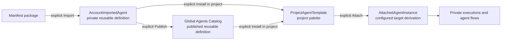

# Implementation Memo: Agent Template Installation and Private Attachments

> **Amendment (2026-07-21, `DEC-041` — `18-node-explainer-tab-retention-memo.md`).** Every provision of this memo that removes the built-in node Explanation tab, its direct prompt/provider path, its cache, or `hasExplanation` behavior (formerly `DEC-033`) is **superseded and must not be implemented**. The Explanation tab is retained permanently; the attached Node Explainer agent chat coexists as an additional explanation surface. The affected passages below are corrected in place and marked with `(DEC-041)`. All other lifecycle provisions of this memo remain authoritative.

## 1. Problem Statement

The superseded planning model treated installation as an account-level palette pointer and allowed publication to be initiated from an installed agent. That model no longer matches the approved lifecycle. It conflated a reusable manifest definition, an account-private imported definition, a project-installed template, and a configured attached instance. It also risked exposing private datasets, node packages, agent definitions, installations, attachments, orchestration state, settings, or prompts when a project/dataflow was shared.

The lifecycle must use three explicit private layers before execution: an account-level imported definition, a project-level installed template, and an attached instance derived from that project template. Import, project installation, attachment, and publication are separate commands. Only account-imported manifest packages are user-publishable for now. Project-installed templates and attached instances are never directly publishable or shareable.

The node UI also contains a built-in Explanation tab. *(DEC-041)* The tab is **retained permanently**; the attached Node Explainer Agent chat is offered as an additional, coexisting explanation surface whose behavior, provider use, history, cost/quota policy, and prompt governance live inside the `agents/` boundary. The former requirement to move node explanation entirely into the agent chat is cancelled.

## 2. Scope

Included: reusable definition identity; account import; global catalog publication eligibility; project installation; per-project agent defaults; private attachment derivation; attachment identity without SemVer; import/install/publish UI actions; project palette behavior; settings-modal applicability; prompt-governance scope; the Node Explainer agent chat as a coexisting explanation surface *(the tab removal is cancelled — DEC-041)*; persistence; APIs; state; tests; migration; KGGraph traceability; and updates to all affected planning/product documents.

Sharing is out of scope (D-0 = B): agents reuse Curio's existing flow-sharing and build no new sharing mechanic.

Out of scope: application implementation in this documentation-only change; publishing project installations or attached instances; automatically importing or installing a package; sharing editable/executable projects or their private dependencies; cross-account collaborative agent execution; versioning attached instances; exporting a project-private agent override back into a manifest package; changing dataset/node-package ownership rules; or defining final retention durations outside `OQ-008`.

## 3. Recommended Implementation Approach

### Canonical lifecycle aggregates

Use distinct aggregates and commands:

| Aggregate | Scope | Created by | Purpose | Publishable/shareable |
| --- | --- | --- | --- | --- |
| `AgentDefinitionArtifact` | Immutable reusable definition | Built-in seed, global catalog, or validated account import | Manifest, prompt assets, contracts, capabilities, safe default suggestions, exact digest/version | A user may publish only through its owning `AccountImportedAgent`; never shared through a flow |
| `AccountImportedAgent` | Authenticated account | Explicit Import in the Agents drawer | Private reusable manifest template and ownership/provenance record | Publish eligible; not installed anywhere automatically |
| `ProjectAgentTemplate` | One project; the current repository uses the project ID as the dataflow scope key | Explicit Install in project from a visible definition | Project palette entry and source of project-specific per-agent defaults | Never directly publishable or shared |
| `AttachedAgentInstance` | One project plus canvas/dataflow/node target | Explicit attach from a project-installed template | Configured private runtime derivation with session/history | Never publishable or shared; no independent SemVer/version lifecycle |



Import must finish with a private account-library item and must not mutate the current project. Install must require a selected authorized project and must not publish. Publish must require an owned validated `AccountImportedAgent` and must not install it. A project installation sourced from a global/built-in/imported definition has no Publish action. If a future workflow needs to publish project-local changes, it must explicitly package and import a new manifest definition first; that conversion is not part of this release.

System-curated catalog ingestion is an administrative path, not a user exception to the “only imported agents are user-publishable” rule.

The tradeoffs are intentional. Project installation duplicates a small settings/profile record per project, but prevents one project from changing another. Imported-only publication requires an explicit packaging/import step before project-local work can become reusable, but blocks accidental disclosure of project context and configuration. Omitting attachment SemVer keeps instances lightweight; immutable execution snapshots retain operational reproducibility. *(DEC-041)* The node Explanation tab is retained alongside the Node Explainer agent: the product accepts two explanation paths, and the former "eliminate a second LLM path" tradeoff argument no longer applies.

### Project defaults and attached-instance configuration

The immutable definition may declare non-secret, schema-valid `settingsDefaults` seed suggestions. Each explicit project install materializes its own project-private `ProjectAgentSettingsProfile`; another project installing the same definition receives a separate profile. Effective runtime policy is:

```text
deployment ceilings
  ∩ account safety/privacy policy
  ∩ project-installed template defaults
  ∩ attached-instance downward-only overrides
  ∩ atomic execution reservation
  = immutable EffectiveAgentPolicySnapshot for one run
```

Reset restores the selected project's per-agent default and re-applies current account/deployment ceilings. It never changes the imported definition, another project installation, or another attachment.

The shared six-screen settings shell remains, with scope-specific applicability. Per the `DEC-038` release cut, the three policy screens (Cost / Quotas / Resource policies) ship in v1 and the three prompt-governance screens (Prompt editor / quality / audit) are v2 (demand-gated); the six-screen shell is the v2 end-state.

- Account policy: Cost, Quotas, and Resource policies establish upper bounds/defaults; the evaluation sub-budget is account-scope only (`DEC-037`).
- Imported definition: Prompt editor, Prompt quality, and Prompt audit govern the owned manifest package; Release creates a new private imported definition artifact that may later be installed or published explicitly.
- Project-installed template: Cost, Quotas, and Resource policies manage per-agent project defaults. Prompt screens show source provenance/evidence read-only **only to the source import's owner while that import is unpublished — collaborators get execution only until it is published** (`DEC-036`); no screen exposes Publish.
- Attached instance: Cost, Quotas, and Resource policies may only tighten the project template. Prompt source/evidence may be inspected when authorized (owner-only until the source import is published, `DEC-036`), but the instance is not an artifact and cannot be released, versioned, published, or shared.

### Attached-instance identity without versioning

`attachmentId` is the stable identity. `AttachedAgentInstance {attachmentId, ownerAccountId, projectId, projectAgentTemplateId, target, configuration, sessionId, revision}` carries both user/account and project authorization boundaries. The optimistic concurrency `revision` protects edits, but there is no SemVer, publication coordinate, release history, or catalog identity. For execution reproducibility, each run persists the resolved source definition digest, project settings revision, attachment revision, prompt digest, provider profile revision, and effective-policy snapshot. Those execution pins do not turn the attachment into a versioned artifact.

### Sharing (out of scope — reuse existing flow-sharing)

Agent sharing is out of scope (D-0 = B). Agents reuse Curio's existing flow-sharing and add no new
sharing mechanism. The only requirement is negative: this feature introduces no agent-private data —
reusable definitions, account imports, project-installed templates, attachments, agent-flow/delegation
graphs, settings, prompt assets, evaluation/audit evidence, transcripts, tool/provider/usage/cost
data, or private identifiers — as a new shared surface. See
`14-plan-hardening-and-open-decisions-memo.md` D-0.

### Node explanation ownership

*(DEC-041 — the removal formerly specified here is cancelled.)* The node Explanation tab, its direct prompt/provider request path, loading/error state, and node-store explanation cache are **retained unchanged**. Independently, the Node Explainer Agent can be explicitly installed in the project and attached to a compatible node; opening its dock tile opens the unified agent chat, where explanation requests, responses, citations/context summaries, cost/quota state, and history are handled. The two surfaces coexist.

## 4. Data and State Handling

Sources of truth:

- `AgentDefinitionArtifactRepository`: immutable built-in, global, and imported package bytes by exact coordinate.
- `AccountImportedAgentRepository`: private account ownership, provenance, current private artifact pointer, validation state, and publication eligibility.
- `AgentPublicationRepository`: global-catalog projection that references one eligible imported artifact; publication never implies project installation.
- `ProjectAgentTemplateRepository`: project-scoped installed templates keyed by `projectAgentTemplateId` and `projectId`/current `dataflowId` scope key.
- `ProjectAgentSettingsRepository`: independent typed per-template settings bindings/revisions seeded on install.
- Project/dataflow attachment repository: private `AttachedAgentInstance` records keyed by `attachmentId`; revisioned for concurrency but not versioned as artifacts.
- Session/execution/event repositories: private attachment interaction and runtime history.

Import validates a bounded manifest package in private staging and atomically creates the immutable artifact plus `AccountImportedAgent`. No project cache changes. Install validates source visibility/trust/compatibility and atomically creates `ProjectAgentTemplate` plus its typed defaults; only that project's palette cache changes. Attach validates project membership, template availability, target compatibility, and permission before creating an instance/session. Detach removes or tombstones only the instance according to retention policy. Uninstall removes only the project template after that same project's live attachment/review/execution reference check.

Updating or republishing an imported definition never mutates existing project templates or attached instances. A project update is a separate reviewed action that selects another exact source definition for future attachments; existing attachments remain operationally linked to their current project template/source snapshot until explicitly migrated or detached. No implicit cross-project cache update is allowed.

## 5. UI and UX Requirements

- The Agents drawer distinguishes `Global Catalog`, `My Imports`, and `Installed in this project` without implying that these states are interchangeable. The **`Global Catalog`** scope is the shared, cross-account **Catalog Hub** — the same global hub datasets and node packs publish to; a user `Publish` from `My Imports` lists an owned imported definition there for other users to discover and `Install in project`. "Global Catalog" (the drawer scope/tab label) and "Catalog Hub" (the publish destination) are the same place.
- `Import package` accepts a manifest-based package and ends on a private imported-agent detail with `Install in project` and, when validated/authorized, `Publish` as separate actions. Neither action runs automatically.
- Global catalog cards offer `Install in project`; they do not offer user republishing.
- Project-installed template detail cards in the drawer show `Installed in this project`, a labeled `Project agent settings` cog, and `Uninstall from project` where appropriate. They never show Publish, Share, global version-release, or account-wide-installed language.
- The draggable palette is populated only from the active project's `ProjectAgentTemplate` records. Switching projects replaces the installed-agent palette with the selected project's list without carrying instances across projects. Palette rows remain action-free; settings/uninstall live in the drawer detail so drag and button behavior cannot conflict.
- Attached agent UI shows the source project template, target, private scope, status, and settings/chat affordances. It has no Version, Publish, Share, or global catalog action.
- Settings headings distinguish `Account policy`, `Imported definition`, `Project agent default`, and `Attached instance`. Reset always states which project-agent default will be restored.
- Sharing adds no agent UI: agents reuse Curio's existing flow-sharing (D-0 = B). The feature only guarantees that agent-private data (definitions, imports, templates, attachments, agent flows, settings, prompts, history) is not exposed in the existing shared result.
- *(DEC-041)* Keep `Explanation` in every node tab list, keyboard order, context menu, state, and accessibility label exactly as it is today. An `Explain with Node Explainer` discoverability affordance may additionally open the normal install/attach/chat flow; it must not recreate a bespoke explanation panel.
- Node Explainer responses use the unified agent chat and the same focus, keyboard, streaming, review/history, privacy, and settings behavior as every attached agent.

## 6. Edge Cases

- Import succeeds while no project is open; it remains in My Imports and no project is mutated.
- Import and Install are clicked repeatedly or concurrently; idempotency produces one account import and one template per intended project/source identity.
- The user imports a package already present globally or imports a new digest under the same publisher/ID/version; provenance/collision rules fail safely without installing it.
- Publish is attempted from a project template, attachment, built-in/global catalog item, or non-manifest legacy item; the server rejects it even if a client fabricates the request.
- A private imported definition is published while already installed in several projects; publication changes only global discovery.
- An imported artifact is deleted/unpublished while project templates or executions reference its bytes; exact referenced bytes remain retained or the operation is blocked according to lifecycle/retention policy.
- A project template is uninstalled while attachments, paused reviews, or nonterminal executions in that project reference it; uninstall is blocked and never detaches silently.
- The same definition is installed in two projects with different defaults; edits and Reset affect only the selected project.
- An attached instance changes concurrently in two tabs; optimistic revision conflict preserves both users' intent without creating an attachment “version.”
- Curio's existing project/dataflow share is generated while a private agent execution is streaming or visible output changes; no partial or internal agent event is exposed through that existing share (no-leak guard — D-0 = B).
- The agents feature does not alter, retire, or replace Curio's existing share route or its caches; it only ensures no agent-private content is added to whatever that existing route already returns.
- If agent-produced visible output would embed a dataset URL, account/project ID, prompt fragment, tool response, secret, or source-code detail, that agent-private data must not be surfaced through the existing flow-sharing.
- A recipient guesses private agent IDs found in old links or cached UI state; the existing share surface must not resolve or expose any private agent resource.
- The Node Explainer is unavailable, not installed, detached, provider-blocked, or over quota; the node UI offers the normal install/attach/retry route, and the retained Explanation tab continues to work independently *(DEC-041)*.
- *(DEC-041)* Saved Explanation-tab state remains valid and in place; the former migration/archival step (`dev/17` §3.5, H-7) is moot — no explanation content moves or is discarded.

## 7. Testing Strategy

- Domain/contract tests for the definition → account import → project template → attachment aggregate boundaries, legal transitions, ownership, idempotency, and stable errors.
- Publication authorization tests proving only owned validated `AccountImportedAgent` artifacts can enter the user publication workflow; installed templates/attachments/global items are rejected server-side.
- Import tests proving bounded validation, private account storage, no active-project mutation, no automatic installation, and no implicit publication.
- Project-install tests proving explicit project scope, project-only palette updates, independent per-project settings-default materialization, Reset isolation, and no publish action/capability.
- Attachment tests proving target/project authorization, private derivation, stable `attachmentId`, optimistic revision without SemVer, no publish/share routes, and execution snapshot pinning.
- Cross-project tests proving one definition can have independently configured templates/attachments and that switching projects never leaks palette, settings, prompt, or session state.
- Sharing regression test (D-0 = B): the agents feature adds no new sharing mechanic; assert that agent-private data (definitions, imports, templates, attachments, agent flows, settings, prompts, evaluation/audit, transcripts, provider/tool data, private IDs) does not appear as a new shared surface in Curio's existing flow-sharing.
- Concurrent project edits, revoked resources, cache separation, account switch, and retention tests.
- *(DEC-041)* Node UI regression test proving the Explanation tab renders and its existing request path still works; if present, the discoverability affordance enters the standard Node Explainer install/attach/chat path.
- Node Explainer agent tests for input context, prompt/preamble, provider parameters, output contract, error behavior, privacy, and single execution through the standard agent path (no parity-vs-tab migration gate — the tab is retained).
- Accessibility tests for drawer state labels/actions, project scope announcements, settings applicability, and Node Explainer chat focus/navigation.

## 8. Acceptance Criteria

- Importing a validated manifest package creates one private account-level reusable definition and does not install it into any project or publish it.
- Only an owned validated imported manifest definition exposes and passes the user Publish command; a project-installed template or attached instance cannot be published through UI or API.
- Installing is an explicit project-scoped action that creates a project template and materializes that project's per-agent defaults; the template appears only in that project's palette.
- Publishing and installing are independent: either may occur first for an imported definition, and neither causes the other.
- An attached agent is a private configured derivation of one project template, identified by `attachmentId`, revisioned only for concurrency, and has no SemVer, release, publication, or share lifecycle.
- Cost/quota/resource defaults are independent per installed project template and remain clamped by account/deployment policy; attachment overrides only tighten.
- Sharing is out of scope (D-0 = B): agents reuse existing flow-sharing and the feature exposes no agent-private data (datasets, node packages, reusable/imported/installed/attached agents, agent flows, configuration, prompts, audit/evaluation data, history, provider/tool details, identifiers, or executable controls) as a new shared surface.
- The agents feature adds no shared-result endpoint; it reuses Curio's existing flow-sharing and exposes no private agent resource through it.
- *(DEC-041)* The built-in node Explanation tab and its direct explanation LLM path are retained; Node Explainer Agent chat is a coexisting node-explanation workflow, not the only one.
- All frontend/backend agent lifecycle, settings, runtime, and Node Explainer agent responsibilities remain behind the documented `agents/` public boundaries and typed domain ports (the retained tab keeps its existing, non-`agents/` path).

## 9. Recommended Commit Breakdown

1. Add lifecycle ADRs, schemas, traceability IDs, and legal-transition tests for imported definitions, project templates, and attachments.
2. Add account import/private-library persistence and explicit imported-only publication authorization with tests.
3. Add project template installation/uninstallation, project palette queries, and per-agent default materialization with isolation tests.
4. Add attachment derivation and execution snapshots without attachment SemVer/publication/share contracts.
5. Add a sharing regression guard (D-0 = B): no new sharing mechanic; prove the feature adds no agent-private data as a new shared surface in existing flow-sharing.
6. ~~Remove the node Explanation tab/direct caller…~~ **Cancelled (`DEC-041`)** — the tab stays; deliver the Node Explainer Agent chat as a coexisting surface with its own accessibility tests.
7. Align settings/prompt-governance applicability, product copy, KGGraph Build Logs, and regenerated design evidence in focused documentation/artifact commits.

## 10. Engineering Quality Checklist

- [ ] Reusable definition, account import, project template, attachment, execution, and publication are distinct typed aggregates.
- [ ] Import, install, attach, and publish are separate explicit commands with no hidden chaining (there is no agent share command — D-0 = B).
- [ ] User publication accepts only owned validated imported manifest definitions.
- [ ] Project templates and attached instances have no Publish/Share route, authorization capability, or UI action.
- [ ] Every project installation owns independent per-agent defaults; Reset and edits cannot cross projects.
- [ ] Attachment `revision` is used only for concurrency and is never presented as artifact versioning.
- [ ] Execution reproducibility pins source/settings/prompt/provider policy without creating an attachment release lifecycle.
- [ ] Datasets, node packages, definitions, imports, installations, attachments, agent flows, prompts, settings, histories, provider/tool details, and private IDs are never added to Curio's existing flow-sharing as a new shared surface.
- [ ] *(DEC-041)* Node Explanation tab/state/direct provider-prompt calls remain present and unchanged; no removal work ships.
- [ ] The Node Explainer *agent* uses only the unified attached-agent chat and governed settings path (the retained tab is a separate, unchanged surface).
- [ ] Account/project switching clears mismatched palette, attachment, settings, prompt, and session caches.
- [ ] Cross-account/project authorization is non-enumerating and tested.
- [ ] Documentation, migrations, tests, commits, and KGGraph evidence are bidirectionally traceable.
