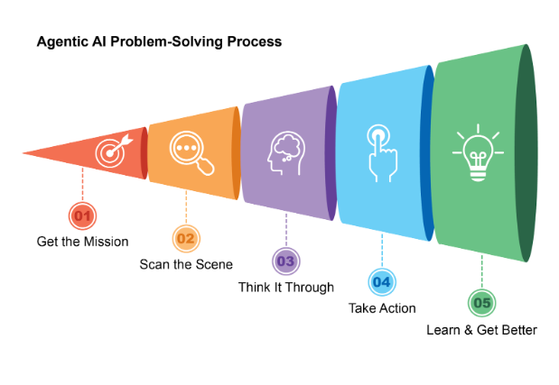
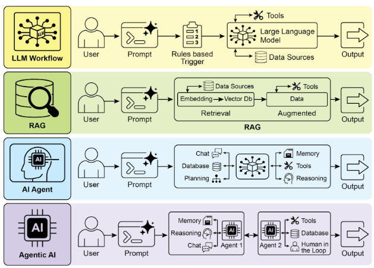
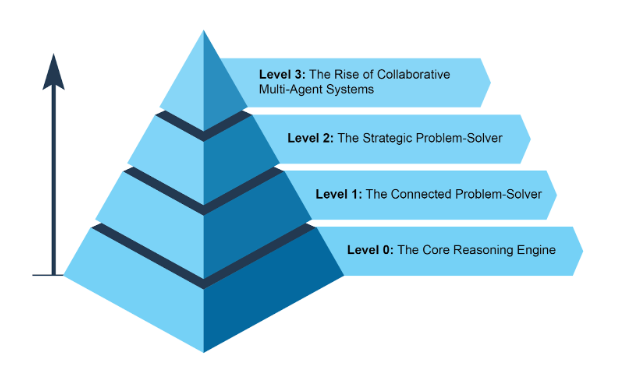
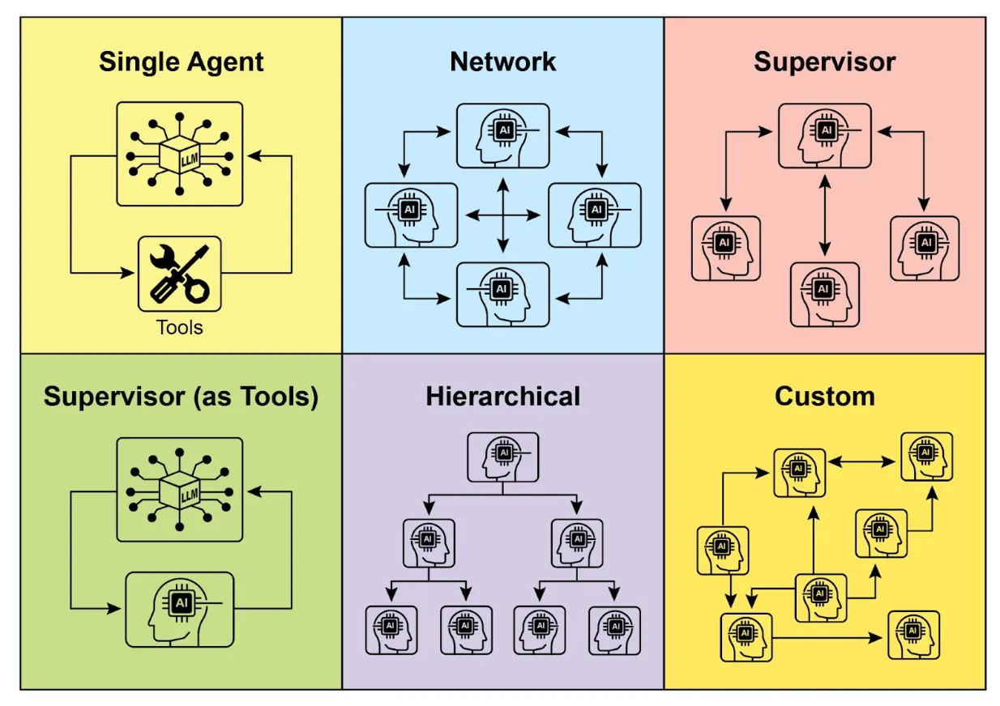

# What is Agentic AI

## Table of Contents

- 1. What is called "AI Agent" ?
- 2. The growing trend of AI Agents
- 3. The level of Agent complexity
- 4. Five theories about the future of Agent
- 5. Improving the accuracy of AI Agents

## 1. What is called "AI Agent" ?

**AI Agent,** is a system designed to **observe an environment**, ** perform an action** to ** achieve the specific goal.**

This is a step forward from the conventional ** LLM**model, thanks to the addition of the ability to ** plan**, ** use tools** and ** interact with the environment/workspace.**

To understand it easily, you can imagine ** Agentic AI** is an ** "intelligent assistant"** that learns while working.

An ** Agent** usually operate in a loop with **5 steps** (Figure 1):

1. ** Get the Mission** - For example: "Arrange my work schedule."
2. ** Scan the Scene**- Collect necessary information: read emails, check calendars, access contacts...
3. ** Think It Through** - Determine the solution to achieve the goal.
4. ** Take Action** - Follow the solution from step 3.
5. ** Learn and Get Better** - Learn from the results, adjust for next time.

*Figure 1: Standard 5-step loop that AI Agent follow.*

## 2. The growing trend of AI Agents

Agent is being more and more popular. Recent researches show that the majority of IT corporations are already using it.

[pwc.com](https://www.pwc.com/us/en/tech-effect/ai-analytics/ai-agent-survey.html)

By 2024, AI Agent startups had raised more than $2 billion, while the market reached $5.2 billion and is expected to explode to nearly $32.5 billion by 2034.

[openpr.com](https://www.openpr.com/news/4091894/ai-agent-market-to-surge-past-32-5-billion-by-2034-fueled)

Among 2 years, AI has transformed from simple automation to complex autonomous systems (Figure 2):

- Origin: LLM + prompt, trigger to process data.
- 2nd generation: **RAG** - Improved reliability through retrieving data on database/Internet.

- 3rd generation: ** AI Agent** - Ability to use tools.
- Present: ** Agentic AI** - Multiple AI Agents work together to achieve goals.

*Figure 2: The evolution of LLM -> RAG -> Agentic RAG -> Agentic AI.*

## 3. The level of Agent complexity

**Level 0 - Core Reasoning Engine**

LLM acts as a ** "brain"** but has ** no tool, memory or any interaction** with the ** environment or workspace**. Its replies base on ** pre-trained knowledge.**

** Level 1 - Connected Problem-Solver**

LLM becomes a real Agent when connecting to ** external tools (search Internet, API, database, etc)**

** Level 2 - Strategic Problem-Solver**

Agent has the ability to ** solve strategic problem, self-improvement**.

Core skills: Prompt Engineering and Context Engineering - select, package, manage important information for each step.

Agents can improve themselves by asking users for feedback and try to improve for next time.

** Level 3 - Collaborative Multi-Agent Systems**

Instead of one AI Agent do everything, many AI Agent work together as an organization

The current limit: The limited thinking of LLM and limited ability to learn from each other.

*Figure 3: Level of agent complexity*

## 4. Five theories about the future of Agent

- **Generalist Agent** - Agent handles long-term, complex goals, and operates continuously.
- ** Deep Personalization & Proactive Goal Discovery** - Agent personalized, learn and suggest potential user goals.

- ** Embodiment** - Agents appear in the form of physical robot, interact directly with the physical world.
- ** Agent-Driven Economy** - Agents participate in the economy as independent entities, operating their own businesses or production-business chains.

- ** Goal-Driven, Metamorphic Multi-Agent System** - Multi-Agent system automatically creates, edits, deletes, and replicates itself to optimize goals; self-improves structure and operation.

AI Agents are a huge step forward from traditional LLMs to systems that are ** autonomous**, ** planning**, ** interactive**, and ** self-improving**.

## 5. Improving the accuracy of AI Agents

- Prompt Chaining:  Instead of solving entire problem in a single step, apply a "divide and conquer" strategy.

  ** Main idea:**
  - Divide a large, difficult problem into a smaller problems, easier to handle.
  - Each sub-problem is solved independently using a specially designed prompt.
  - The ** output** of the previous step is given as the ** input** to the next prompt in the chain.
This sequential approach brings ** modularity** and ** clarity** when interacting with LLM.

Example: curio/utk_curio/llm-prompts/evaluate_generated_content_prompt.txt

Generator prompt: new_content_prompt.txt

Evaluator prompt: evaluate_generated_content_prompt.txt

    You are a code quality evaluator for urban analytics workflows. Your job is to review Python code or Vega-Lite JSON generated by another agent and identify issues.
    
    Given:
    1. The subtask description
    2. The generated code/content
    3. The node type (DATA_LOADING, DATA_CLEANING, etc.)
    4. Input/output data types
    
    Evaluate the generated content for:
    
    **CRITICAL ERRORS** (must be fixed):
    - Syntax errors in Python or JSON
    - Missing return statements in Python nodes
    - Incorrect data structure (DataFrame vs GeoDataFrame)
    - Using undefined variables or incorrect column names
    - Wrong library imports or non-existent functions
    - Incompatible operations (e.g., spatial operations on non-geo data)
    
    **QUALITY ISSUES** (should be improved):
    - Inefficient code patterns
    - Missing error handling for edge cases
    - Hardcoded values that should be parameterized
    - Poor variable naming
    - Missing comments for complex logic
    - Incomplete implementation of the subtask
    
    **OUTPUT FORMAT:**
    Return a JSON object with this structure:
    '''json
    {
        "has_critical_errors": true/false,
        "critical_errors": ["error description 1", "error description 2"],
        "quality_issues": ["issue description 1", "issue description 2"],
        "suggested_fix": "corrected code if critical errors exist, otherwise empty string",
        "overall_assessment": "PASS" or "FAIL"
    }
    '''
    
    **EXAMPLES:**
    
    Example 1 - PASS:
    Generated Code:
    '''python
    import pandas as pd
    df = pd.read_csv('data.csv')
    return df
    '''
    Evaluation:
    '''json
    {
        "has_critical_errors": false,
        "critical_errors": [],
        "quality_issues": ["Could add error handling for missing file"],
        "suggested_fix": "",
        "overall_assessment": "PASS"
    }
    '''
    
    Example 2 - FAIL (missing return):
    Generated Code:
    '''python
    import pandas as pd
    df = pd.read_csv('data.csv')
    df = df.dropna()
    '''
    Evaluation:
    '''json
    {
        "has_critical_errors": true,
        "critical_errors": ["Missing return statement - data won't be passed to next node"],
        "quality_issues": [],
        "suggested_fix": "import pandas as pd\ndf = pd.read_csv('data.csv')\ndf = df.dropna()\nreturn df",
        "overall_assessment": "FAIL"
    }
    '''
    
    Example 3 - FAIL (wrong data type):
    Generated Code:
    '''python
    import geopandas as gpd
    df = pd.read_csv('locations.csv')
    df['geometry'] = gpd.points_from_xy(df.longitude, df.latitude)
    return df
    '''
    Evaluation:
    '''json
    {
        "has_critical_errors": true,
        "critical_errors": ["Created geometry column but returned pandas DataFrame instead of GeoDataFrame", "pd is not imported"],
        "quality_issues": [],
        "suggested_fix": "import pandas as pd\nimport geopandas as gpd\ndf = pd.read_csv('locations.csv')\ngeometry = gpd.points_from_xy(df.longitude, df.latitude)\ngdf = gpd.GeoDataFrame(df, geometry=geometry)\nreturn gdf",
        "overall_assessment": "FAIL"
    }
    '''
    
    **IMPORTANT RULES:**
    - Be strict on critical errors but lenient on quality issues
    - Always provide a suggested_fix if overall_assessment is "FAIL"
    - Keep error descriptions concise (max 50 characters each)
    - Only output valid JSON, no other text
    - If content is "not controllable", output: {"has_critical_errors": false, "critical_errors": [], "quality_issues": [], "suggested_fix": "", "overall_assessment": "PASS"}

- Prompt Engineering: Designing, testing, and refining prompts to instruct the LLM to generate the best result.

  **Main idea:**
  - Assign a role to the model.
  - Few-shot / Zero-shot Prompting - Provide sample.
  - Ask the model to think in steps.
  - Order the requirements from most important to least important.
  - Specify the output format (JSON, table, bullet points).
Example: curio/utk_curio/llm-prompts/new_content_prompt.txt

    ###
    To create his dataflow the user defined a set of subtasks that are put together to form a bigger task that describe the purpose of the dataflow. 
    
    Your job is to generate the appropriate content for a node given the trill specification of the current dataflow, the node id, the node subtask, the task.
    
    Generate the content of the node paying attention to how it is controllable, as mentioned before. For example, Vega nodes are controlled through the Vega-Lite JSON grammar, while most of the other boxes are controllable through python.
    
    ## FEW-SHOT EXAMPLES:
    
    Example 1 - DATA_LOADING:
    Subtask: "Load earthquake data from CSV file"
    Output:
    '''python
    import pandas as pd
    df = pd.read_csv('earthquake_data.csv', parse_dates=['date'])
    return df
    '''
    
    Example 2 - DATA_CLEANING:
    Subtask: "Remove null values and invalid coordinates"
    Output:
    '''python
    # Remove rows with missing critical data
    df = df.dropna(subset=['latitude', 'longitude', 'magnitude'])
    # Filter invalid coordinates
    df = df[(df['latitude'].between(-90, 90)) & (df['longitude'].between(-180, 180))]
    return df
    '''
    
    Example 3 - DATA_TRANSFORMATION:
    Subtask: "Calculate distance from city center"
    Output:
    '''python
    import numpy as np
    # City center coordinates
    center_lat, center_lon = 41.8781, -87.6298
    # Calculate distance in km
    df['distance_km'] = np.sqrt(
        ((df['latitude'] - center_lat) * 111.0) ** 2 +
        ((df['longitude'] - center_lon) * 111.0 * np.cos(np.radians(center_lat))) ** 2
    )
    return df
    '''
    
    Example 4 - COMPUTATION_ANALYSIS:
    Subtask: "Group by region and calculate average magnitude"
    Output:
    '''python
    result = df.groupby('region')['magnitude'].mean().reset_index()
    result.columns = ['region', 'avg_magnitude']
    return result
    '''
    
    **ONLY OUTPUT THE CONTENT FOR THE NODE AND NOT ANY OTHER TEXT. IF A BOX IS NOT CONTROLLABLE OUTPUT 'not controllable'**
    ###

- Reflection Pattern: Agent evaluate its own output and using that evaluation to improve performance or refine its response. Reflection can sometimes be performed by a separate agent dedicated to analyzing the original agent's output.

  **Main idea:**
  - An agent generated an output.
  - Agent analyzes the results from the previous step. The evaluation may check for correctness, coherence, style or other relevant criteria.
  - Based on the critique, the agent determines how to improve. This could be creating refined output, adjusting parameters for the next step, or even modifying the overall plan.
  - (Optional) The reflection process can repeat until satisfactory results are achieved or a stopping condition is met.
Example: curio/utk_curio/backend/app/api/[routes.py](http://routes.py/)

    # Self-critique for content generation
        if prompt_file == "new_content_prompt" and assistant_reply and "not controllable" not in assistant_reply.lower():
            try:
                # Load evaluator prompt
                evaluator_prompt_file = open("./llm-prompts/evaluate_generated_content_prompt.txt")
                evaluator_prompt = evaluator_prompt_file.read()
                
                # Build evaluation request
                eval_message = f"{evaluator_prompt}\n\nSubtask from original request:\n{text}\n\nGenerated content to evaluate:\n'''\n{assistant_reply}\n'''"
                
                # Call evaluator with low temperature for consistency
                eval_response = model.generate_content(
                    eval_message,
                    generation_config=genai.types.GenerationConfig(
                        temperature=0.1,
                        max_output_tokens=1024,
                    )
                )
                
                eval_result = eval_response.text.strip()
                # Clean JSON markers
                eval_result = eval_result.replace("'''json", "").replace("'''", "").strip()
                
                # Parse evaluation
                eval_data = json.loads(eval_result)
                
                # If FAIL, regenerate with suggested fix or error feedback
                if eval_data.get("overall_assessment") == "FAIL":
                    print(f"Self-critique FAILED. Critical errors: {eval_data.get('critical_errors')}")
                    
                    if eval_data.get("suggested_fix"):
                        # Use the suggested fix
                        assistant_reply = eval_data["suggested_fix"]
                        print("Applied suggested fix from evaluator")
                    else:
                        # Regenerate with error feedback
                        error_feedback = "\n\nPrevious attempt had critical errors:\n" + "\n".join(eval_data.get("critical_errors", []))
                        retry_message = full_message + error_feedback
                        
                        retry_response = model.generate_content(
                            retry_message,
                            generation_config=genai.types.GenerationConfig(
                                temperature=0.3,  # Slightly higher for more creativity
                                max_output_tokens=2048,
                            )
                        )
                        assistant_reply = retry_response.text
                        print("Regenerated content after self-critique")
                else:
                    print(f"Self-critique PASSED. Quality issues: {len(eval_data.get('quality_issues', []))}")
                    
            except Exception as e:
                print(f"Self-critique error (non-blocking): {str(e)}")
                # Continue with original response if evaluation fails

- Planning: The core computational processes in autonomous systems that allow agents to synthesize sequences of actions to achieve goals, especially in dynamic or complex environments. This process transforms a high-level goal into a structured plan of discrete, executable steps.
- Multi-agent (Agentic AI): Instead of solving entire problem in a single step, apply a "divide and conquer" strategy.

  **Main idea:**
  - Divide a large, difficult problem into a smaller problems, easier to handle.
  - Each sub-problem is solved independently by each agent.
Example: There are 14 agents in curio/utk_curio/llm-prompts, create an Agentic AI ecosystem

    "chat_prompt",
    "debug_prompt",
    "explanation_prompt",
    "single_box_explanation_prompt",
    "new_content_prompt",
    "new_subtask_from_exec_prompt",
    "new_subtasks_prompt",
    "new_connection_prompt",
    "workflow_suggestions_prompt",
    "evaluate_coherence_subtasks_prompt",
    "evaluate_generated_content_prompt",
    "syntax_analysis_prompt",
    "task_refresh_prompt",
    "keywords_binding_prompt".

*Figure 4: AI Agent and Agentic AI designs*
