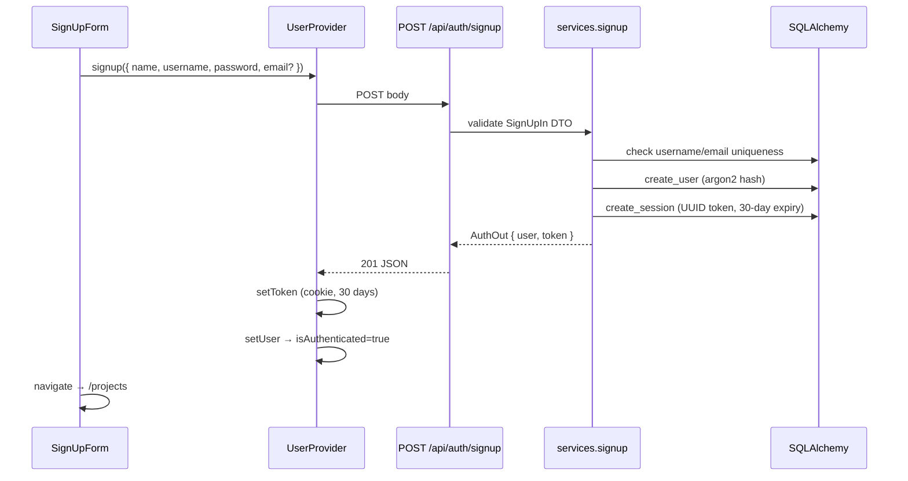
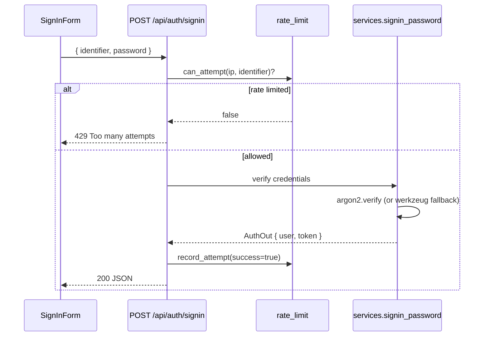
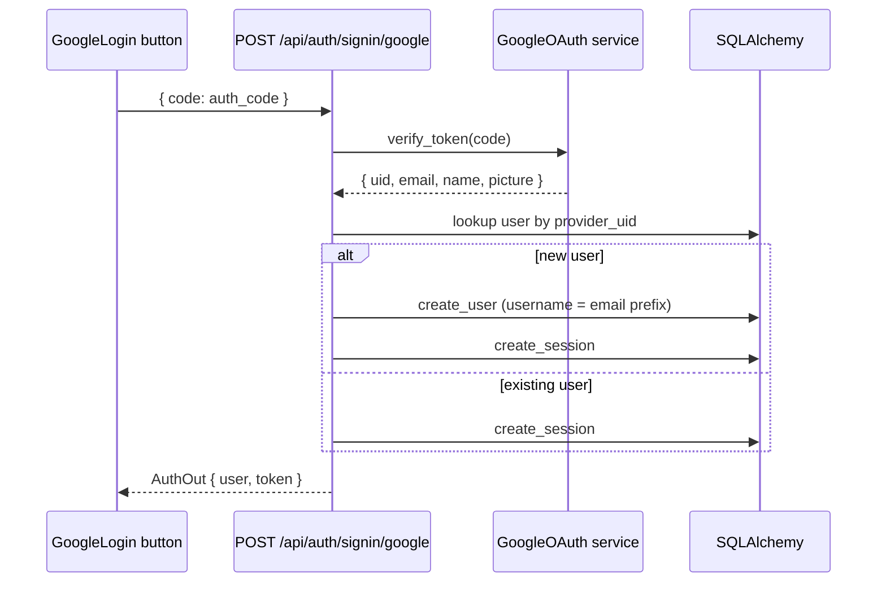
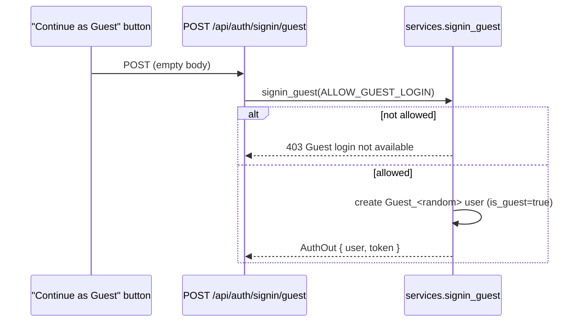

# User Authentication Feature — Technical Documentation

## 1. Architecture Overview

```
Frontend (React 18)                          Backend (Flask)
┌──────────────────────┐                     ┌──────────────────────────────┐
│ authApi.ts           │  HTTP + Bearer      │ /api/auth/*   (auth_bp)      │
│  signup / signin     │ ──────────────────► │ /api/config/* (config_bp)    │
│  signinGoogle        │                     │                              │
│  signinGuest         │                     │  routes.py                   │
│  signout / getMe     │                     │    ↓                         │
│                      │                     │  services.py  (business)     │
│ UserProvider.tsx      │                     │    ↓               ↓         │
│  (React context)     │                     │  repositories.py  security.py│
│                      │                     │    ↓               ↓         │
│ RequireAuth.tsx       │                     │  models.py    rate_limit.py  │
│  (route guard)       │                     │    ↓                         │
│                      │                     │  SQLAlchemy app DB           │
└──────────────────────┘                     └──────────────────────────────┘
```

The backend follows a strict layered pattern:
**routes → services → repositories → models**, with cross-cutting concerns
(`security`, `rate_limit`, `dependencies`) kept in dedicated modules.

## 2. Authentication Flows

### Sign Up (Email/Password)



### Sign In (Password)



### Sign In (Google OAuth)



### Guest Login (Dev Only)



## 3. Token Lifecycle

| Property | Value |
|---|---|
| Format | UUID v4 (`UserSession.token`) |
| Storage (frontend) | `js-cookie` with key `session_token`, expires 30 days |
| Transport | `Authorization: Bearer <token>` header on every `apiFetch` call |
| Lifetime | 30 days (`SESSION_LIFETIME_DAYS`), checked via `UserSession.is_expired` |
| Touch-on-use | `last_seen_at` updated on each authenticated request (`touch_session`) |
| Invalidation | `POST /api/auth/signout` sets `session.active = False` |

### `@require_auth` Middleware

Applied as a decorator on protected endpoints. Flow:

1. Extract `Authorization` header (supports `Bearer <token>` and legacy raw token).
2. Look up active session by token.
3. Reject if session not found or expired.
4. Update `last_seen_at` and attach `g.user` for the request handler.
5. Return `401 { "error": "Authorization required." }` on failure.

## 4. Password Security

| Aspect | Implementation |
|---|---|
| Primary algorithm | `argon2id` via `argon2-cffi` (memory-hard, side-channel resistant) |
| Fallback | `werkzeug.security.generate_password_hash` (pbkdf2:sha256) when `argon2-cffi` is not installed |
| Hash detection | `verify_password` checks for `$argon2` prefix to choose the correct verifier |
| Minimum length | 8 characters (enforced in `SignUpIn.validate()`) |

## 5. Rate Limiting

Backed by the `auth_attempt` table — no external dependencies like Redis.

| Parameter | Value |
|---|---|
| Window | 10 minutes (`WINDOW_SECONDS = 600`) |
| Max failures | 5 per IP+identifier pair |
| Scope | `POST /api/auth/signin` only |
| Recording | Both successes and failures logged; only failures counted toward the limit |

After 5 failed attempts for the same IP + identifier within 10 minutes, subsequent
attempts return `429 Too many attempts. Try again later.`

## 6. Feature Flags

| Flag | Default | Effect |
|---|---|---|
| `CURIO_ENV` | `dev` | Controls guest login default and cleanup behavior |
| `ALLOW_GUEST_LOGIN` | `true` in dev, `false` in prod | Shows/hides "Continue as Guest" button; backend enforces via `signin_guest()` |

The frontend fetches flags at startup via `GET /api/config/public` and uses them to
conditionally render the guest button and configure the Google OAuth provider.

## 7. Database Schema

### `user` table

| Column | Type | Notes |
|---|---|---|
| `id` | `Integer` PK | auto-increment |
| `username` | `String(64)` UNIQUE | required; 3–32 chars, alphanumeric + underscore |
| `email` | `String(120)` UNIQUE | nullable (not required for guests or password-only) |
| `name` | `String(100)` | display name |
| `password_hash` | `String(255)` | nullable (Google/guest users have none) |
| `profile_image` | `String(200)` | Google profile picture URL |
| `type` | `String(100)` | `programmer` \| `expert` \| `guest` |
| `provider` | `String(50)` | `google` or null |
| `provider_uid` | `String(200)` | Google UID for federated lookup |
| `is_guest` | `Boolean` | default `false`; `true` for ephemeral guest accounts |
| `created_at` | `DateTime` | auto-set UTC |
| `updated_at` | `DateTime` | auto-set with `onupdate` |

### `user_session` table

| Column | Type | Notes |
|---|---|---|
| `id` | `Integer` PK | |
| `user_id` | `FK → user.id` | |
| `token` | `String(36)` UNIQUE | UUID session token |
| `active` | `Boolean` | set `false` on signout |
| `expires_at` | `DateTime` | 30 days from creation |
| `last_seen_at` | `DateTime` | updated on each authenticated request |

### `auth_attempt` table (rate limiting)

| Column | Type | Notes |
|---|---|---|
| `id` | `Integer` PK | |
| `ip` | `String(45)` | IPv4/IPv6 remote address |
| `identifier` | `String(200)` | username or email used in the attempt |
| `success` | `Boolean` | |
| `created_at` | `DateTime` | auto-set; indexed with `ip` and `identifier` |

Indexes: `(ip, created_at)`, `(identifier, created_at)`.

### Migration

`a1b2c3d4e5f6_auth_schema_upgrade.py` adds new columns to `user` and `user_session`
using SQLite-safe `batch_alter_table`. Existing users are backfilled with usernames
derived from email local-part (or `user_<id>` when email is null).

## 8. API Endpoints

### Auth Blueprint (`/api/auth`)

| Method | Path | Auth | Description |
|---|---|---|---|
| POST | `/api/auth/signup` | — | Create account. Body: `{ name, username, password, email? }` |
| POST | `/api/auth/signin` | — | Password login. Body: `{ identifier, password }`. Rate-limited. |
| POST | `/api/auth/signin/google` | — | Google OAuth. Body: `{ code }` |
| POST | `/api/auth/signin/guest` | — | Guest account. Gated by `ALLOW_GUEST_LOGIN`. |
| POST | `/api/auth/signout` | Bearer | Invalidate current session |
| GET | `/api/auth/me` | Bearer | Return current user profile |
| PATCH | `/api/auth/me` | Bearer | Update profile. Body: `{ name?, email?, type? }` |

### Config Blueprint (`/api/config`)

| Method | Path | Auth | Description |
|---|---|---|---|
| GET | `/api/config/public` | — | Returns `{ allow_guest_login, google_client_id, curio_env }` |

### Response Format

**Auth success (signup / signin)**:
```json
{
  "user": {
    "id": 1,
    "username": "karla",
    "name": "Karla",
    "email": "karla@example.com",
    "profile_image": null,
    "type": "programmer",
    "is_guest": false
  },
  "token": "a1b2c3d4-e5f6-7890-abcd-ef1234567890"
}
```

**Error**:
```json
{ "error": "Invalid credentials." }
```

## 9. Frontend Architecture

### Key Files

| File | Role |
|---|---|
| `utils/authApi.ts` | HTTP client: `apiFetch` with automatic `Bearer` header, typed `authApi` methods |
| `providers/UserProvider.tsx` | React context managing `user`, `loading`, `isAuthenticated`, `allowGuest` state |
| `components/RequireAuth.tsx` | Route guard: redirects to `/auth/signin` if unauthenticated |
| `pages/auth/SignIn.tsx` | Sign-in page with two-panel layout |
| `pages/auth/SignUp.tsx` | Sign-up page with two-panel layout |
| `components/AuthForm/SignInForm.tsx` | Username/password form + `AltAuthBox` |
| `components/AuthForm/SignUpForm.tsx` | Registration form (name, username, email?, password, confirm) |
| `components/AuthForm/AltAuthBox.tsx` | Google OAuth button + conditional guest button |
| `components/AuthForm/AuthFormWrapper.tsx` | Two-panel layout: black left panel (Curio logo), white right panel |

### Token Flow

```
Login success
  → authApi returns { user, token }
  → UserProvider.handleAuth()
      → setToken(token)     // js-cookie, 30 days
      → setUser(user)       // React state
      → addUser(provenance) // provenance tracking
  → Navigate to /projects

Subsequent page load
  → UserProvider useEffect
      → getToken() from cookie
      → authApi.getMe() validates token with backend
      → success: setUser(user)
      → failure: clearToken(), redirect to /auth/signin

Signout
  → authApi.signout()      // backend invalidates session
  → clearToken()           // remove cookie
  → setUser(null)          // clear React state
```

### Route Protection

```tsx
<Routes>
  <Route path="/auth/signin" element={<SignIn />} />
  <Route path="/auth/signup" element={<SignUp />} />
  <Route path="/projects" element={<RequireAuth><ProjectsList /></RequireAuth>} />
  <Route path="/workflow/:id?" element={<RequireAuth><MainCanvasRoute /></RequireAuth>} />
  <Route path="/" element={<Navigate to="/projects" />} />
</Routes>
```

`RequireAuth` checks `UserProvider` context: shows `<Loading />` during initial
token validation, redirects to `/auth/signin` when unauthenticated, and renders
children when authenticated.

## 10. CORS Configuration

CORS is applied globally at the Flask app level in `create_app()`:

```python
CORS_HEADERS = {
    "Access-Control-Allow-Origin": "*",
    "Access-Control-Allow-Headers": "Content-Type,Authorization",
    "Access-Control-Allow-Methods": "GET,PUT,POST,PATCH,DELETE,OPTIONS",
    "Access-Control-Max-Age": "600",
}
```

- `@app.before_request` short-circuits `OPTIONS` preflight with 204.
- `@app.after_request` applies CORS headers to every response.
- Both `auth_bp` and `config_bp` have catch-all `OPTIONS` handlers as a safety net.

## 11. Validation Rules

### Sign Up (`SignUpIn.validate`)

| Field | Rule |
|---|---|
| `name` | Required, non-blank |
| `username` | 3–32 characters, `[a-zA-Z0-9_]` only, must be unique |
| `password` | Minimum 8 characters |
| `email` | Optional; if provided, must not be blank, must be unique |

### Sign In (`SignInIn.validate`)

| Field | Rule |
|---|---|
| `identifier` | Required (username or email) |
| `password` | Required |

## 12. Google OAuth Integration

- Uses the auth-code flow via `@react-oauth/google` on the frontend.
- Backend verifies the token through `GoogleOAuth.verify_token()` (wraps `google-auth` library).
- `CLIENT_ID` is read from the environment and exposed via `GET /api/config/public`.
- Auto-provisions a new user on first Google login; derives username from email prefix
  with collision avoidance (`karla`, `karla_2`, `karla_3`, …).

## 13. Guest Account Behavior

| Aspect | Detail |
|---|---|
| Creation | Ephemeral user with `is_guest=true`, random username (`guest_<hex>`), name `Guest_<hex>` |
| Visibility | Button shown only when `allow_guest_login=true` (fetched from `/api/config/public`) |
| Project quota | 20 projects in dev mode; 403 in prod |
| Cleanup | `cleanup_expired_guest_projects` deletes guest projects idle >24h (runs on startup + every 6h) |
| Session | Standard 30-day token; no special expiry |
