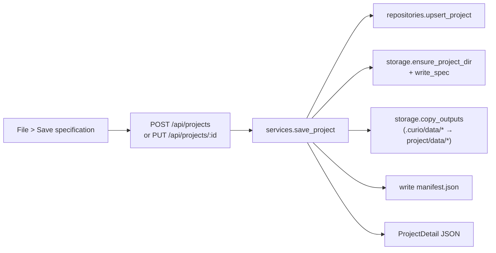
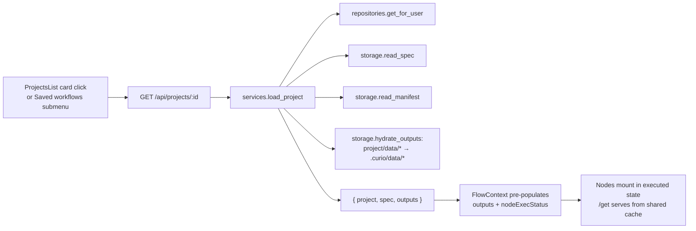

# Projects Feature — Technical Documentation

## 1. Disk Layout

```
<CURIO_LAUNCH_CWD>/.curio/
├── provenance.db                     # unchanged: provenance SQLite
├── data/                             # unchanged: shared execution output cache
│   └── <ts>_<hash>.data             # zlib-compressed JSON blobs
└── users/
    └── <user_id>/
        └── projects/
            └── <project_uuid>/
                ├── manifest.json     # metadata + output inventory
                ├── spec.trill.json   # authoritative Trill graph spec
                └── data/
                    └── <ts>_<hash>.data  # per-project output copies
```

### Path Safety

All filesystem operations in `storage.py` resolve paths through `_safe_resolve()`,
which calls `Path.resolve()` and asserts the result starts with the base directory.
This mirrors the traversal guard in the existing `/get` endpoint.

## 2. Save / Load Lifecycle

### Save Flow



1. Frontend calls `saveCurrentProject()` in `FlowContext`.
2. `TrillGenerator.generateTrill()` builds the spec from current nodes/edges.
3. Output refs are collected from `FlowContext.outputs`.
4. `projectsApi.create()` or `.update()` sends spec + output refs to the backend.
5. Backend writes spec, copies `.data` files, writes manifest, upserts DB row.
6. On success, `projectId` / `projectSavedAt` / `projectDirty=false` are set in context.

### Load Flow (Hydration)



1. `ProjectLoader` component detects a UUID in the URL param.
2. Calls `loadProject(id)` which fetches the full project + spec + outputs.
3. Hydration copies project `.data` files back into `.curio/data/` so `/get` works.
4. `loadTrill(spec)` applies the graph via existing `loadParsedTrill`.
5. Outputs are pushed into `FlowContext.outputs` in the same tick.
6. `nodeExecStatus` marks all output-bearing nodes as `"executed"`.
7. Each node renders with a green checkmark in the header when status is `"executed"`.

## 3. Hydration Model vs Phase 2 Cache

### Current Model (Phase 1)

- **On save**: output `.data` files are **copied** from the shared cache into the project folder.
- **On load**: they are **copied back** into the shared cache so the existing `/get` endpoint works.
- Filename collisions between projects are extremely unlikely due to timestamp+content-hash naming.

### Phase 2 Cache (Scaffolded, Not Wired)

- Gated behind `CURIO_PROJECT_EXEC_CACHE` env flag (default `false`).
- `exec_cache_entry` table stores `(project_id, content_key, output_filename)`.
- `cache.content_key(code, inputs, params)` computes `sha256` of the execution signature.
- When enabled, `/processPythonCode` would check the cache before executing.
- Currently only the table, `cache.py` stubs, and no-op tests are shipped.

## 4. Guest Quota Behavior

| Environment | Behavior |
|---|---|
| `CURIO_ENV=dev` | Guests can save up to 20 projects. `cleanup_expired_guest_projects` runs on startup and every 6 hours, deleting projects idle >24h. |
| `CURIO_ENV=prod` | Save returns 403 for guest users (unless `ALLOW_GUEST_LOGIN=true`). |

The cleanup task uses `threading.Timer` as a daemon thread — lightweight and
auto-terminates with the process.

## 5. Database Schema

### `project` table (SQLAlchemy app DB)

| Column | Type | Notes |
|---|---|---|
| `id` | `String(36)` PK | UUID generated server-side |
| `user_id` | `FK → user.id` | not null, indexed |
| `name` | `String(200)` | user-facing display name |
| `slug` | `String(240)` | derived from name + collision suffix |
| `description` | `Text` nullable | optional subtitle |
| `folder_path` | `String(512)` | absolute path to project directory |
| `thumbnail_accent` | `String(16)` | `peach \| sky \| mint \| lilac` |
| `spec_revision` | `Integer` default 1 | bumps on each save |
| `last_opened_at` | `DateTime` nullable | powers "last edited" |
| `archived_at` | `DateTime` nullable | soft delete marker |
| `created_at` | `DateTime` | auto-set |
| `updated_at` | `DateTime` | auto-set with onupdate |

Composite index: `(user_id, archived_at, last_opened_at DESC)`.

### `exec_cache_entry` table (Phase 2 scaffold)

| Column | Type | Notes |
|---|---|---|
| `id` | `Integer` PK | |
| `project_id` | `FK → project.id` | |
| `activity_name` | `Text` | |
| `content_key` | `String(64)` | sha256 hash |
| `output_filename` | `Text` | |
| `created_at` | `DateTime` | |

### Provenance DB changes

- `workflowExecution.project_id` (`TEXT NULL`) — added at runtime via
  `_ensure_wfexec_project_id_column()`. Forward-compatible; not consumed by MVP.

## 6. API Endpoints

All require `Authorization: Bearer <token>`.

| Method | Path | Description |
|---|---|---|
| POST | `/api/projects` | Create a new project |
| PUT | `/api/projects/:id` | Update (bumps revision) |
| GET | `/api/projects` | List user's projects (`?scope=mine\|recent\|archived&sort=last_opened\|name\|created`) |
| GET | `/api/projects/:id` | Full detail + hydration |
| DELETE | `/api/projects/:id` | Soft delete (`?purge=true` for hard delete) |
| POST | `/api/projects/:id/duplicate` | Clone project |

## 7. Recovery: Hand-Editing Project Folders

If a project folder is manually edited:

1. **spec.trill.json**: Can be edited directly — the next load will use the new spec.
2. **data/*.data**: Files must be valid zlib-compressed JSON. If removed, the
   corresponding node won't hydrate to `"executed"` state.
3. **manifest.json**: Should be regenerated by saving the project again after edits.
   The manifest is rebuilt from scratch on each save.
4. **Deleting the folder**: The DB row will still exist but loads will fail gracefully.
   Use `DELETE /api/projects/:id?purge=true` to clean up the DB row.
