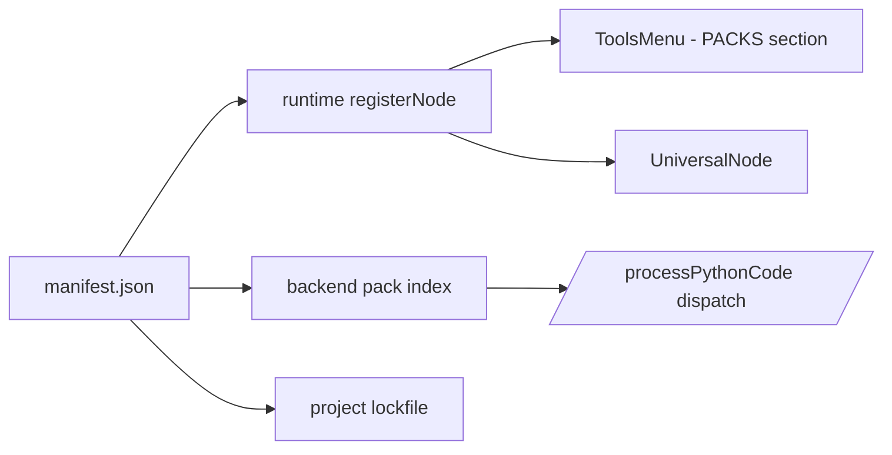

# Curio Nodes Factory — Epic plan

## Goal

Deliver a **public, shareable catalog of nodes** so users can **author, import / export, and publish** node packages to a **warehouse**, see **new nodes** appear in the **nodes menu** with **clear separation** from built-ins, and add **new node kinds** without shipping a new core app build for each package.

**Artifacts (all in `sketches/nodesfactory/`):**

- [`epic_nodes_factory.md`](sketches/nodesfactory/epic_nodes_factory.md) — refined epic with invariants and task list.
- [`manifest_spec.md`](../../docs/nodesfactory@docs/manifest_spec.md) — pack manifest v1 schema, dependencies, permissions, examples.
- [`spike_option_b.md`](sketches/nodesfactory/spike_option_b.md) — locked implementation spike (canonical string ids + dynamic registry).
- [`spike_option_a.md`](sketches/nodesfactory/spike_option_a.md) — carrier-node alternative kept for comparison.
- [`nodes_warehouse_pages.md`](sketches/nodesfactory/nodes_warehouse_pages.md) — screen inventory and design tokens.
- [`figma_mockups/01..03`](sketches/nodesfactory/figma_mockups/) — consumer surface (warehouse, install, palette).
- [`figma_mockups/04..08`](sketches/nodesfactory/figma_mockups/) — Node Factory authoring wizard (metadata, ports, template, dependencies, validate &amp; publish).
- [`svg_single/`](sketches/nodesfactory/svg_single/) — clean traces of base screenshots; composites under `svg_single/composites/`.

Canonical folder is **`nodesfactory`** (typo `nodesfactoy` is deprecated).

---

## Architectural invariants (locked)

These constrain every artifact in this epic and every PR that lands afterwards:

1. **Core `NodeType` enum stays.** [`utk_curio/frontend/urban-workflows/src/constants.ts`](utk_curio/frontend/urban-workflows/src/constants.ts) is **append-only** for built-ins; pack node kinds **never** add enum members.
2. **Pack kinds use canonical string ids** of the form `<packId>/<kindId>@<major>` (e.g. `ai.urbanlab.uhvi/uhvi-load@2`). These are persisted in saved Trill graphs and are the backend dispatch keys.
3. **Manifest is the single source of truth** for pack metadata, ports, dependencies, and permissions ([`manifest_spec.md`](../../docs/nodesfactory@docs/manifest_spec.md)).
4. **Dependencies are declared up front** (`compatibility.curioRuntime`, `dependencies.{packs,python,js}`) and **resolved at install** with deterministic lockfiles. Install fails closed on any unsatisfiable range, including any cross-pack semver conflict in the shared sandbox env.
5. **Permissions are explicit** and shown verbatim at install (per [`figma_mockups/02_install_permissions.svg`](sketches/nodesfactory/figma_mockups/02_install_permissions.svg)).
6. **Packs are self-contained.** Every Python template preset, grammar spec, widget spec, and icon a pack uses lives **inside the pack archive root**. Pack code MUST NOT reference [`<CURIO_LAUNCH_CWD>/templates/`](templates/) or any other path outside its own pack directory. The built-in `templates/<node_type_lower>/` folder is for built-in `NodeType` presets only.
7. **Shared sandbox env, fail-closed conflicts.** Pack Python deps are merged into a single project-level requirement set and installed into the existing single sandbox interpreter via [`/installPackages`](utk_curio/backend/app/api/routes.py); there is no per-pack venv. Two packs in the same project requesting incompatible semver ranges for the same PyPI package is a hard install error, not a silent override.
8. **Mock-up gate.** No Curio app code changes until the warehouse + factory mocks are signed off.

---

## Current product baseline (constraints, anchored on the repo)

Today, nodes are **compile-time** registered. The single source of registration is [`registerNode(descriptor)`](utk_curio/frontend/urban-workflows/src/registry/nodeRegistry.ts) (one argument, keyed by `descriptor.id: NodeType`); call sites live in [`descriptors.ts`](utk_curio/frontend/urban-workflows/src/registry/descriptors.ts). The registry itself is a `Map<NodeType, NodeDescriptor>`. The left **tools palette** [`ToolsMenu.tsx`](utk_curio/frontend/urban-workflows/src/components/menus/nodes/ToolsMenu.tsx) reads from [`getPaletteNodeTypes()`](utk_curio/frontend/urban-workflows/src/registry/nodeRegistry.ts) and emits a flat, palette-order-sorted list. Drag payload is `event.dataTransfer.setData("application/reactflow", nodeType)` — a single string, today always a `NodeType` enum value.

Backend execution: every port-validation lookup goes through the in-memory `_node_type_registry` dict in [`utk_curio/backend/app/api/routes.py`](utk_curio/backend/app/api/routes.py), which the frontend overwrites at boot via `POST /node-types`. Python execution paths run through `POST /processPythonCode` → `_sandbox_call('post', '/exec', …)` against the sandbox process; JS via `/processJavaScriptCode` → `/execJs`. Package installs go through `POST /installPackages` → sandbox `POST /install`, which calls `subprocess.run([sys.executable, '-m', 'pip', 'install', package], …)` in [`utk_curio/sandbox/app/api.py`](utk_curio/sandbox/app/api.py). There is exactly **one** Python interpreter in the sandbox today, and `/install` mutates *it*.

**Templates** today: [`generate_templates()` in `routes.py`](utk_curio/backend/app/api/routes.py) walks `<CURIO_LAUNCH_CWD>/templates/<node_type_lower>/*.py`, reads each file, and emits `{ id, type, name, description, accessLevel:'ANY', code, custom:true }`. The frontend [`TemplateProvider.tsx`](utk_curio/frontend/urban-workflows/src/providers/TemplateProvider.tsx) consumes that list and filters by `NodeType`. **Templates today are presets per existing built-in `NodeType` — not new node kinds.**

Storage on disk today (see [`utk_curio/backend/app/projects/storage.py`](utk_curio/backend/app/projects/storage.py)): `_users_base() = <CURIO_LAUNCH_CWD>/.curio/users/`; per-project files live under `<users_base>/<user_key>/projects/<project_id>/`. There is no `packs/` directory yet — this epic adds one (see §Pack storage & runtime environments below).

Operational docs: [`docs/ADDING-NODES.md`](docs/ADDING-NODES.md) (enum + descriptor + backend registry + templates folder).

The epic adds **runtime extensibility**, **dependency resolution**, and **distribution** — a step change from today's checklist-driven flow, **without** disturbing the existing built-in registration path.

---

## Refined feature set

| Capability | User-facing value | Notes |
|------------|-------------------|--------|
| **Node packages** | Install a capability in one action | Manifest: metadata, ports, editor flags, **self-contained** templates, icon, semver, **explicit deps + permissions** |
| **Warehouse** | Discover, trust, install community / org nodes | Search, categories, versioning, author, optional signing. v1 ships **sideload + per-user local cache**; a remote warehouse server is v2. |
| **Import / export** | Offline + enterprise | `.curio-nodepack` zip with structural validation; all assets relative to the pack root |
| **Palette integration** | Plug-and-play on canvas | Sections: **Built-in** / **PACKS** with **NEW** badge for recent installs |
| **Node factory** | Authors define kinds without forking Curio | Full 5-step wizard; output is a manifest-conformant pack |
| **Dependency resolution** | Reproducible installs | Shared sandbox env via `/installPackages`; project lockfile pins pack + python + js versions; cross-pack semver conflicts fail closed |

Trust &amp; safety (signing, org allowlists) is a **parallel workstream**, partially specified in [manifest_spec.md §2.4](../../docs/nodesfactory@docs/manifest_spec.md#24-lineage-fork-provenance-optional).

---

## Architecture direction (locked)

**Option B — Dynamic `registerNode()` keyed by canonical string ids** is the only spike track. Spec: [`spike_option_b.md`](sketches/nodesfactory/spike_option_b.md). Option A ([`spike_option_a.md`](sketches/nodesfactory/spike_option_a.md)) stays in the repo for comparison.



---

## User stories (refined)

1. **Browse warehouse** — search/filter/inspect packs and read trust signals before installing.
2. **Install / uninstall** — see permissions + dependencies; uninstall keeps existing graphs working (versions are pinned per project).
3. **Palette clarity** — **Built-in** vs **PACKS** sections with a count badge for new kinds.
4. **Author a pack** — wizard captures metadata, ports, template, deps; validates on a sample graph; **export `.curio-nodepack` or publish**.
5. **Reproducible installs** — project lockfile re-resolves to the exact same pack + python + npm versions.
6. **Dynamic kinds** — newly installed packs register in the runtime registry without a core build, **without changing the `NodeType` enum**.
7. **Templates bridge** — packs may also ship templates for existing built-in kinds (compat with current `Template` model).

---

## Task breakdown

**Discovery / Phase 0 — done in this epic folder**

- [x] Manifest v1 spec ([`manifest_spec.md`](../../docs/nodesfactory@docs/manifest_spec.md)).
- [x] Spike spec ([`spike_option_b.md`](sketches/nodesfactory/spike_option_b.md)) + comparison ([`spike_option_a.md`](sketches/nodesfactory/spike_option_a.md)).
- [x] Consumer mocks ([`figma_mockups/01..03`](sketches/nodesfactory/figma_mockups/)).
- [x] Node factory authoring mocks ([`figma_mockups/04..08`](sketches/nodesfactory/figma_mockups/)).
- [x] Screen inventory ([`nodes_warehouse_pages.md`](sketches/nodesfactory/nodes_warehouse_pages.md)).

**Spike (post mock-up sign-off)**

- [ ] Implement Option B: widen `NodeDescriptor.id` and the registry map key from `NodeType` to `NodeKindId = NodeType | string` (no signature change to `registerNode(descriptor)`); built-ins continue to register with `NodeType` ids; a fake pack registers a kind by calling the same `registerNode(descriptor)` with `descriptor.id` set to a canonical string id; Trill round-trip; one backend dispatch path through `_node_type_registry` (or its dynamic successor).
- [ ] Migration table for legacy `NodeType` values in saved graphs (no rewrite required).

**Manifest &amp; install**

- [ ] Shared schema validators (frontend + backend).
- [ ] Pack-archive opener with structural checks (paths, no `..`, allowed dirs; every referenced asset must resolve **inside the pack root**).
- [ ] Dependency resolver: pack DAG + pip + npm; deterministic lockfiles.
- [ ] Shared sandbox env install path: pack `dependencies.python` flow through the existing `/installPackages` → sandbox `/install` (`pip install` into `sys.executable`); cross-pack semver conflicts for the same PyPI package fail closed before any install runs. No per-pack venv.

**Warehouse &amp; distribution**

- [ ] Backend API (v1): list/search installed packs locally; sideload `.curio-nodepack` upload; uninstall. Remote publish/list is a v2 stub (see §Pack storage & runtime environments).
- [ ] Client: warehouse panel UI per [`01_warehouse_browse.svg`](sketches/nodesfactory/figma_mockups/01_warehouse_browse.svg); install dialog per [`02_install_permissions.svg`](sketches/nodesfactory/figma_mockups/02_install_permissions.svg); My packs management.

**Palette &amp; graph**

- [ ] Sectioned palette per [`03_palette_sectioned_rail.svg`](sketches/nodesfactory/figma_mockups/03_palette_sectioned_rail.svg).
- [ ] Project lockfile (`installedPacks[]` recorded inside `spec.trill.json`, alongside resolved python / js pins) + missing-pack banner with deep-links.

**Factory**

- [ ] Implement the wizard per [`04..08`](sketches/nodesfactory/figma_mockups/) driven by [`manifest_spec.md`](../../docs/nodesfactory@docs/manifest_spec.md). Output archive must be self-contained (no external template references).
- [ ] Sample-graph dry-runner used in Step 5.

**Polish**

- [ ] Telemetry (install counts, errors).
- [ ] Third-party authoring docs.

---

## Pack storage &amp; runtime environments

This epic introduces two distinct concerns that the rest of the plan and docs reference; both are pinned here so individual sections can stay short.

### On-disk storage layout

```
<CURIO_LAUNCH_CWD>/
├── templates/                         # built-in NodeType presets ONLY (existing)
│   └── <node_type_lower>/<Preset>.py
└── .curio/
    ├── data/                          # shared artifact cache (CURIO_SHARED_DATA)
    └── users/
        └── <user_key>/
            ├── projects/<project_id>/
            │   ├── spec.trill.json    # graph + installedPacks[] + resolved deps
            │   └── data/              # project outputs
            └── packs/                 # NEW — per-user installed pack store
                ├── index.json         # cache of installed pack ids/versions/integrity
                └── <packId>@<major>/  # ONE directory per (pack, major) the user has installed
                    ├── manifest.json
                    ├── integrity.json # sha256 of every file in the pack (filled by installer)
                    ├── templates/
                    │   └── <kindId>/<Preset>.py    # all pack code presets — self-contained
                    ├── grammars/<kindId>/<Preset>.json
                    ├── widgets/<kindId>/<Preset>.json
                    └── icons/<kindId>.svg
```

Key rules:

- A pack's installed root is **the only place** a pack's templates, grammars, widgets, and icons can live. The installer rejects any pack archive whose manifest references a file outside the archive root, and the runtime resolver never falls back to `<CURIO_LAUNCH_CWD>/templates/` for pack canonical ids.
- The per-user `packs/` directory mirrors the existing per-user `projects/` directory in [`utk_curio/backend/app/projects/storage.py`](utk_curio/backend/app/projects/storage.py); the same `_users_base()` resolution and `safe_join` validation apply.
- Project lockfile lives **inside** the project (`spec.trill.json` gains an `installedPacks[]` field per [manifest_spec.md §6](../../docs/nodesfactory@docs/manifest_spec.md#6-trill--project-graph-round-trip)). A clean machine can reproduce the install set by re-running the resolver against this list.
- Warehouse-server storage (the catalog itself, where authors publish packs to be discovered by other users) is **deferred to v2**. v1 supports two install paths only: sideloading a `.curio-nodepack` zip a user has on disk, and a future static-index fetch — both land in the same per-user `packs/<packId>@<major>/` directory.

### Runtime environments

| Layer | v1 policy | Where it lives | Conflict resolution |
|-------|-----------|----------------|---------------------|
| Python | **One** shared sandbox interpreter for all built-ins and all installed packs. `dependencies.python` from every pack in a project is merged into a single requirement set, resolved against PyPI, and installed via the existing `POST /installPackages` (which forwards to sandbox `POST /install` → `subprocess.run([sys.executable, '-m', 'pip', 'install', …])`). | Sandbox process (`sys.executable`) in [`utk_curio/sandbox/app/api.py`](utk_curio/sandbox/app/api.py) | Cross-pack incompatible semver ranges for the same PyPI package = **hard install error**, not silent override. |
| JavaScript | Single shared sandbox JS runtime used by `engine: "javascript"` pack kinds (parallel structure to Python). | Sandbox process; `/processJavaScriptCode` → `/execJs` | Same fail-closed conflict policy. |
| System (apt/brew/native) | **Rejected** in v1; manifests with non-empty `dependencies.system` fail validation. | n/a | n/a |

Implication: **there is no per-pack venv**. The isolation boundary is the *project* (pinned lockfile inside the project dir), not the *pack*. Authors must declare reasonable, range-y pins so multiple packs can co-exist in the same project.

---

## UI inspiration (for mock-up planning)

| Reference | Why it fits | Link |
|-----------|-------------|------|
| **SketchUp Extension Warehouse** | Canonical 3D/tool extension browsing, categories, install | https://extensions.sketchup.com/ |
| **Dribbble — `plugin` tag** | Broad set of plugin / extension chrome | https://dribbble.com/tags/plugin |
| **Dribbble — extension UI search** | Manager / store layouts | https://dribbble.com/search/extension-ui |
| **Chrome extension style panel** | Compact extension detail + toggles | https://dribbble.com/shots/3169385-CSS-Peeper-Chrome-Extension-UI |
| **Framer marketplace** | Component store + categories | https://www.framer.com/marketplace/ |

Borrow: category rail + card grid; author + version row; primary **Install**; permission disclosure; **My packs** vs store.

---

## UI base assets - SVG (mirror Auth workflow)

**Source screenshots:** [`sketches/nodesfactory/base/`](sketches/nodesfactory/base/).

**Pipeline:** [`sketches/extract_single_svg.py`](sketches/extract_single_svg.py) (depends on [`sketches/extract_vectors.py`](sketches/extract_vectors.py) + [`sketches/requirements.txt`](sketches/requirements.txt)).

Layout:

- `base/*.png` — originals
- `svg_single/*.svg` — clean traces (`--min-area 24 --simplify 0.002 --color-k 32`)
- `svg_single/composites/` — PNG underlay + vector overlay
- `svg_single/legacy_dense_trace/` — earlier noisy traces (archive)
- `figma_mockups/` — pure-vector concept screens (consumer + factory wizard)

Regenerate clean traces:

```bash
cd /Users/karla/coding/curiomain/sketches
.venv/bin/python extract_single_svg.py nodesfactory/base \
  --out nodesfactory/svg_single \
  --min-area 24 --simplify 0.002 --color-k 32
```

---

## Success criteria (epic level)

- All consumer + factory mock-ups approved before app implementation.
- Spike proves **Option B** end-to-end on a branch (descriptor + Trill round-trip + one backend dispatch path) **with the core `NodeType` enum unchanged** and **only the `NodeKindId` alias widened** on the existing single-arg `registerNode(descriptor)`.
- A fake pack with declared dependencies installs deterministically into `.curio/users/<u>/packs/<packId>@<major>/`, registers a kind in the **PACKS** palette section, and runs end-to-end **without** reading any file outside its own pack root.
- Two installed packs with compatible Python deps coexist in the same project on the **shared sandbox env**; a third pack with a conflicting semver range is **rejected at install** with a precise error citing both packs.
- Authors can produce a `.curio-nodepack` end-to-end via the wizard with **no manual JSON editing**, including pack / python / js dependency declarations, and the resulting archive validates as self-contained (no path outside the archive root).
- Saved graphs reload identically on a clean machine using the project lockfile.
