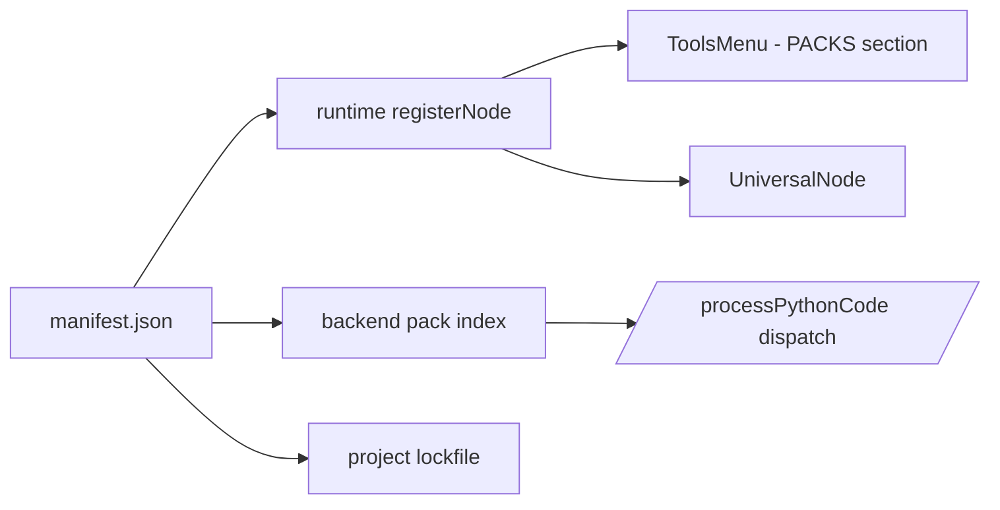

# Curio Nodes Factory — Epic (refined)

## Refinement gate (ordering)

**Do not change Curio application code** (`utk_curio/`, `docs/ADDING-NODES.md` implementation, frontend `urban-workflows`) until mock-up planning for this epic is complete and reviewed.

Completed in this folder:

- **Vector base:** clean SVG traces of `base/` screenshots ([`svg_single/`](svg_single/)) + photo+vector overlays ([`svg_single/composites/`](svg_single/composites/)).
- **Pure-vector concept screens:** [`figma_mockups/`](figma_mockups/) — warehouse, install, palette, **and the full 5-step Node factory wizard**.
- **Manifest specification (v1 draft):** [`manifest_spec.md`](../../docs/nodesfactory@docs/manifest_spec.md).
- **Technical spike (Option B, locked for implementation):** [`spike_option_b.md`](spike_option_b.md).
- **Alternative spike (Option A, carrier node — comparison only):** [`spike_option_a.md`](spike_option_a.md).
- **Screen inventory:** [`nodes_warehouse_pages.md`](nodes_warehouse_pages.md).

---

## Goal

Deliver a **public, shareable catalog of nodes** so users can **author, import / export, and publish** node packages to a **warehouse**, and see **new nodes** appear in the **nodes menu** with **clear separation** from built-ins. Support **new node kinds** without shipping a new core app build for each package.

Canonical sketch assets live under **`sketches/nodesfactory/`**. The older path `sketches/nodesfactoy/` is a typo; new work uses **`nodesfactory`** only.

---

## Architectural invariants (locked)

These hold across both spike options and **constrain every artifact in this folder**:

1. **Core `NodeType` enum stays.** [`utk_curio/frontend/urban-workflows/src/constants.ts`](../../utk_curio/frontend/urban-workflows/src/constants.ts) is **append-only** for built-ins; pack node kinds **never** add enum members.
2. **Pack kinds use canonical string ids** of the form `<packId>/<kindId>@<major>` (e.g. `ai.urbanlab.uhvi/uhvi-load@2`). These are the **values persisted in saved Trill graphs** and dispatched by the backend.
3. **Single source of truth = manifest.** All UI, palette descriptors, backend dispatch, and lockfiles derive from [`manifest_spec.md`](../../docs/nodesfactory@docs/manifest_spec.md).
4. **Declared dependencies, fail closed.** Compatibility, pack deps, Python deps, and JS deps are resolved at install; missing/unsatisfiable ranges — **including any cross-pack semver conflict in the shared sandbox env** — block install with a precise error.
5. **Permissions are explicit and shown verbatim** at install (see [`figma_mockups/02_install_permissions.svg`](figma_mockups/02_install_permissions.svg)).
6. **Packs are fully self-contained.** Every Python template preset, grammar spec, widget spec, and icon used by a pack lives **inside the pack archive root** (`templates/<kindId>/<Preset>.py`, `grammars/<kindId>/<Preset>.json`, …). Pack code MUST NOT reference [`<CURIO_LAUNCH_CWD>/templates/`](../../templates/) or any other path outside its own pack root. The built-in `templates/<node_type_lower>/` folder remains in use only for built-in `NodeType` presets.
7. **Shared sandbox env.** Pack Python deps install into the existing single sandbox interpreter via the existing [`/installPackages`](../../utk_curio/backend/app/api/routes.py) route (→ sandbox `/install` → `subprocess.run([sys.executable, '-m', 'pip', 'install', …])`). There is **no per-pack venv**. The isolation boundary is the project (lockfile), not the pack.
8. **Mock-up gate:** no Curio app code changes until the warehouse + factory mocks are signed off.

---

## Architecture decision (still locked)

**Option B — Dynamic `registerNode()` keyed by canonical string ids** — see [`spike_option_b.md`](spike_option_b.md). Option A (single carrier `NodeType` + payload) is documented in [`spike_option_a.md`](spike_option_a.md) for comparison; **the implementation track remains Option B**.



---

## Refined capabilities

| Capability | User value | Notes |
|------------|------------|--------|
| **Node packages** | One-click capability install | Manifest: metadata, ports, editor flags, templates, icon, semver, **explicit dependencies** ([`manifest_spec.md` §2.3](../../docs/nodesfactory@docs/manifest_spec.md)) |
| **Warehouse** | Discover + trust community / org nodes | Search, categories, versions, author; UX anchor: SketchUp Extension Warehouse |
| **Import / export** | Offline + enterprise | `.curio-nodepack` zip + structural validation |
| **Palette** | Plug-and-play on canvas | Sections: **Built-in** / **PACKS** (and **NEW** badge for recently installed) |
| **Node factory** | Author new kinds without forking Curio | Full 5-step wizard ([`figma_mockups/04..08`](figma_mockups/)): metadata, ports, template, dependencies, validate &amp; publish |

Trust &amp; safety (permissions summary, signing, org allowlists) is a **parallel workstream** — partially specified in §2.2 and §2.4 of [`manifest_spec.md`](../../docs/nodesfactory@docs/manifest_spec.md).

---

## Node factory authoring UI (mocks ready)

Five 1440 x 900 vector screens live in [`figma_mockups/`](figma_mockups/), sharing a common header / stepper / footer language. They are the **product surface** of [`manifest_spec.md`](../../docs/nodesfactory@docs/manifest_spec.md): every field shown maps 1:1 to a manifest path.

| Step | File | Wires up… |
|------|------|-----------|
| 1 — Metadata | [`figma_mockups/04_factory_step1_metadata.svg`](figma_mockups/04_factory_step1_metadata.svg) | `id`, `version`, `displayName`, `description`, `author`, `license`, `category`, pack icon |
| 2 — Ports | [`figma_mockups/05_factory_step2_ports.svg`](figma_mockups/05_factory_step2_ports.svg) | `nodeKinds[].kindId`, `inputPorts`, `outputPorts`, `category`, `paletteOrder`; left rail manages multiple kinds in one pack |
| 3 — Template &amp; engine | [`figma_mockups/06_factory_step3_template.svg`](figma_mockups/06_factory_step3_template.svg) | `editor`, `engine`, `hasCode/Widgets/Grammar`, `templateDir` (multi-preset, all `.py` inside become Template entries), `defaultTemplate`, widget marker detection, dry-run output, descriptor preview |
| 4 — Dependencies &amp; permissions | [`figma_mockups/07_factory_step4_dependencies.svg`](figma_mockups/07_factory_step4_dependencies.svg) | `compatibility.curioRuntime`, `dependencies.{packs,python,js}`, `permissions.{network,fileWrite,pythonStdlibOnly}`, manifest preview |
| 5 — Validate &amp; publish | [`figma_mockups/08_factory_step5_validate_publish.svg`](figma_mockups/08_factory_step5_validate_publish.svg) | Full validator checklist, sample-graph dry run, lockfile preview, **Export .curio-nodepack** vs **Publish to warehouse** with visibility (Public / Private / Org allowlist) |

**Best-practice principles enforced in the wizard:**

- **Stable identity:** `id` and `version` are entered first because they participate in `canonicalId`, which is persisted in graphs forever.
- **One-pack / many-kinds:** the wizard is per-pack, with a left rail to add/edit individual kinds in steps 2–3.
- **Live preview everywhere:** every step renders the corresponding manifest snippet or live UI tile, so authors see exactly what will land in users' palettes.
- **Validate before publish:** step 5 is a **separate state**, not an alias for "submit"; users explicitly choose Export vs Warehouse.
- **Fail closed on resolution:** dependency rows show resolved versions inline; unresolvable ranges block "Next".
- **Reversible publish:** save-draft and export-only paths exist; warehouse submission is a separate, explicit action.

---

## Dependency model (summary, full schema in [`manifest_spec.md`](../../docs/nodesfactory@docs/manifest_spec.md))

```jsonc
"compatibility": { "curioRuntime": ">=1.4.0 <2.0.0" },

"dependencies": {
  "packs":  { "ai.urbanlab.geo-base": "^1.2.0" },
  "python": { "rasterio": "^1.3", "numpy": ">=1.24,<3" },
  "js":     {},
  "system": []
}
```

| Bucket | Source | Resolution scope | Failure mode |
|--------|--------|------------------|--------------|
| `compatibility.curioRuntime` | host app version | Per host | Block install |
| `dependencies.packs` | warehouse / sideload cache | Project-wide DAG, single version per pack | Block install with cycle/conflict |
| `dependencies.python` | PyPI | **Shared sandbox env** for the project (one interpreter); pack reqs merged into a single resolver run, installed via `/installPackages` → sandbox `/install` (`pip install` into `sys.executable`) | Block install with resolver error, **including any cross-pack incompatible semver range for the same package** |
| `dependencies.js` | npm | **Shared sandbox JS runtime**, parallel to Python; only invoked when any `nodeKind.engine == "javascript"` | Block install (same conflict rule as python) |
| `dependencies.system` | reserved | — | v1 installer rejects non-empty |

The project file persists a **lockfile** (`installedPacks[]` with semver and integrity hashes, plus resolved python/js pins) inside `spec.trill.json` so loading a graph either reuses pinned versions or surfaces a banner with deep-links to the warehouse.

---

## User stories (refined)

1. **Browse warehouse** — As a user, I can search/filter packs and read trust signals before installing.
2. **Install / uninstall** — As a user, I see a permissions + dependencies summary and can uninstall without corrupting saved graphs (versions are pinned per project).
3. **Palette clarity** — As a user, I see **Built-in** vs **PACKS** with a count badge for newly installed kinds.
4. **Author a pack** — As a maintainer, I run the factory wizard, declare deps + permissions, validate on a sample graph, and export `.curio-nodepack` or publish to the warehouse.
5. **Reproducible installs** — As an org admin, the lockfile lets me redeploy a project on a clean machine and get the exact same pack versions.
6. **Dynamic kinds** — As the platform, newly installed packs register in the runtime registry without restarting the app.

---

## Current product baseline (anchored on the repo)

Same baseline as the plan; restated here so this folder reads stand-alone:

- Frontend registration: single-arg [`registerNode(descriptor)`](../../utk_curio/frontend/urban-workflows/src/registry/nodeRegistry.ts) keyed by `descriptor.id: NodeType`; registry shape `Map<NodeType, NodeDescriptor>`. Call sites all live in [`descriptors.ts`](../../utk_curio/frontend/urban-workflows/src/registry/descriptors.ts). Palette is [`ToolsMenu.tsx`](../../utk_curio/frontend/urban-workflows/src/components/menus/nodes/ToolsMenu.tsx) reading [`getPaletteNodeTypes()`](../../utk_curio/frontend/urban-workflows/src/registry/nodeRegistry.ts).
- Backend port-validation table: in-memory `_node_type_registry` dict in [`utk_curio/backend/app/api/routes.py`](../../utk_curio/backend/app/api/routes.py), overwritten at boot via `POST /node-types`. Python execution dispatch goes through `POST /processPythonCode` → sandbox `POST /exec`; JS via `/processJavaScriptCode` → `/execJs`.
- Package install: `POST /installPackages` → sandbox `POST /install` → `subprocess.run([sys.executable, '-m', 'pip', 'install', package], …)` in [`utk_curio/sandbox/app/api.py`](../../utk_curio/sandbox/app/api.py). **One** interpreter total.
- Templates today: [`generate_templates()`](../../utk_curio/backend/app/api/routes.py) walks `<CURIO_LAUNCH_CWD>/templates/<node_type_lower>/*.py` and emits `{ id, type, name, description, accessLevel:'ANY', code, custom:true }`. The frontend [`TemplateProvider.tsx`](../../utk_curio/frontend/urban-workflows/src/providers/TemplateProvider.tsx) filters that list by `NodeType`. Templates today are *presets per existing built-in `NodeType`*, not new node kinds.
- Per-user disk layout: [`utk_curio/backend/app/projects/storage.py`](../../utk_curio/backend/app/projects/storage.py) → `_users_base() = <CURIO_LAUNCH_CWD>/.curio/users/`, `<users_base>/<user_key>/projects/<project_id>/`. No `packs/` directory exists yet — this epic adds one (see next section).

The epic adds **runtime extensibility** + **dependency resolution** + **distribution** on top of these, with **zero** changes to the existing built-in registration path.

---

## Pack storage &amp; runtime environments

This is the canonical statement; [`manifest_spec.md`](../../docs/nodesfactory@docs/manifest_spec.md) §1 and [`spike_option_b.md`](spike_option_b.md) §4–§5 reference it.

### On-disk layout

```
<CURIO_LAUNCH_CWD>/
├── templates/                         # built-in NodeType presets ONLY (existing)
│   └── <node_type_lower>/<Preset>.py
└── .curio/
    ├── data/                          # shared artifact cache (CURIO_SHARED_DATA, existing)
    └── users/
        └── <user_key>/
            ├── projects/<project_id>/
            │   ├── spec.trill.json    # graph + installedPacks[] + resolved python/js pins
            │   └── data/              # project outputs (existing)
            └── packs/                 # NEW — per-user installed pack store
                ├── index.json         # cache: installed pack ids/versions/integrity
                └── <packId>@<major>/  # ONE directory per (pack, major) the user has installed
                    ├── manifest.json
                    ├── integrity.json # sha256 of every file in the pack (filled by installer)
                    ├── templates/
                    │   └── <kindId>/<Preset>.py    # all pack code presets — self-contained
                    ├── grammars/<kindId>/<Preset>.json
                    ├── widgets/<kindId>/<Preset>.json
                    └── icons/<kindId>.svg
```

Hard rules:

- The pack root is the **only** place a pack's templates, grammars, widgets, and icons can live. The installer rejects any archive whose manifest references a file outside the pack root (no `..`, no absolute paths, no unknown top-level dirs).
- The runtime template loader **never** falls back to `<CURIO_LAUNCH_CWD>/templates/` for a pack's canonical id. That folder is reserved for built-in `NodeType` presets.
- `.curio/users/<user_key>/packs/` mirrors the existing `projects/` sibling and uses the same `_users_base()` + `safe_join` plumbing in [`storage.py`](../../utk_curio/backend/app/projects/storage.py).
- The project lockfile lives **inside** `spec.trill.json` (`installedPacks[]`, see [`manifest_spec.md` §6](../../docs/nodesfactory@docs/manifest_spec.md)). Loading a project on a clean machine re-resolves against this list — same versions, same integrity hashes, same on-disk layout.
- **Warehouse-server storage** (the public catalog where authors publish, and where other users discover) is **deferred to v2**. v1 ships two paths only: (a) sideloading a `.curio-nodepack` zip that the user already has on disk, and (b) optionally a static HTTPS index that returns pack archives; both land in the same per-user `packs/<packId>@<major>/` directory.

### Runtime environments

| Layer | v1 policy | Where it lives | Conflict resolution |
|-------|-----------|----------------|---------------------|
| Python | **One shared** sandbox interpreter for all built-ins and all installed packs in a project. Pack `dependencies.python` from every installed pack in the project is merged into a single requirement set, resolved against PyPI, and installed via the existing `POST /installPackages` (→ sandbox `POST /install` → `subprocess.run([sys.executable, '-m', 'pip', 'install', …])`). | Sandbox process (`sys.executable`) — [`utk_curio/sandbox/app/api.py`](../../utk_curio/sandbox/app/api.py) | Cross-pack incompatible semver ranges for the same PyPI package = **hard install error**, surfaced with both pack ids and the offending range. |
| JavaScript | Single shared sandbox JS runtime used by `engine: "javascript"` pack kinds; same merge + resolver model. | Sandbox process; `/processJavaScriptCode` → `/execJs` | Same fail-closed conflict policy. |
| System (apt/brew/native) | **Rejected** in v1; manifests with non-empty `dependencies.system` fail validation. | n/a | n/a |

Consequence: **there is no per-pack venv**. The isolation boundary is the *project* (its lockfile inside `spec.trill.json`), not the *pack*. Authors must declare reasonable range-y pins so multiple packs can co-exist in the same project.

---

## Engineering tasks (after mock-up sign-off)

**Phase 0 — Spike (Option B)**

- [ ] Implement spike per [`spike_option_b.md`](spike_option_b.md): widen `NodeDescriptor.id` and the registry map key from `NodeType` to `NodeKindId = NodeType | string`; the existing single-arg `registerNode(descriptor)` works unchanged for both built-ins (NodeType ids) and pack kinds (canonical string ids); **core enum unchanged**.
- [ ] One fake installed pack with one kind under `.curio/users/<u>/packs/<packId>@<major>/`, ported through Trill round-trip and one backend dispatch path; templates loaded **only** from the pack root.

**Manifest &amp; install**

- [ ] Implement [`manifest_spec.md`](../../docs/nodesfactory@docs/manifest_spec.md) v1 validators (frontend + backend share schema).
- [ ] Pack-archive opener: structural checks (paths, no `..`, no unknown top-level dirs); every referenced asset must resolve **inside the pack root**.
- [ ] Dependency resolver (packs DAG + pip + npm) with deterministic lockfiles + cross-pack conflict detection on the shared sandbox env.
- [ ] Shared-env install path: route pack python deps through the existing `/installPackages` route; never spawn a per-pack venv.

**Warehouse &amp; distribution**

- [ ] v1 install paths: sideload `.curio-nodepack` upload + (optional) static-index fetch; uninstall; list installed packs.
- [ ] v2 (separate epic): remote warehouse server — publish, search, signing, payments.
- [ ] Client: warehouse panel UI, install dialog (per [`02_install_permissions.svg`](figma_mockups/02_install_permissions.svg)), my-packs management.

**Palette &amp; graph**

- [ ] Sectioned palette ([`03_palette_sectioned_rail.svg`](figma_mockups/03_palette_sectioned_rail.svg)).
- [ ] Project lockfile (inside `spec.trill.json`) + missing-pack banner with deep-link to warehouse.

**Factory**

- [ ] Build the wizard per [`04..08`](figma_mockups/), driven by [`manifest_spec.md`](../../docs/nodesfactory@docs/manifest_spec.md). Output archive must be self-contained (no external template references).
- [ ] Sample-graph dry-runner (validator step 5).

**Templates loader (pack side)**

- [ ] New helper in [`utk_curio/backend/app/api/routes.py`](../../utk_curio/backend/app/api/routes.py) (sibling to `generate_templates()`) that, for the current user, walks `.curio/users/<user>/packs/*/templates/<kindId>/*.py` and emits `Template` objects whose `type` is the pack's `canonicalId`. The existing `<CURIO_LAUNCH_CWD>/templates/` walk is kept ONLY for built-in `NodeType` folders.
- [ ] Frontend [`TemplateProvider.tsx`](../../utk_curio/frontend/urban-workflows/src/providers/TemplateProvider.tsx) extended to filter on `NodeType | canonicalId` so the existing `TemplateModal` works unchanged for pack kinds.

**Polish**

- [ ] Telemetry (install counts, errors).
- [ ] Third-party authoring docs.

---

## UI inspiration

| Reference | Role | URL |
|-----------|------|-----|
| SketchUp Extension Warehouse | Browse / install / versions | https://extensions.sketchup.com/ |
| Dribbble — `plugin` tag | Plugin chrome | https://dribbble.com/tags/plugin |
| Dribbble — extension UI search | Manager layouts | https://dribbble.com/search/extension-ui |
| CSS Peeper | Compact extension panel | https://dribbble.com/shots/3169385-CSS-Peeper-Chrome-Extension-UI |
| Framer marketplace | Component store pattern | https://www.framer.com/marketplace/ |

Borrow: category rail + card grid; author + version row; primary **Install**; permission disclosure; **My packs** vs store.

---

## Disk layout (this folder)

| Path | Purpose |
|------|---------|
| [`base/`](base/) | Original screenshots |
| [`preview/`](preview/) | Same PNGs for quick viewing |
| [`svg_single/`](svg_single/) | Clean vector traces (`--min-area 24 --simplify 0.002 --color-k 32`) |
| [`svg_single/composites/`](svg_single/composites/) | `preview/` PNG + vector Nodes hub overlays |
| [`svg_single/legacy_dense_trace/`](svg_single/legacy_dense_trace/) | Optional archive of earlier noisy traces |
| [`figma_mockups/`](figma_mockups/) | Curio-styled concept screens (Rubik / `#1E1F23` / `#FBAA69`) — warehouse, install, palette, factory wizard |
| [`epic_nodes_factory.md`](epic_nodes_factory.md) | This epic |
| [`manifest_spec.md`](../../docs/nodesfactory@docs/manifest_spec.md) | Pack manifest v1 schema + dependency model |
| [`nodes_warehouse_pages.md`](nodes_warehouse_pages.md) | Screen + mock-up planning notes |
| [`spike_option_a.md`](spike_option_a.md) | Option A — carrier `NodeType` + instance payload (comparison) |
| [`spike_option_b.md`](spike_option_b.md) | Option B — runtime registry, canonical string ids (implementation) |

Regenerate clean traces:

```bash
cd sketches
.venv/bin/python extract_single_svg.py nodesfactory/base --out nodesfactory/svg_single \
  --min-area 24 --simplify 0.002 --color-k 32
```

---

## Success criteria

- Warehouse + palette + factory mock-ups approved before app implementation.
- Spike proves **Option B** end-to-end on a branch with the **core `NodeType` enum unchanged** and the existing single-arg `registerNode(descriptor)` unchanged (only `NodeKindId` widens to `NodeType | string`).
- A fake pack installs into `.curio/users/<u>/packs/<packId>@<major>/`, registers a kind in the **PACKS** palette section, and executes end-to-end **without** reading any file outside its own pack root.
- Two packs with compatible Python deps coexist in one project on the shared sandbox env; a third with a conflicting semver range is **rejected at install** with a precise error citing both packs.
- Authors can produce a `.curio-nodepack` end-to-end via the wizard with **no manual JSON editing**, and the resulting archive validates as self-contained.
