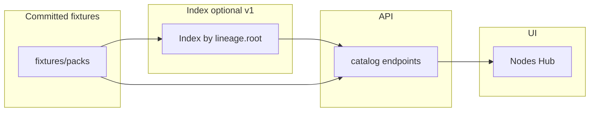

# Warehouse v2 — resolver, catalog, and semver channels

## Goal

Evolve the pack **warehouse** beyond the v1 fixture catalog and narrow resolver:

- **Resolver / publishing policy** — deterministic pack dependency resolution when multiple majors or forks exist; validated publish rules aligned with `manifest_spec`.
- **Catalog semantics** — deduplication and/or **family grouping** using a stable key (prefer `lineage.root`); clear collision rules for publishes.
- **Global index by `root`** — server-side view of all catalog (and optionally installed) entries keyed by family root for dedupe validation, updates, and search (v1 can be fixture scan–built).
- **Rich semver / channels** — proper pre-release ordering and optional **channel** UX instead of lexical `version` string sorting only.

Frontend fork-family grouping in the dock palette and Nodes Hub (**installed** lists) already uses `partitionPacksByForkFamily` / `lineage.root`; catalog **must not** collapse duplicate publishes until backend semantics guarantee uniqueness (`docs/nodesfactory@docs/warehouse_v2.md`).

---

## Constraints / current baseline

- **Catalog:** `GET /api/packs/catalog` serves fixtures from `utk_curio/backend/fixtures/packs/` with `familyKey`, `channel`, `families[]`, and `catalogCollisions[]` — see `list_catalog_packs` in `utk_curio/backend/app/packs/routes.py` and `catalog_family.py`.
- **Resolver semver:** `parse_version` in `resolver.py` still **ignores pre-release / build tails** for range math; full pre-release ordering is **not** implemented yet.
- **Pack DAG:** `_topo_order` accepts **`packId@major`** keys; bare `packId` only when a single installed directory matches (otherwise `ResolverError: ambiguous`).
- **Lineage / channel:** `manifest.py` + `pack_channel.py` — `lineage`, optional `distribution.channel`.

---

## Workstreams (checklist)

- [x] **W1 — Catalog family / dedupe key**  
  **Shipped:** `familyKey` = `lineage.root` coordinate or `dirName`; collision report `catalogCollisions` on `(familyKey, channel, version)`. Optional `familyId` / `catalogSlug` still future if needed.

- [x] **W2 — Publishing policy**  
  **Shipped in spec:** `manifest_spec.md` §2.3 `packs` keys and §2.4.1 `distribution`; fork validation remains in `manifest.py`. Centralised publish enforcement (remote registry) still out of scope.

- [x] **W3 — Resolver**  
  **Shipped:** `packId@major` edges; ambiguous bare `packId` errors; lockfile `familyKey` + `lineageRoot`. **Not shipped:** ranged majors in one dep key.

- [x] **W4 — Catalog API v2**  
  **Shipped (fixture index):** per-row `familyKey`, top-level `families`, `catalogCollisions`. Full “catalog v2” remote API still future.

- [ ] **W5 — Semver + channels**  
  **Partial:** `channel` in manifest + API + lockfile carry-through for `familyKey`; **not** full pre-release precedence or channel-aware `parse_range`.

- [x] **W6 — Frontend (after API)**  
  **Partial:** `packsApi` types + Nodes Hub **channel** chip when not `stable`. **Not** catalog collapse-by-family (cards stay flat per policy until product chooses default release per family).

---

## Out of scope (later)

Remote warehouse CDN, artifact signing, global multi-tenant registry (unless bundled with Catalog v2 deliberately).

---

## Overview (fixtures → Hub)

